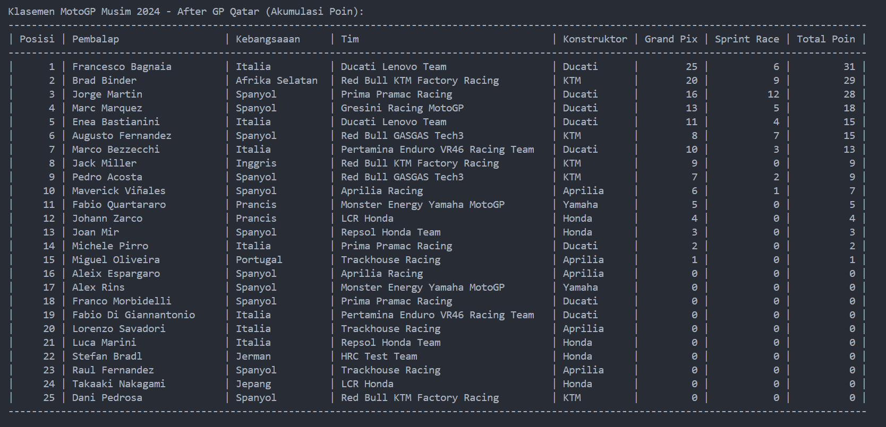
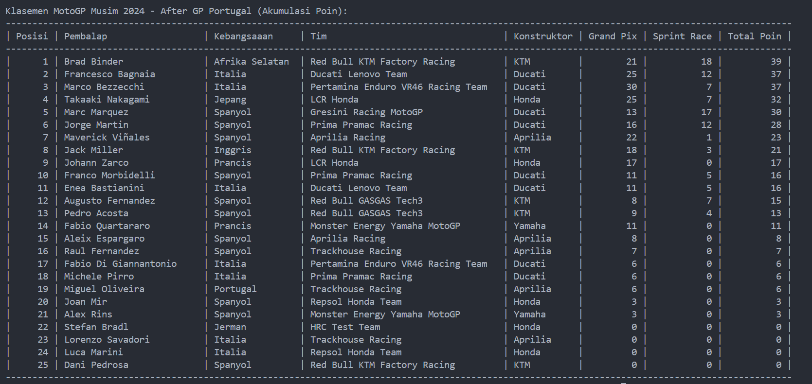

# 
Laporan Praktikum Pertemuan 11 Algoritma dan Struktur Data

    

    

     

 Nama     : Dio Andika Pradana Mulia Tama 

 NIM      : 2341720098 

 Prodi    : Teknik Informatika

 Kelas    : 1B 

 Presensi : 09 

# Kuis 2

## Hasil Program

Moto GP 2024 berbeda dengan sebelumnya. Kini ada tambahan babak Sprint Race. Sprint Race merupakan sesi balapan tambahan yang berlangsung tiga jam setelah Kualifikasi MotoGP terakhir pada hari Sabtu. Jumlah balapan sesi Sprint Race beda dengan balapan utama (Grand Prix). Adapun total lap pada Sprint Race hanya 12 putaran. Namun, ajang tersebut memberikan poin tambahan kepada sembilan pebalap terdepan. Hasil Sprint Race memengaruhi penghitungan poin MotoGP dalam perebutan juara.

