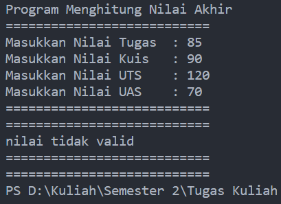
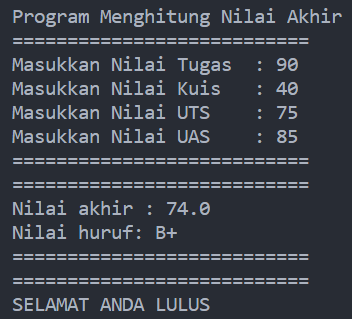
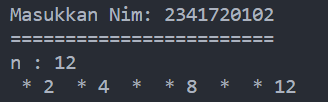
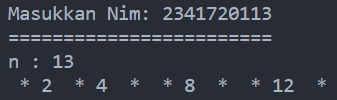
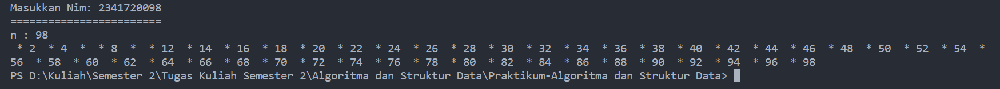
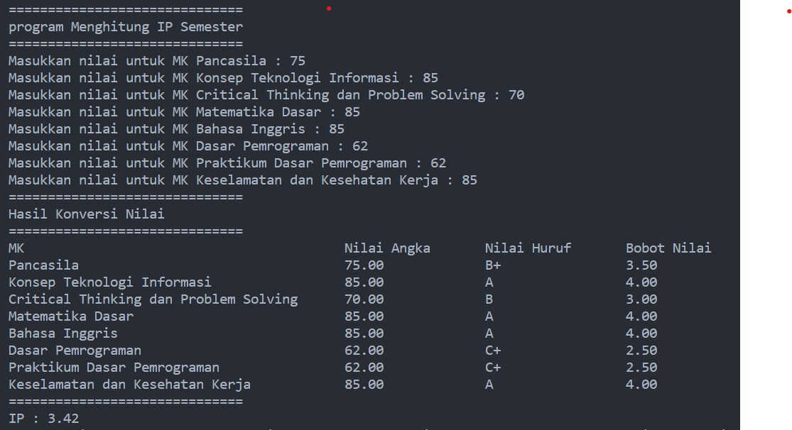
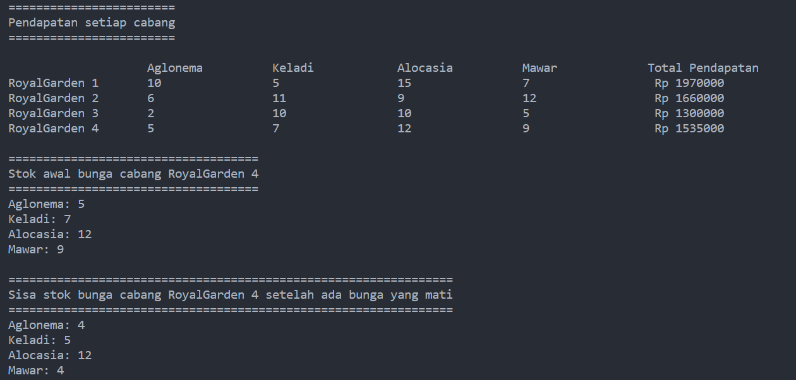

# <p align ="center">Laporan Praktikum Pertemuan 2 Algoritma dan Struktur Data</p>
<br><br><br><br>

<p align="center">
    </p>

<br><br><br><br><br>

<p align = "center"> Nama     : Dio Andika Pradana Mulia Tama </p>
<p align = "center"> NIM      : 2341720098 </p>
<p align = "center"> Prodi    : Teknik Informatika</p>
<p align = "center"> Kelas    : 1B </p>
<p align = "center"> Presensi : 09 </p>

# Jobsheet 1

## 2.2.1 Praktikum Pemilihan

Kode Program:
```java
import java.util.Scanner;
public class Pemilihan09 {
    public static void main(String[] args) {
        Scanner input09 = new Scanner(System.in);

        System.out.println("Program Menghitung Nilai Akhir");
        System.out.println("===========================");

        System.out.print("Masukkan Nilai Tugas  : ");
        float tugas = input09.nextFloat();
        System.out.print("Masukkan Nilai Kuis   : ");
        float kuis = input09.nextFloat();
        System.out.print("Masukkan Nilai UTS    : ");
        float uts = input09.nextFloat();
        System.out.print("Masukkan Nilai UAS    : ");
        float uas = input09.nextFloat();

        System.out.println("===========================");
        System.out.println("===========================");

        if (uas < 0 || uas > 100) {
            notValid();
        } else if (uts < 0 || uts > 100) {
            notValid();
        } else if (kuis < 0 || kuis > 100) {
            notValid();
        } else if (tugas < 0 || tugas > 100) {
            notValid();
        } else {
            float total = (uas * 0.3F) + (uts * 0.3F) + (kuis * 0.2F) + (tugas * 0.2F);

            String nilaiHuruf;
            if (total > 80 && total <= 100) {
                nilaiHuruf = "A";
            } else if (total > 73 && total <= 80) {
                nilaiHuruf = "B+";        
            } else if (total > 65 && total <= 73) {
                nilaiHuruf = "B";
            } else if (total > 60 && total <= 65) {
                nilaiHuruf = "C+";
            } else if (total > 50 && total <= 60) {
                nilaiHuruf = "C";
            } else if (total > 39 && total <= 50) {
                nilaiHuruf = "D";
            } else {
                nilaiHuruf = "E";
            }
            System.out.println("Nilai akhir : " + total);
            System.out.println("Nilai huruf: " + nilaiHuruf);

            System.out.println("===========================");
            System.out.println("===========================");

            String message = total <= 50 ? "MAAF ANDA TIDAK LULUS" : "SELAMAT ANDA LULUS";
            System.out.println(message);
        }
    }
    
    static void notValid() {
        System.out.println("nilai tidak valid");
        System.out.println("===========================");
        System.out.println("===========================");
    }
}
```

Output Program:




## 2.2.2 Praktikum Perulangan

Kode Program:
```java
import java.util.Scanner;
public class Perulangan09 {
    public static void main(String[] args) {
        Scanner sc = new Scanner(System.in);

        System.out.print("Masukkan Nim: ");
        String nim = sc.nextLine();
        System.out.println("========================");

        int n = Integer.parseInt(nim.substring(nim.length()-2, nim.length()));
        if (n < 10) {
            n += 10;
        }
        System.out.println("n : " + n);
    
        for (int i = 1; i <= n; i++) {
            if (i == 6 || i == 10) {
                continue;   
            }
            if (i % 2 != 0) {
                System.out.print(" * ");
            } else {
                System.out.print(i + " ");
            }           
        }
        sc.close();
    }  
}
```

Output Program:<br>






## 2.2.3 Praktikum Array

Kode Program:
```java
import java.util.Scanner;
public class Array09 {
    public static void main(String[] args) {
        Scanner input = new Scanner(System.in);

        double[] nilaiMatkul = new double[8];
        String[] matKul = {"Pancasila", "Konsep Teknologi Informasi", "Critical Thinking dan Problem Solving", "Matematika Dasar", "Bahasa Inggris", "Dasar Pemrograman", "Praktikum Dasar Pemrograman", "Keselamatan dan Kesehatan Kerja"};
        String nilaiHuruf[] = new String[8];
        float nilaiSetara[] = new float[8];

        System.out.println("==============================");
        System.out.println("program Menghitung IP Semester");
        System.out.println("==============================");

        for (int i = 0; i < matKul.length; i++) {
            System.out.print("Masukkan nilai untuk MK " + matKul[i] + " : ");
            nilaiMatkul[i] = input.nextFloat();

            if (nilaiMatkul[i] <= 100 && nilaiMatkul[i] >= 0) {  
                if (nilaiMatkul[i] > 80 && nilaiMatkul[i] <= 100) {
                    nilaiSetara[i] = 4.00f;
                    nilaiHuruf[i] = "A";
                } else if (nilaiMatkul[i] > 73 && nilaiMatkul[i] <= 80) {
                    nilaiSetara[i] = 3.50f;
                    nilaiHuruf[i] = "B+";                       
                } else if (nilaiMatkul[i] > 65 && nilaiMatkul[i] <= 73) {
                    nilaiSetara[i] = 3.00f;
                    nilaiHuruf[i] = "B";
                } else if (nilaiMatkul[i] > 60 && nilaiMatkul[i] <= 65) {
                    nilaiSetara[i] = 2.50f;
                    nilaiHuruf[i] = "C+";
                } else if (nilaiMatkul[i] > 50 && nilaiMatkul[i] <= 60) {
                    nilaiSetara[i] = 2.00f;
                    nilaiHuruf[i] = "C";
                } else if (nilaiMatkul[i] > 39 && nilaiMatkul[i] <= 50) {
                    nilaiSetara[i] = 1.00f;
                    nilaiHuruf[i] = "D";
                } else if (nilaiMatkul[i] <= 39) {
                    nilaiSetara[i] = 0;
                    nilaiHuruf[i] = "E";
                } 
            } else {
                nilaiMatkul[i] = 0;
            }
        }

        System.out.println("==============================");
        System.out.println("Hasil Konversi Nilai");
        System.out.println("==============================");

        System.out.printf("%-43s%-18s%-18s%-18s%n", "MK", "Nilai Angka", "Nilai Huruf", "Bobot Nilai");
        
        for (int j = 0; j < matKul.length; j++) {
            System.out.printf("%-43s%-18.2f%-18s%-18.2f%n", matKul[j], nilaiMatkul[j], nilaiHuruf[j], nilaiSetara[j]);
        }
        
        int[] sks = {2, 2, 2, 3, 2, 2, 3, 2};
        int jmlSks = 0;
        float nilaiTotal = 0;

        for (int i = 0; i < sks.length; i++) {
            jmlSks += sks[i];
            nilaiTotal += (nilaiSetara[i] * sks[i]);
        }
        
        float ip = (nilaiTotal / jmlSks);
        System.out.println("==============================");
        System.out.printf("IP : %.2f", ip );

    }
}
```

Output program:<br>


## 2.2.4 Praktikum Fungsi

Kode Program:
```java
public class Fungsi09 {
    public static void main(String[] args) {
        int[][] stock = {
            {10, 5, 15, 7},
            {6, 11, 9, 12},
            {2, 10, 10, 5},
            {5, 7, 12, 9}
        };

        int[] harga = {75000, 50000, 60000, 10000};
        String[] jenisBunga = {"Aglonema", "Keladi", "Alocasia", "Mawar"};

        System.out.println("========================");
        System.out.println("Pendapatan setiap cabang");
        System.out.println("========================");
        System.out.println();
        tampilPendapatan(stock, harga, jenisBunga);
        System.out.println();
        tampilStokRG4(stock, jenisBunga);
    }

    public static void tampilPendapatan(int[][] x, int [] y, String[] jenis)  {
        System.out.printf("%-20s%-18s%-18s%-18s%-18s%-18s%n", "", jenis[0], jenis[1], jenis[2], jenis[3], "Total Pendapatan");
        for (int i = 0; i < x.length; i++) {
            int totalPendapatan = 0;
            for (int j = 0; j < x[i].length; j++) {
                totalPendapatan += x[i][j] * y[j];
            }
            System.out.printf("%-20s%-18s%-18s%-18s%-18s%-18s%n","RoyalGarden " + (i + 1), x[i][0], x[i][1], x[i][2], x[i][3], " Rp " + totalPendapatan);
        }
    }

    public static void tampilStokRG4(int[][] x, String[] jenis) {
        System.out.println("====================================");
        System.out.println("Stok awal bunga cabang RoyalGarden 4");
        System.out.println("====================================");
        for (int i = 0; i < x[3].length; i++) {
            System.out.println(jenis[i] + ": " + x[3][i]);
        }
        System.out.println();
        
        x[3][0] -= 1;
        x[3][1] -= 2;
        x[3][2] -= 0;
        x[3][3] -= 5;

        System.out.println("================================================================");
        System.out.println("Sisa stok bunga cabang RoyalGarden 4 setelah ada bunga yang mati");
        System.out.println("================================================================");

        for (int i = 0; i < x[3].length; i++) {
            System.out.println(jenis[i] + ": " + x[3][i]);
        }       
    }
}
```

Output Program:<br>


## 3. Tugas

1. Kode Program:
```java
import java.util.Scanner;
public class Tugas109 {
    public static void main(String[] args) {
        Scanner sc = new Scanner(System.in);

        char[] KODE = {'A', 'B', 'D', 'E', 'F', 'G', 'H', 'L', 'N', 'T'};
        char[] KOTA[] = {
            {'B', 'A', 'N', 'T', 'E', 'N'},
            {'J', 'A', 'K', 'A', 'R', 'T', 'A'},
            {'B', 'A', 'N', 'D', 'U', 'N', 'G'},
            {'C', 'I', 'R', 'E', 'B', 'O', 'N'},
            {'B', 'O', 'G', 'O', 'R'},
            {'P', 'E', 'K', 'A', 'L', 'O', 'N', 'G', 'A', 'N'},
            {'S', 'E', 'M', 'A', 'R', 'A', 'N', 'G'},
            {'S', 'U', 'A', 'B', 'A', 'Y', 'A'},
            {'M', 'A', 'L', 'A', 'N', 'G'},
            {'T', 'E', 'G', 'A', 'L'},
        };

        System.out.print("Masukkan kode plat nomor: ");
        char plat = sc.next().toUpperCase().charAt(0);

        for (int i = 0; i < KODE.length; i++) {
            if (plat == KODE[i]) {
                for (int j = 0; j < KOTA[i].length; j++) {
                    System.out.print(KOTA[i][j]);
                }
            } 
        }
    }
}
```

Output Program:
