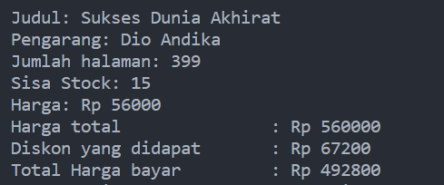
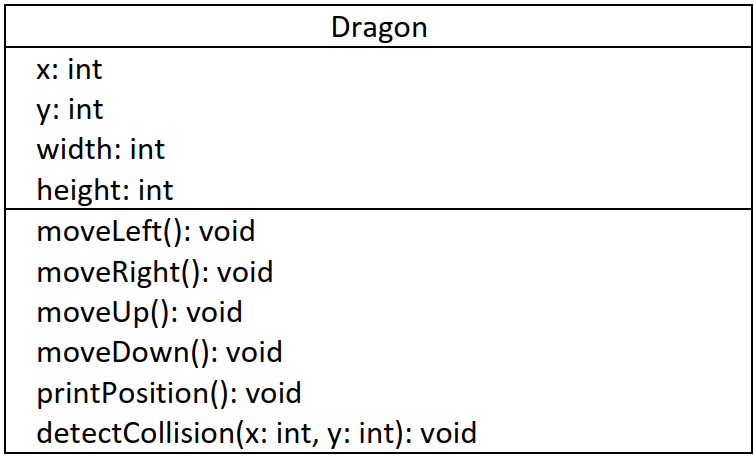

# <p align ="center">Laporan Praktikum Pertemuan 2 Algoritma dan Struktur Data</p>
<br><br><br><br>

<p align="center">
    </p>

<br><br><br><br><br>

<p align = "center"> Nama     : Dio Andika Pradana Mulia Tama </p>
<p align = "center"> NIM      : 2341720098 </p>
<p align = "center"> Prodi    : TEKNIK INFOMATIKA</p>
<p align = "center"> Kelas    : 1B </p>
<p align = "center"> Presensi : 09 </p>

# Jobsheet 2

## Percobaan 1

### 2.1.1 Langkah-langkah Percobaan
```java
    public class Buku {
    String judul, pengarang;
    int halaman, stok, harga;

    void tampilInformasi() {
        System.out.println("Judul: " + judul);
        System.out.println("Pengarang: " + pengarang);
        System.out.println("Jumlah halaman: " + halaman);
        System.out.println("Sisa Stock: " + stok);
        System.out.println("Harga: Rp " + harga);
    }
    void terjual(int jml) {
        stok -= jml;
    }

    void restock(int jml) {
        stok += jml;
    }

    void gantiHarga(int hrg) {
        harga = hrg;
    }
}
```

### 2.1.2 Verifikasi Hasil Percobaan


### 2.1.3 Pertanyaan
1. Sebutkan dua karakteristik class atau object!<br>
Jawab:<br>
    1. Atribut<br>
Atribut merepresentasikan data atau informasi yang dimiliki oleh class atau object. Jika diibaratkan sebuah motor, atributnya bisa berupa merk, warna, tahun produksi, dan spesifikasi mesin. Atribut dapat berupa nilai statis (seperti merk) atau nilai dinamis (seperti kecepatan saat motor bergerak).<br>
    2. Tingkah Laku<br>
Tingkah laku merepresentasikan tindakan atau fungsi yang dapat dilakukan oleh class atau object. Ibarat motor, behaviornya bisa berupa jalan, berhenti, belok, dan klakson. Behavior didefinisikan sebagai method atau fungsi yang dapat dipanggil untuk memanipulasi atribut atau menghasilkan suatu output.<br>
    Class adalah rancangan atau desain dari sebuah object, sedangkan object adalah hasil nyata dari suatu class. Jika objek diibaratkan sebagai rumah, maka class akan memberikan gambaran tentang rancangan atau desain untuk membangun rumah tersebut.

2. Perhatikan class Buku pada Praktikum 1 tersebut, ada berapa atribut yang dimiliki oleh class
Buku? Sebutkan apa saja atributnya!<br>
Ada lima atribut pada class Buku, yang terdiri dari: judul, pengarang, halaman, stok, dan harga.

3. Ada berapa method yang dimiliki oleh class tersebut? Sebutkan apa saja methodnya!<br>
Ada empat method yang dimiliki class tersebut, yang terdiri dari:
    - tampilInformasi() 
    - terjual(jml: int)
    - restock(n: int)
    - gantiHarga()hrg: int.

4. Perhatikan method terjual() yang terdapat di dalam class Buku. Modifikasi isi method tersebut
sehingga proses pengurangan hanya dapat dilakukan jika stok masih ada (lebih besar dari 0)!
```java 
    void terjual(int jml) {
        if (stok > 0) {
            stok -= jml;
        }
    }
```
5. Menurut Anda, mengapa method restock() mempunyai satu parameter berupa bilangan int?
Karena method restock() digunakan untuk menambah stok buku sehingga membutuhkan parameter berupa bilangan bulat yang menunjukkan berapa buku yang ditambah ke dalam stok.

6. Commit dan push kode program ke Github


## Percobaan 2

### 2.2.1 Langkah-langkah Percobaan
```java
public class BukuMain09 {
    public static void main(String[] args) {
        Buku09 bk1 = new Buku09();
        bk1.judul = "Today Ends Tomorrow Comes";
        bk1.pengarang = "Denanda pratiwi";
        bk1.halaman = 198;
        bk1.stok = 13;
        bk1.harga = 71000;

        bk1.tampilInformasi();
        bk1.terjual(5);
        bk1.gantiHarga(60000);
        bk1.tampilInformasi();
    }
}
```
<p>Screenshot push dan commit:</p>


### 2.2.2 Verifikasi Hasil Percobaan
  

### 2.2.3 Pertanyaan
1. Pada class BukuMain, tunjukkan baris kode program yang digunakan untuk proses instansiasi!
Apa nama object yang dihasilkan?
```java 
    Buku09 bk1 = new Buku09();
```
Kode program di atas digunakan untuk proses instansiasi dan <strong>bk1</strong> adalah nama objek yang dihasilkan.

2. Bagaimana cara mengakses atribut dan method dari suatu objek?<br>
Untuk mengakses atribut dan method dari suatu objek dapat menggunakan tanda titik atau notasi dot. Untuk mengakses atribut dari suatu objek, nama objek diketik terlebih dahulu lalu diikuti oleh operator titik (".") dan kemudian diikuti dengan nama atribut yang ingin diakses. Contoh:

```java
        bk1.judul = "Today Ends Tomorrow Comes";
        bk1.pengarang = "Denanda pratiwi";
        bk1.halaman = 198;
        bk1.stok = 13;
        bk1.harga = 71000;
```

Untuk mengakses method dari suatu objek, nama objek diketik terlebih dahulu diikuti oleh operator titik (".") dan kemudian diikuti dengan nama metode yang ingin diakses, lalu tanda kurung (). Jika method memiliki parameter, maka nilai parameter harus dimasukkan dalam tanda kurung. Contoh:

```java
bk1.tampilInformasi();
bk1.terjual(5);
bk1.gantiHarga(60000);
bk1.tampilInformasi();
```

3. Mengapa hasil output pemanggilan method tampilInformasi() pertama dan kedua berbeda?<br>
Karena objek bk1 telah diproses oleh method terjual() dan gantiHarga() sehingga atribut dari objek bk1 mengalami perubahan. Hal ini terjadi Karena posisi method method terjual() dan gantiHarga() berada diantara method tampilInformasi() pertama dan kedua. Mengapa demikian, karena kode pada Java dieksekusi dari atas ke bawah dan dari kiri ke kanan.
```java
    bk1.tampilInformasi();
    bk1.terjual(5);
    bk1.gantiHarga(60000);
    bk1.tampilInformasi();
```

## Percobaan 3

### 2.3.1 Langkah-langkah Percobaan

Class Buku

```java
public class Buku09{
    String judul, pengarang;
    int halaman, stok, harga;

    void tampilInformasi() {
        System.out.println("Judul: " + judul);
        System.out.println("Pengarang: " + pengarang);
        System.out.println("Jumlah halaman: " + halaman);
        System.out.println("Sisa Stock: " + stok);
        System.out.println("Harga: Rp " + harga);
    }
    void terjual(int jml) {
        if (stok > 0) {
            stok -= jml;
        } 
    }

    void restock(int jml) {
        stok += jml;
    }

    void gantiHarga(int hrg) {
        harga = hrg;
    }

    public Buku09() {

    }

    public Buku09(String jud, String pg, int hal, int stok, int har) {
        judul = jud;
        pengarang = pg;
        halaman = hal;
        this.stok = stok;
        harga = har;
    }
}
```
Class Buku Main

```java
public class BukuMain09 {
    public static void main(String[] args) {
        Buku09 bk1 = new Buku09();
        bk1.judul = "Today Ends Tomorrow Comes";
        bk1.pengarang = "Denanda pratiwi";
        bk1.halaman = 198;
        bk1.stok = 13;
        bk1.harga = 71000;

        bk1.tampilInformasi();
        bk1.terjual(5);
        bk1.gantiHarga(60000);
        bk1.tampilInformasi();

        Buku09 bk2 = new Buku09("Self Reward", "Maheera Ayesha", 160, 29, 59000);
        bk2.terjual(11);
        bk2.tampilInformasi();
    }
}
```

<p>Screenshot push dan commit:</p>


### 2.3.2 Verifikasi Hasil Percobaan


### 2.3.3 Pertanyaan
1. Pada class Buku di Percobaan 3, tunjukkan baris kode program yang digunakan untuk
mendeklarasikan konstruktor berparameter!
```java
public Buku09(String jud, String pg, int hal, int stok, int har) {
        judul = jud;
        pengarang = pg;
        halaman = hal;
        this.stok = stok;
        harga = har;
    }
``` 
Kode program di atas merupakan kode yang digunakan untuk mendeklarasikan konstruktor berparameter. Di dalam tanda kurung diberikan parameter dengan didahului tipe datanya.

2. Perhatikan class BukuMain. Apa sebenarnya yang dilakukan pada baris program berikut?
```java
Buku09 bk2 = new Buku09("Self Reward", "Maheera Ayesha", 160, 29, 59000);
``` 
Kode program di atas merupakan proses instansiasi yang menghasilkan objek <strong>bk2<strong> dengan mengisikan parameter dalam tanda kurung. Konstruktor yang digunakan adalah konstruktor berparameter sehingga perlu menambahkan nilai parameter saat menginstansiasi objek. Parameter yang dimasukkan harus urut sesuai dengan deklarasi konstruktor pada class Buku.

3. Hapus konstruktor default pada class Buku, kemudian compile dan run program. Bagaimana
hasilnya? Jelaskan mengapa hasilnya demikian!

Program akan error, hal ini terjadi karena konstruktor defaultnya dihapus sehingga objek bk1 tidak dapat diinstansiasi pada class BukuMain. jika ingin kodenya berjalan maka harus menambah kembali konstruktor default atau sekalian menghapus semua konstruktor (konstruktor berparameter juga harus dihapus) dan tidak mengisikan nilai parameter dalam tanda kurung saat menginstansiasi objek.

4. Setelah melakukan instansiasi object, apakah method di dalam class Buku harus diakses
secara berurutan? Jelaskan alasannya!<br>
Tidak, karena method bersifat fleksibel. Artinya method dapat dipanggil kapan saja dan tidak harus berurutan.

5. Buat object baru dengan nama buku(Namamahasiswa) menggunakan konstruktor
berparameter dari class Buku!<br>
```java
Buku09 bukuDio = new Buku09("Sukses Dunia Akhirat", "Dio Andika", 399, 42, 56000);
bukuDio.terjual(19);
bukuDio.restock(10);
bukuDio.tampilInformasi();
```

6. Commit dan push kode program ke Github


### Latihan Praktikum
1. Pada class Buku yang telah dibuat, tambahkan tiga method yaitu **hitungHargaTotal()**,
**hitungDiskon()**, dan **hitungHargaBayar()** dengan penjelasan sebagai berikut:
    * Method hitungHargaTotal() digunakan untuk     menghitung harga total yang merupakan
    perkalian antara harga dengan jumlah buku yang terjual
    * Method hitungDiskon() digunakan untuk menghitung diskon dengan aturan berikut:
        - Jika harga total lebih dari 150000, maka harga didiskon sebesar 12%
        - Jika harga total antara 75000 sampai 150000, maka harga didiskon sebesar 5%
        - Jika harga total kurang dari 75000, maka harga tidak didiskon
    * Method hitungHargaBayar() digunakan untuk menghitung harga total setelah dikurangi
diskon <br><br>
Class diagram Buku setelah penambahan ketiga method tersebut adalah sebagai berikut.


Kode program penambahan method hitungHargaTotal(), hitungDiskon(), dan hitungHargaBayar():
```java
int hitungHargaTotal() {
    return harga*terjual;
}

int hitungDiskon() {
    int hargaTotal = hitungHargaTotal();
    if (hargaTotal > 150000) {
        return (hargaTotal * 12 / 100) ;
    } else if (hargaTotal <= 150000 && hargaTotal >= 75000) {
        return (hargaTotal * 5 / 100);  
    } else {
        return 0;
     }
}

int hitungHargaBayar() {
    return hitungHargaTotal()-hitungDiskon();
}
```

Kode program pemanggilan method pada objek bukuDio dalam class main:
```java
Buku09 bukuDio = new Buku09("Sukses Dunia Akhirat", "Dio Andika", 399, 20, 56000);
bukuDio.terjual(10);
bukuDio.restock(5);
bukuDio.tampilInformasi();
System.out.println("Harga total               : Rp " + bukuDio.hitungHargaTotal());
System.out.println("Diskon yang didapat       : Rp " + bukuDio.hitungDiskon());
System.out.println("Total Harga bayar         : Rp " + bukuDio.hitungHargaBayar());
```

Output Program<br>


2. Buat program berdasarkan class diagram berikut ini!

Penjelasan dari atribut dan method pada class Dragon tersebut adalah sebagai berikut:
* Atribut x digunakan untuk menyimpan posisi koordinat x (mendatar) dari dragon, sedangkan
atribut y untuk posisi koordinat y (vertikal)
* Atribut width digunakan untuk menyimpan lebar dari area permainan, sedangkan height
untuk menyimpan panjang area
* Method moveLeft() digunakan untuk mengubah posisi dragon ke kiri (koordinat x akan
berkurang 1), sedangkan moveRight() untuk bergerak ke kanan (koordinat x akan bertambah
1). Perlu diperhatikan bahwa koordinat x tidak boleh lebih kecil dari 0 atau lebih besar dari
nilai width. Jika koordinat x < 0 atau x > width maka panggil method detectCollision()
* Method moveUp() digunakan untuk mengubah posisi dragon ke atas (koordinat y akan
berkurang 1), sedangkan moveDown() untuk bergerak ke bawah (koordinat y akan bertambah 1). Perlu diperhatikan bahwa koordinat y tidak boleh lebih kecil dari 0 atau lebih besar dari
nilai height. Jika koordinat y < 0 atau y > height maka panggil method detectCollision()
* Method detectCollision() akan mencetak pesan “Game Over” apabila dragon menyentuh
ujung area permainan.

Kode program class Dragon:
```java
public class Dragon09 {
    int x, y, width, height;
    boolean gameOver;

    public Dragon09(int x, int y, int width, int height) {
        this.x = x;
        this.y = y;
        this.width = width;
        this.height = height;
    }

    void moveLeft() {
        x--;
        if (x < 0 || x > width) {
            detectCollision(x, y);
        } else {
            if (gameOver != true) {
                position();
            } 
        }
    }

    void moveRight() {
        x++;
        if (x < 0 || x > width) {
            detectCollision(x, y);
        } else {
            if (gameOver != true) {
                position();
            } 
        } 
    }

    void moveUp() {
        y--;
        if (y < 0 || y > height) {
            detectCollision(x, y);
        } else {
            if (gameOver != true) {
                position();
            }      
        }
    }

    void moveDown() {
        y++;
        if (y < 0 || y > height) {
            detectCollision(x, y);
        } else {
            if (gameOver != true) {
                position();
            }         
        }
    }

    void detectCollision(int x, int y) {
        System.out.println("Game Over!");
        gameOver = true;
    }

    void position() {
        System.out.println("Position : x = " + x +", y = " + y); 
    }
}
```

Kode program class DragonMain:
```java
public class DragonMain09 {
    public static void main(String[] args) {
        Dragon09 dragon1 = new Dragon09(6, 12, 12, 15);
        dragon1.moveLeft();
        dragon1.moveLeft();
        dragon1.moveDown();
        dragon1.moveUp();
        dragon1.moveDown();
        dragon1.moveDown();
        dragon1.moveDown();
        dragon1.moveRight();
        dragon1.moveDown(); 
        dragon1.moveRight(); //method tidak tereksekusi karena sudah game over
        dragon1.moveUp(); //method tidak tereksekusi karena sudah game over
    }
}
```

Output program:<br>
