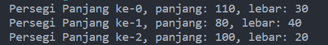
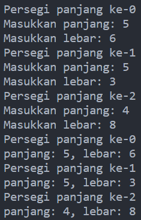
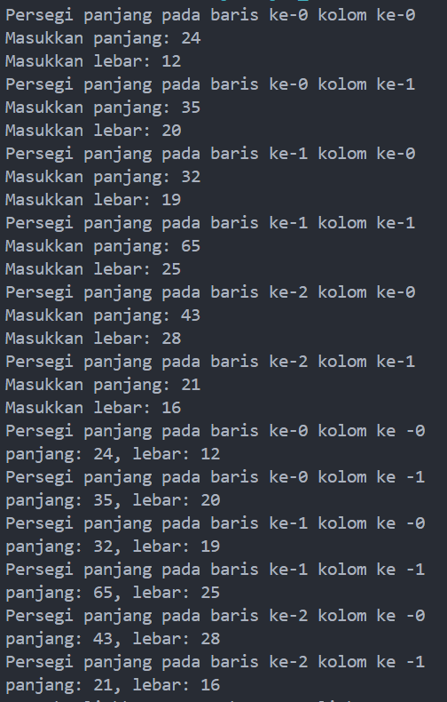
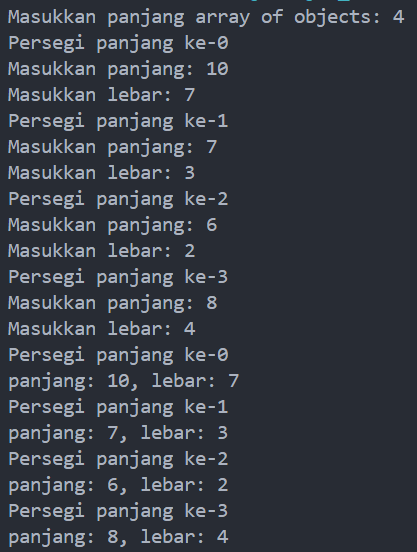
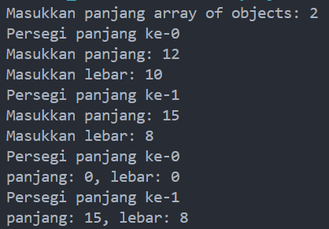
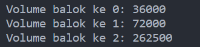
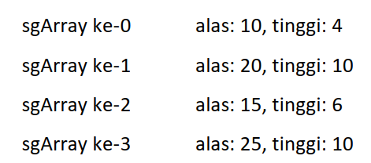
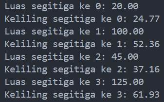
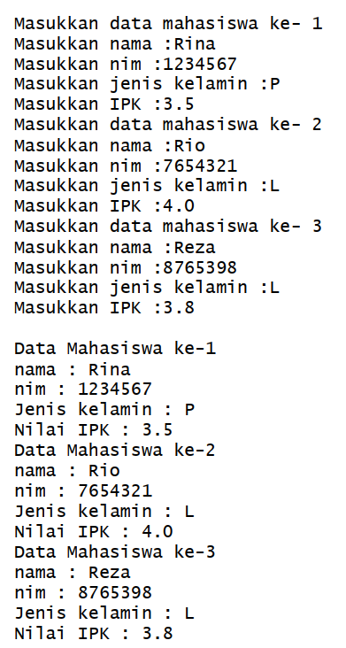

# <p align ="center">Laporan Praktikum Pertemuan 3 Algoritma dan Struktur Data</p>
<br><br><br><br>

<p align="center">
    </p>

<br><br><br><br><br>

<p align = "center"> Nama     : Dio Andika Pradana Mulia Tama </p>
<p align = "center"> NIM      : 2341720098 </p>
<p align = "center"> Prodi    : TEKNIK INFOMATIKA</p>
<p align = "center"> Kelas    : 1B </p>
<p align = "center"> Presensi : 09 </p>

# Jobsheet 3

## 3.2 Percobaan 1: Membuat Array dari Object, Mengisi dan Menampilkan

### 3.2.1 Langkah-langkah Percobaan
Kode program class PersegiPanjang:
```java
public class PersegiPanjang {
    public int panjang;
    public int lebar;
}
```
Kode program class ArrayObjects:
```java
public class ArrayObjects {
    public static void main(String[] args) {
        PersegiPanjang[] ppArray = new PersegiPanjang[3];

        ppArray[0] = new PersegiPanjang();
        ppArray[0].panjang = 110; 
        ppArray[0].lebar = 30; 

        ppArray[1] = new PersegiPanjang();
        ppArray[1].panjang = 80; 
        ppArray[1].lebar = 40; 

        ppArray[2] = new PersegiPanjang();
        ppArray[2].panjang = 100; 
        ppArray[2].lebar = 20; 

        System.out.println("Persegi Panjang ke-0, panjang: " + ppArray[0].panjang + ", lebar: " + ppArray[0].lebar);
        System.out.println("Persegi Panjang ke-1, panjang: " + ppArray[1].panjang + ", lebar: " + ppArray[1].lebar);
        System.out.println("Persegi Panjang ke-2, panjang: " + ppArray[2].panjang + ", lebar: " + ppArray[2].lebar);
    }
}
```

### 3.2.2 Verifikasi Hasil Percobaan


### 3.2.3 Pertanyaan
1. Berdasarkan uji coba 3.2, apakah class yang akan dibuat array of object harus selalu memiliki
atribut dan sekaligus method?Jelaskan!<br>
Jawab: Class yang akan dibuat array of object tidak selalu harus memiliki atribut dan sekaligus method. Pada uji coba 3.2, hanya atribut yang diisi, meskipun begitu program tetap dapat berjalan dan tidak error serta bisa menghasilkan output tanpa memerlukan method tambahan. Begitu pula jika hanya terdapat method saja pada class yang akan dibuat array of object. Meskipun hanya terdapat method saja tanpa atribut, program tetap dapat berjalan dan tidak error serta bisa menghasilkan output tanpa memerlukan atribut. Jadi, tidak harus menambahkan atribut dan sekaligus method dalam class yang akan dibuat array of object. Bisa atribut saja atau method saja.<br>
Dapat disimpulkan bahwa penggunaan atribut dan method pada class yang akan dibuat array of object bergantung kepada kebutuhan. Apakah ingin menambahkan atribut saja atau method saja atau bahkan atribut dan method sekaligus.

2. Apakah class PersegiPanjang memiliki konstruktor?Jika tidak, kenapa dilakukan pemanggilan
konstruktur pada baris program berikut :
```java
    ppArray[1] = new PersegiPanjang();
```
Jawab: Class PersegiPanjang tidak memiliki konstruktor secara eksplisit tetapi class tersebut memiliki konstruktor default secara implisit. Konstruktor default dibuat oleh Java jika tidak ada konstruktor lain yang didefinisikan secara eksplisit dalam sebuah kelas. Pemanggilan konstruktor pada baris program di atas akan menggunakan konstruktor default. Konstruktor default akan membuat objek dalam array ppArray[i] pada class PersegiPanjang dengan nilai default untuk panjang dan lebar (0).

3. Apa yang dimaksud dengan kode berikut ini:
```java
    Persegipanjang[] ppArray = new PersegiPanjang[3];
```
Jawab: Kode di atas mendeklarasikan sebuah array dengan nama ppArray yang dapat menampung 3 objek dari class PersegiPanjang. Pada kode tersebut, hanya deklarasi array yang dilakukan tetapi belum menginisialisasi objek-objeknya.

4. Apa yang dimaksud dengan kode berikut ini:
```java
    ppArray[1] = new PersegiPanjang();
    ppArray[1].panjang = 80; 
    ppArray[1].lebar = 40; 
```
Jawab: Pada baris pertama, objek PersegiPanjang dibuat dan ditempatkan di indeks ke-1 dari array ppArray. Ini merupakan inisialisasi objek kedua dalam array ppArray (karena indeks array dimulai dengan 0).
Pada baris kedua, atribut panjang dari objek yang berada di indeks ke-1 dalam array ppArray diakses dan nilai atribut panjang diatur menjadi 80.
Pada baris ini, atribut lebar dari objek yang berada di indeks ke-1 dalam array ppArray diakses dan nilai atribut lebar diatur menjadi 40.

5. Mengapa class main dan juga class PersegiPanjang dipisahkan pada uji coba 3.2?
Jawab: Pemisahan class main dan class PersegiPanjang dilakukan agar program lebih rapi dan modular. Jika ingin melakukan perubahan pada class PersegiPanjang, maka tidak perlu khawatir akan mempengaruhi class main. Pemisahan class main dan class PersegiPanjang menjadikan kode program menjadi lebih mudah dibaca dan mudah dipahami. Hal ini sesuai dengan prinsip pembagian tugas dalam pemrograman berorientasi objek. Setiap class memiliki tugas yang spesifik dan tidak berlebihan.

## 3.3 Percobaan 2: Menerima Input Isian Array Menggunakan Looping

### 3.3.1 Langkah-langkah Percobaan
Kode program class ArrayObjects:
```java
import java.util.Scanner;

public class ArrayObjects {
    public static void main(String[] args) {
        PersegiPanjang[] ppArray = new PersegiPanjang[3];

        Scanner sc = new Scanner(System.in);

        for (int i = 0; i < 3; i++) {
            ppArray[i] = new PersegiPanjang();
            System.out.println("Persegi panjang ke-" + i);
            System.out.println("Masukkan panjang: ");
            ppArray[i].panjang = sc.nextInt();
            System.out.println("Masukkan lebar: ");
            ppArray[i].lebar = sc.nextInt();
        }

        for (int i = 0; i < 3; i++) {
            System.out.println("Persegi panjang ke-" + i);
            System.out.println("panjang: " + ppArray[i].panjang + ", lebar: " + ppArray[i].lebar);
        }
    }
}
```

### 3.3.2 Verifikasi Hasil Percobaan


### 3.3.3 Pertanyaan
1. Apakah array of object dapat diimplementasikan pada array 2 Dimensi?
Jawab: Ya, array of object dapat diimplementasikan pada array dua dimensi. 

2. Jika jawaban soal no satu iya, berikan contohnya! Jika tidak, jelaskan!
Jawab: Berikut adalah contoh program yang mengimplementasikan array of object pada array 2 Dimensi:
Kode program:
```java
import java.util.Scanner;

public class PersegiPanjang2D {
    public static void main(String[] args) {
        PersegiPanjang[][] ppArray = new PersegiPanjang[3][2];

        Scanner sc = new Scanner(System.in);

        for (int i = 0; i < 3; i++) {
            for (int j= 0; j < 2; j++) {
                ppArray[i][j] = new PersegiPanjang();
                System.out.println("Persegi panjang pada baris ke-" + i + " kolom ke-" + j);
                System.out.print("Masukkan panjang: ");
                ppArray[i][j].panjang = sc.nextInt();
                System.out.print("Masukkan lebar: ");
                ppArray[i][j].lebar = sc.nextInt();
            }          
        }

        for (int i = 0; i < 3; i++) {
            for (int j = 0; j < 2; j++) {
                System.out.println("Persegi panjang pada baris ke-" + i + " kolom ke -" +j);
                System.out.println("panjang: " + ppArray[i][j].panjang + ", lebar: " + ppArray[i][j].lebar);
            }      
        }

        sc.close();
        
    }
}
```
Output program:



3. Jika diketahui terdapat class Persegi yang memiliki atribut sisi bertipe integer, maka kode
dibawah ini akan memunculkan error saat dijalankan. Mengapa?
```java
Persegi[] pgArray = new Persegi[100];
pgArray[5].sisi = 20;
```
Jawab: Kode tersebut akan memunculkan error null pointer exception karena pada index pgArray ke-5 belum dibuat objek Persegi. Baris kode pgArray[5].sisi = 20; akan mengakses elemen array pgArray pada indeks ke-5 dan mengubah nilai atribut sisi menjadi 20. Namun, pada index pgArray ke-5 belum dibuat objek Persegi. Berikut adalah kode yang benar:
```java
Persegi[] pgArray = new Persegi[100];
pgArray[5] = new Persegi(); // Pembuatan objek Persegi pada pgArray index ke-5
pgArray[5].sisi = 20;
```

4. Modifikasi kode program pada praktikum 3.3 agar length array menjadi inputan dengan Scanner!
Jawab:<br>
Modifikasi kode program:
```java
import java.util.Scanner;

public class ArrayObjects {
    public static void main(String[] args) {
        Scanner sc = new Scanner(System.in);

        System.out.print("Masukkan panjang array of objects: ");
        int pjgArray = sc.nextInt();

        PersegiPanjang[] ppArray = new PersegiPanjang[pjgArray];

        for (int i = 0; i < ppArray.length; i++) {
            ppArray[i] = new PersegiPanjang();
            System.out.println("Persegi panjang ke-" + i);
            System.out.print("Masukkan panjang: ");
            ppArray[i].panjang = sc.nextInt();
            System.out.print("Masukkan lebar: ");
            ppArray[i].lebar = sc.nextInt();
        }          
    

        for (int i = 0; i < ppArray.length; i++) {        
            System.out.println("Persegi panjang ke-" + i);
            System.out.println("panjang: " + ppArray[i].panjang + ", lebar: " + ppArray[i].lebar);         
        }

        sc.close();
        
    }
}
```
Output program:<br>


5. Apakah boleh Jika terjadi duplikasi instansiasi array of objek, misalkan saja instansiasi dilakukan pada ppArray[i] sekaligus ppArray[0]?Jelaskan !
Jawab: Boleh saja. Duplikasi instansiasi array of objek tidak menghasilkan error, namun nilai atribut yang disimpan pada objek yang diduplikasi akan hilang. Jika instansiasi dilakukan pada ppArray[i] sekaligus ppArray[0] maka akan terjadi instansiasi pada ppArray[0] setelah pengisian atribut pada ppArray[i] sehingga nilai atribut pada ppArray[0] akan hilang.<br>


## 3.4 Percobaan 3: Penambahan Operasi Matematika di Dalam Method

### 3.4.1 Langkah-langkah Percobaan
Kode program class Balok dalam package ArrayBalok:
```java
package ArrayBalok;

public class Balok {
    public int panjang;
    public int lebar;
    public int tinggi;

    public Balok(int p, int l, int t) {
        panjang = p;
        lebar = l;
        tinggi = t;
    }

    public int hitungVolume() {
        return panjang * lebar * tinggi;
    }
}
```
Kode program class ArrayBalok pada package ArrayBalok:
```java
package ArrayBalok;

public class ArrayBalok {
    public static void main(String[] args) {
        Balok[] blArray = new Balok[3];

        blArray[0] = new Balok(100, 30, 12);
        blArray[1] = new Balok(120, 40, 15);
        blArray[2] = new Balok(210, 50, 25);

        for (int i = 0; i < 3; i++) {
            System.out.println("Volume balok ke " + i + ": " + blArray[i].hitungVolume());
        }
    }
}
```

### 3.4.2 Verifikasi Hasil Percobaan


### 3.4.3 Pertanyaan
1. Dapatkah konstruktor berjumlah lebih dalam satu kelas? Jelaskan dengan contoh!<br>
Jawab: Ya, konstruktor dapat berjumlah lebih dalam satu kelas dengan syarat setiap konstruktor dalam satu kelas memiliki parameter yang berbeda-beda. Berikut contohnya:<br>
```java
    public Buku09() {

    }

    public Buku09(String jud, String pg, int hal, int stok, int har) {
        judul = jud;
        pengarang = pg;
        halaman = hal;
        this.stok = stok;
        harga = har;
    }
```
Pada potongan kode program di atas, terdapat dua konstruktor. Konstruktor pertama (bagian atas) merupakan konstruktor default yang tidak memiliki parameter dan konstruktor kedua (bagian bawah) adalah konstruktor yang memiliki parameter. Konstruktor yang lain pun dapat dibuat dalam class yang sama asalkan parameternya berbeda.

2. Jika diketahui terdapat class Segitiga seperti berikut ini:
```java
public class Segitiga {
    int alas;
    int tinggi;
}
```
Tambahkan konstruktor pada class Segitiga tersebut yang berisi parameter int a, int t
yang masing-masing digunakan untuk mengisikan atribut alas dan tinggi.<br>
Kode program:
```java
public class Segitiga {
    int alas;
    int tinggi;

    public Segitiga(int a, int t) {
        alas = a;
        tinggi = t;
    }
}
```

3. Tambahkan method hitungLuas() dan hitungKeliling() pada class Segitiga
tersebut. **Asumsi segitiga adalah segitiga siku-siku**. *(Hint: Anda dapat menggunakan bantuan
library Math pada Java untuk mengkalkulasi sisi miring)*<br>
Kode program: 
```java
    public double hitungLuas() {
        return 0.5 * alas * tinggi;
    }

    public double hitungkeliling() {
        return alas + tinggi + Math.sqrt(Math.pow(alas, 2) + Math.pow(tinggi, 2));
    }
```

4. Pada fungsi main, buat array Segitiga sgArray yang berisi 4 elemen, isikan masing-masing
atributnya sebagai berikut:

Kode program:

```java
public class ArraySegitiga {
    public static void main(String[] args) {
        Segitiga sgArray[] = new Segitiga[4];

        sgArray[0] = new Segitiga(10, 4);
        sgArray[1] = new Segitiga(20, 10);
        sgArray[2] = new Segitiga(15, 6);
        sgArray[3] = new Segitiga(25, 10);
    }
}
```

5. Kemudian menggunakan looping, cetak luas dan keliling dengan cara memanggil method hitungLuas() dan hitungKeliling().<br>
Kode Program:
```java
public class ArraySegitiga {
    public static void main(String[] args) {
        Segitiga sgArray[] = new Segitiga[4];

        sgArray[0] = new Segitiga(10, 4);
        sgArray[1] = new Segitiga(20, 10);
        sgArray[2] = new Segitiga(15, 6);
        sgArray[3] = new Segitiga(25, 10);

        for (int i = 0; i < sgArray.length; i++) {
            System.out.printf("Luas segitiga ke %d: %.2f \n", i, sgArray[i].hitungLuas());
            System.out.printf("Keliling segitiga ke %d: %.2f \n", i, sgArray[i].hitungkeliling());
        }
    }
}
```
Output program:<br>


## 3.5 Latihan Praktikum

1. Buatlah program yang dapat menghitung luas permukaan dan volume bangun ruang kerucut,
limas segi empat sama sisi, dan bola. Buatlah 3 (tiga) class sesuai dengan jumlah jenis bangun
ruang. Buatlah satu main class untuk membuat array of objects yang menginputkan atributatribut yang ada menggunakan konstruktor semua bangun ruang tersebut. Dengan ketentuan,<br>
    <strong>a. Buat looping untuk menginputkan masing-masing atributnya, kemudian tampilkan
    luas permukaan dan volume dari tiap jenis bangun ruang tersebut.<br>
    b. Pada kerucut, inputan untuk atribut hanya jari-jari dan sisi miring<br>
    c. Pada limas segi empat sama sisi, inputan untuk atribut hanya panjang sisi alas dan
    tinggi limas<br>
    d. Pada bola, inpuntan untuk atribut hanya jari-jari<br></strong>

2. Sebuah kampus membutuhkan program untuk menampilkan informasi mahasiswa berupa nama,
nim, jenis kelamin dan juga IPK mahasiswa. Program dapat menerima input semua informasi
tersebut, kemudian menampilkanya kembali ke user. Implementasikan program tersebut jika
dimisalkan terdapat 3 data mahasiswa yang tersedia. Contoh output program:<br>


3. Modifikasi program Latihan no.2 di atas, sehingga bisa digunakan untuk menghitung rata-rata IPK,
serta menampilkan data mahasiswa dengan IPK terbesar! (gunakan method untuk masing-masing
proses tersebut)