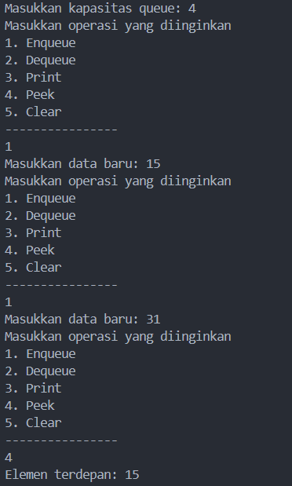
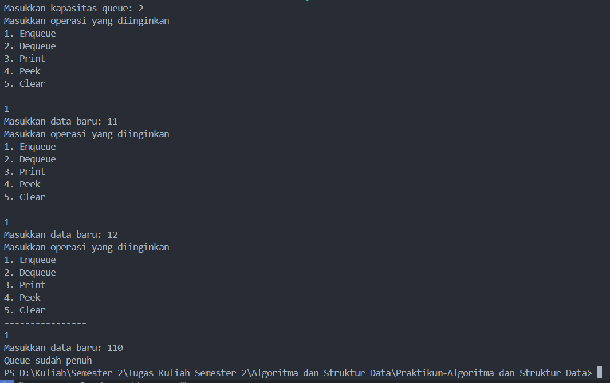
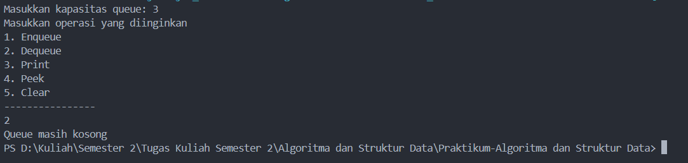
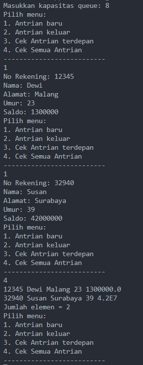
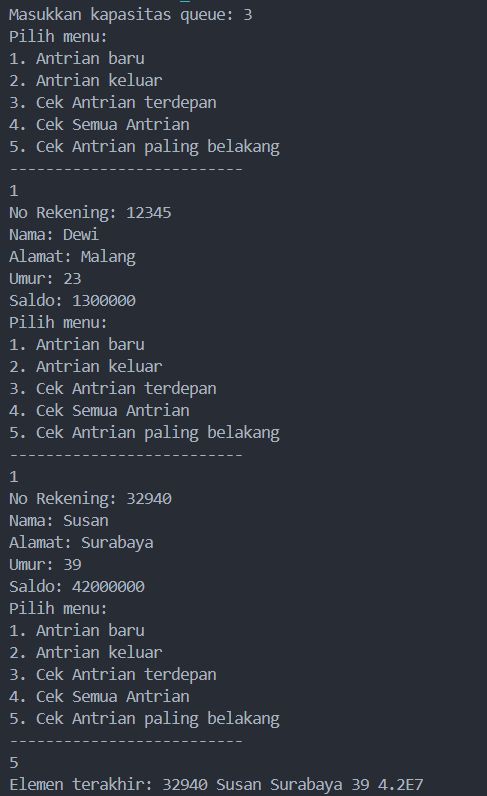
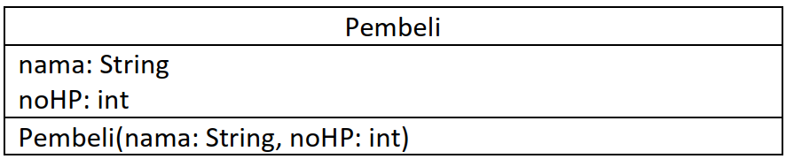
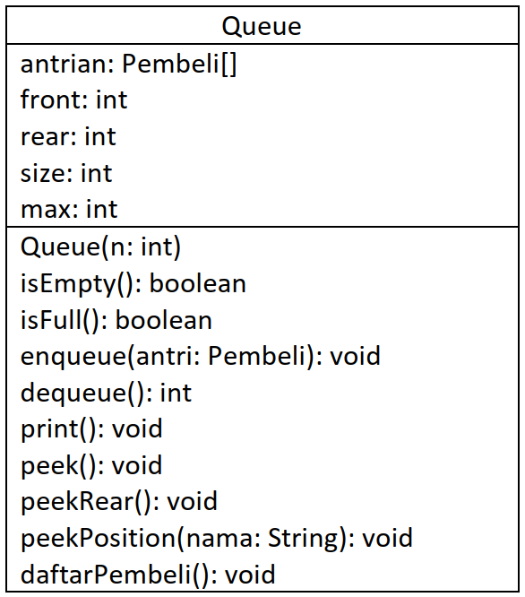

# <p align ="center">Laporan Praktikum Pertemuan 10 Algoritma dan Struktur Data</p>
<br><br><br><br>

<p align="center">
    </p>

<br><br><br><br><br>

<p align = "center"> Nama     : Dio Andika Pradana Mulia Tama </p>
<p align = "center"> NIM      : 2341720098 </p>
<p align = "center"> Prodi    : Teknik Informatika</p>
<p align = "center"> Kelas    : 1B </p>
<p align = "center"> Presensi : 09 </p>

# Jobsheet 10
# Queue

## 10.2 Praktikum 1

### 10.2.1 Langkah-langkah Percobaan
Kode program class Queue:
```java
package Pertemuan10.Praktikum1;

public class Queue {
    int[] data;
    int front, rear, size, max;

    public Queue(int n) {
        max = n;
        data = new int[max];
        front = rear = -1;
        size = 0;
    }

    public boolean IsEmpty() {
        if (size == 0) {
            return true;
        } else {
            return false;
        }
    }

    public boolean IsFull() {
        if (size == max) {
            return true;
        } else {
            return false;   
        }
    }

    public void peek() {
        if (!IsEmpty()) {
            System.out.println("Elemen terdepan: " + data[front]);
        } else {
            System.out.println("Queue masih kosong");   
        }
    }

    public void print() {
        if (IsEmpty()) {
            System.out.println("Queue masiih kosong");
        } else {
            int i = front;
            while (i != rear) {
                System.out.print(data[i] + " ");
                i = (i + 1) % max;  
            }
            System.out.println(data[i] + " ");
            System.out.println("Jumlah elemen = " + size);
        }
    }

    public void clear() {
        if (!IsEmpty()) {
            front = rear = -1;
            size = 0;
            System.out.println("Queue berhasil dikosongkan");
        } else {
            System.out.println("Queue masih kosong");   
        }
    }


    public void Enqueue(int dt) {
        if (IsFull()) {
            System.out.println("Queue sudah penuh");
        } else {
            if (IsEmpty()) {
                front = rear = 0;
            } else {
                if (rear == max - 1) {
                    rear = 0;
                } else {
                    rear++;     
                }
            }
            data[rear] = dt;
            size++;
        }
    }

    public int Dequeue() {
        int dt = 0;
        if (IsEmpty()) {
            System.out.println("Queue masih kosong");
        } else {
            dt = data[front];
            size--;
            if (IsEmpty()) {
                front = rear = -1;
            } else {
                if (front == max - 1) {
                    front = 0;
                } else {
                    front++;
                }
            }
        }
        return dt;
    }
}
```
Kode program class QueueMain:
```java
package Pertemuan10.Praktikum1;
import java.util.Scanner;

public class QueueMain {
    public static void menu() {
        System.out.println("Masukkan operasi yang diinginkan");
        System.out.println("1. Enqueue");
        System.out.println("2. Dequeue");
        System.out.println("3. Print");
        System.out.println("4. Peek");
        System.out.println("5. Clear");
        System.out.println("----------------");
    }

    public static void main(String[] args) {
        Scanner sc = new Scanner(System.in);
        System.out.print("Masukkan kapasitas queue: ");
        int n = sc.nextInt();

        Queue Q = new Queue(n);
        int pilih;

        do {
            menu();
            pilih = sc.nextInt();
            switch (pilih) {
                case 1:
                    System.out.print("Masukkan data baru: ");
                    int dataMasuk = sc.nextInt();
                    Q.Enqueue(dataMasuk);
                    break;
                case 2:
                    int dataKeluar= Q.Dequeue();
                    if (dataKeluar != 0) {
                        System.out.println("Data yang dikeluarkan: " + dataKeluar);
                    }   
                    break;
                case 3:
                    Q.print();
                    break;
                case 4:
                    Q.peek();
                    break;
                case 5:
                    Q.clear();
                    break;
            }
        } while (pilih == 1 || pilih == 2 || pilih == 3 || pilih == 4 || pilih == 5);
    }
}
```

### 10.2.2 Verifikasi Hasil Percobaan


### 10.2.3 Pertanyaan
1. Pada konstruktor, mengapa nilai awal atribut front dan rear bernilai -1, sementara atribut size bernilai 0?
Jawab: Pada awal pembuatan queue, front dan rear bernilai -1 karena tidak menunjuk ke data manapun dan untuk atribut size bernilai 0 karena queue masih kosong.
2. Pada method **Enqueue**, jelaskan maksud dan kegunaan dari potongan kode berikut!
```java
    if (rear == max - 1) {
    rear = 0;
```
Jawab: Potongan kode di atas akan dieksekusi ketika data paling belakang dari queue (rear) berada di indeks terakhir array. Kegunaannya adalah untuk menggeser rear ke indeks 0. Pada saat enqueue, jika rear berada di indeks terakhir, maka rear yang baru akan ditempatkan di indeks ke 0 (jika queue belum penuh). Hal ini dapat dilakukan karena front tidak selalu berada pada indeks ke-0, bisa saja indeks ke-1 atau yang lain karena sebelumnya sudah ada data yang dikeluarkan dari array (dequeue). Oleh karena itu, rear bisa saja menempati indeks 0. 

3. Pada method **Dequeue**, jelaskan maksud dan kegunaan dari potongan kode berikut!
```java
    if (front == max - 1) {
    front = 0;
```
Jawab: Potongan kode di atas akan dieksekusi ketika data paling depan (front) dari queue berada di indeks terakhir array. Kegunaannya adalah untuk menggeser front ke indeks 0. Pada saat dequeue, jika front berada di indeks terakhir, maka front akan bergeser ke indeks 0 (jika queue tidak kosong setelah di ambil datanya). Indeks front bisa lebih besar dari rear karena pada kondisi penuh terdapat penghapusan data sampai front berada di indeks terakhir, kemudian dilakukan penambahan data sehingga menggeser indeks rear.

4. Pada method **print**, mengapa pada proses perulangan variabel i tidak dimulai dari 0 (int i=0), melainkan int i=front?
Jawab: Karena elemen pertama pada queue tidak selalu dimulai dari indeks 0 melainkan dari front. Pada queue, front tidak selalu berada pada indeks ke-0, bisa saja indeks ke-1 atau yang lain karena sebelumnya sudah ada data yang dikeluarkan dari array (dequeue). Oleh karena itu, jika ingin menampilkan semua data yang ada di dalam queue, maka lebih tepat menggunakan front. Jika pada method print, proses perulangan menggunakan variabel i yang dimulai dari 0, maka bisa saja pada indeks ke 0 bukan merupakan front melainkan rear atau datanya kosong (karena sudah didequeue).

5. Perhatikan kembali method **print**, jelaskan maksud dari potongan kode berikut!
```java
    i = (i + 1) % max;
```
Jawab: Potongan kode di atas digunakan untuk memindahkan indeks i ke elemen berikutnya dalam queue secara sirkular. Ini berarti ketika i mencapai indeks maksimum (max), maka akan kembali ke indeks awal (0). Kode program `(i + 1)` berarti menambahkan 1 ke indeks saat ini dan `% max` digunakan untuk menghitung sisa pembagian dari (i + 1) dengan max. Hal ini dilakukan agar ketika mencapai indeks terakhir array, i dapat kembali ke indeks awal (0) untuk melanjutkan perulangan secara sirkular. Jadi operasi modulo digunakan untuk memastikan bahwa perulangan dalam method print dapat kembali lagi ke indeks 0 jika i telah mencapai indeks terakhir array.

6. Tunjukkan potongan kode program yang merupakan queue overflow!
Jawab: Queue overflow merupakan kondisi yang dihasilkan dari mencoba menambahkan elemen ke queue yang sudah penuh. Pada method `Enqueue(int dt)`, kode program yang merupakan queue overflow adalah pada pengecekan kondisi apakah queue sudah penuh. Karena jika queue sudah penuh, maka tidak dapat menambah data lagi. Hal ini sesuai dengan definisi queue overflow.
```java
        if (IsFull()) {
            System.out.println("Queue sudah penuh");
        } 
```
Method IsFull() digunakan untuk mengecek apakah array sudah penuh atau belum. Method IsFull() akan mengembalikan nilai boolean true jika queue sudah penuh dan akan mengembalikan false jika queue belum penuh. Ketika method IsFull() mengembalikan nilai true, maka blok kode if akan dijalankan dan akan mencetak "Queue sudah penuh!" dan tidak melakukan pergeseran rear (karena queue sudah penuh). 

7. Pada saat terjadi queue overflow dan queue underflow, program tersebut tetap dapat berjalan dan hanya menampilkan teks informasi. Lakukan modifikasi program sehingga pada saat terjadi queue overflow dan queue underflow, program dihentikan!
Jawab: Berikut modifikasi kode program sehingga pada saat terjadi queue overflow dan queue underflow, program dihentikan:
```java
    public void Enqueue(int dt) {
        if (IsFull()) {
            System.out.println("Queue sudah penuh");
            System.exit(1);
        }
```
```java
    public int Dequeue() {
        int dt = 0;
        if (IsEmpty()) {
            System.out.println("Queue masih kosong");
            System.exit(1);
        }
```
Modifikasi yang saya lakukan adalah dengan menambahkan `System.exit(1)` pada blok kode if method Enqueue() dan Dequeue(). `System.exit(1)` digunakan untuk mengakhiri program dengan status keluaran yang menunjukkan bahwa terjadi kesalahan atau kondisi abnormal selama eksekusi program. Kesalahannya adalah menambahkan data pada queue yang sudah penuh (queue overflow) atau menghapus data pada queue yang masih kosong (queue underflow).

Output kode program yang telah dimodifikasi:<br>
<br>
Keterangan : Mencoba menambah data ketika queue sudah penuh (queue overflow)
<br>
Keterangan : Mencoba menghapus data ketika queue masih kosong (queue underflow)

## 10.3 Praktikum 2
### 10.3.1 Langkah-langkah Percobaan
Kode Program class Nasabah:
```java
package Pertemuan10.Praktikum2;

public class Nasabah {
    String norek, nama, alamat;
    int umur;
    double saldo;

    Nasabah(String norek, String nama, String alamat, int umur, double saldo) {
        this.norek = norek;
        this.nama = nama;
        this.alamat = alamat;
        this.umur = umur;
        this.saldo = saldo;
    }

    Nasabah() {
        
    }
}
```
Kode Program class QueueNasabah:
```java
package Pertemuan10.Praktikum2;

public class QueueNasabah {
    Nasabah[] data;
    int front, rear, size, max;

    public QueueNasabah(int n) {
        max = n;
        data = new Nasabah[n];
        front = rear = -1;
        size = 0;
    }

    public boolean IsEmpty() {
        if (size == 0) {
            return true;
        } else {
            return false;
        }
    }

    public boolean IsFull() {
        if (size == max) {
            return true;
        } else {
            return false;   
        }
    }

    public void Enqueue(Nasabah dt) {
        if (IsFull()) {
            System.out.println("Queue sudah penuh");
        } else {
            if (IsEmpty()) {
                front = rear = 0;
            } else {
                if (rear == max - 1) {
                    rear = 0;
                } else {
                    rear++;     
                }
            }
            data[rear] = dt;
            size++;
        }
    }

    public Nasabah Dequeue() {
        Nasabah dt = new Nasabah();
        if (IsEmpty()) {
            System.out.println("Queue masih kosong");
        } else {
            dt = data[front];
            size--;
            if (IsEmpty()) {
                front = rear = -1;
            } else {
                if (front == max - 1) {
                    front = 0;
                } else {
                    front++;
                }
            }
        }
        return dt;
    }

    public void clear() {
        if (!IsEmpty()) {
            front = rear = -1;
            size = 0;
            System.out.println("Queue berhasil dikosongkan");
        } else {
            System.out.println("Queue masih kosong");   
        }
    }

    public void peek() {
        if (!IsEmpty()) {
            System.out.println("Elemen terdepan: " + data[front].norek + " " + data[front].nama
            + " " + data[front].alamat + " " + data[front].umur + " " + data[front].saldo);
        } else {
            System.out.println("Queue masih kosong");   
        }
    }

    public void print() {
        if (IsEmpty()) {
            System.out.println("Queue masih kosong");
        } else {
            int i = front;
            while (i != rear) {
                System.out.println(data[i].norek + " " + data[i].nama
                        + " " + data[i].alamat + " " + data[i].umur + " " + data[i].saldo);
                i = (i + 1) % max;  
            }
            System.out.println(data[i].norek + " " + data[i].nama
                        + " " + data[i].alamat + " " + data[i].umur + " " + data[i].saldo);
            System.out.println("Jumlah elemen = " + size);
        }
    }
}
```
Kode Program class QueueMain:
```java
package Pertemuan10.Praktikum2;
import java.util.Scanner;

public class QueueMain {
    public static void menu() {
        System.out.println("Pilih menu: ");
        System.out.println("1. Antrian baru");
        System.out.println("2. Antrian keluar");
        System.out.println("3. Cek Antrian terdepan");
        System.out.println("4. Cek Semua Antrian");
        System.out.println("--------------------------");
    }
    public static void main(String[] args) {
        Scanner sc = new Scanner(System.in);
        Scanner s = new Scanner(System.in);

        System.out.print("Masukkan kapasitas queue: ");
        int jumlah = sc.nextInt();
        QueueNasabah antri = new QueueNasabah(jumlah);

        int pilih;

        do {
            menu();
            pilih = sc.nextInt();
            switch (pilih) {
                case 1:
                    System.out.print("No Rekening: ");
                    String norek = s.nextLine();
                    System.out.print("Nama: ");
                    String nama = s.nextLine();
                    System.out.print("Alamat: ");
                    String alamat = s.nextLine();
                    System.out.print("Umur: ");
                    int umur = sc.nextInt();
                    System.out.print("Saldo: ");
                    double saldo = sc.nextDouble();
                    Nasabah nb = new Nasabah(norek, nama, alamat, umur, saldo);
                    antri.Enqueue(nb);
                    break;
                case 2:
                    Nasabah data = antri.Dequeue();
                    if (!"".equals(data.norek) && !"".equals(data.nama) && !"".equals(data.alamat) 
                            && data.umur != 0 && data.saldo != 0) {
                        System.out.println("Antrian yang keluar: " + data.norek + " " + data.nama + " "
                                + data.alamat + " " + data.umur + " " + data.saldo);
                        break;
                    }
                case 3:
                    antri.peek();
                    break;
                case 4:
                    antri.print();
                    break;
            }
        } while (pilih == 1 || pilih == 2 || pilih == 3 || pilih == 4);
    }
}
```

### 10.3.2 Verifikasi Hasil Percobaan


### 10.3.3 Pertanyaan
1. Pada class QueueMain, jelaskan fungsi IF pada potongan kode program berikut!
```java
                    if (!"".equals(data.norek) && !"".equals(data.nama) && !"".equals(data.alamat) 
                            && data.umur != 0 && data.saldo != 0) {
                        System.out.println("Antrian yang keluar: " + data.norek + " " + data.nama + " "
                                + data.alamat + " " + data.umur + " " + data.saldo);
                        break;
                    }
```
Jawab: Fungsi if pada kotongan kode program di atas adalah untuk memastikan nasabah yang dikeluarkan dari queue datanya lengkap dan valid (tidak ada yang kosong). Jika kelima kondisi if terpenuhi semuanya (data nomor rekening, nama, alamat tidak kosong dan umur serta saldo tidak nol), maka data nasabah valid dan akan dicetak ke layar.

2. Lakukan modifikasi program dengan menambahkan method baru bernama **peekRear** pada class Queue yang digunakan untuk mengecek antrian yang berada di posisi belakang! Tambahkan pula daftar menu **5. Cek Antrian paling belakang** pada class **QueueMain** sehingga method **peekRear** dapat dipanggil!
Jawab: Berikut modifikasi yang saya lakukan:
- Menambahkan method peekRear() pada class QueueNasabah
```java
    public void peekRear() {
        if (!IsEmpty()) {
            System.out.println("Elemen terakhir: " + data[rear].norek + " " + data[rear].nama
            + " " + data[rear].alamat + " " + data[rear].umur + " " + data[rear].saldo);
        } else {
            System.out.println("Queue masih kosong");   
        }
    }
```
- Menambahkan menu 5. Cek Antrian paling belakang pada class QueueMain
    - Modifikasi pada fungsi menu():
        ```java
        public static void menu() {
                System.out.println("Pilih menu: ");
                System.out.println("1. Antrian baru");
                System.out.println("2. Antrian keluar");
                System.out.println("3. Cek Antrian terdepan");
                System.out.println("4. Cek Semua Antrian");
                System.out.println("5. Cek Antrian paling belakang");//Modifikasi pada fungsi menu()
                System.out.println("--------------------------");
            }
        ```
    - Modifikasi pada fungsi main():
        ```java
                        //Existing code
                        case 5:
                            antri.peekRear();
                            break;
                        //Existing kode
        ```
- Output kode program setelah dimodifikasi:<br>


## 10.4 Tugas
1. Buatlah program antrian untuk mengilustasikan pesanan disebuah warung. Ketika seorang pembeli akan mengantri, maka dia harus mendaftarkan nama, dan nomor HP seperti yang digambarkan pada Class diagram berikut:
<br>
Class diagram Queue digambarkan sebagai berikut:<br>

Keterangan:

- Method create(), isEmpty(), isFull(), enqueue(), dequeue() dan print(), kegunaannya sama seperti yang telah dibuat pada Praktikum
- Method peek(): digunakan untuk menampilkan data Pembeli yang berada di posisi antrian paling depan
- Method peekRear(): digunakan untuk menampilkan data Pembeli yang berada di posisi antrian paling belakang
- Method peekPosition(): digunakan untuk menampilkan seorang pembeli (berdasarkan nama) posisi antrian ke berapa
- Method daftarPembeli(): digunakan untuk menampilkan data seluruh pembeli