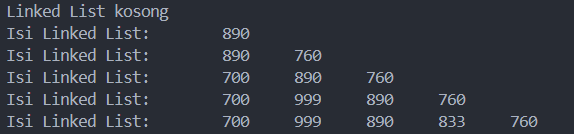
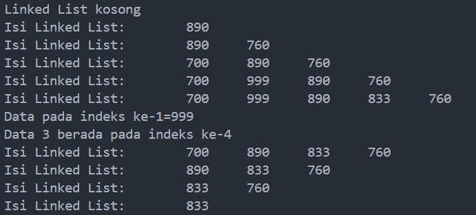
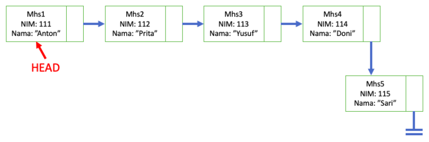
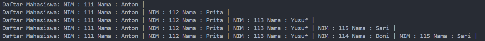

# <p align ="center">Laporan Praktikum Pertemuan 11 Algoritma dan Struktur Data</p>
<br><br><br><br>

<p align="center">
    </p>

<br><br><br><br><br>

<p align = "center"> Nama     : Dio Andika Pradana Mulia Tama </p>
<p align = "center"> NIM      : 2341720098 </p>
<p align = "center"> Prodi    : Teknik Informatika</p>
<p align = "center"> Kelas    : 1B </p>
<p align = "center"> Presensi : 09 </p>

# Jobsheet 11
# Linked List

## 2. Praktikum

## 2.1 Pembuatan Single Linked List
Kode program class Node:
```java
package Pertemuan11.minggu11;

public class Node {
    int data;
    Node next;

    Node(int nilai, Node berikutnya) {
        data = nilai;
        next = berikutnya;
    }
}
```

Kode program class SingleLinkedList:
```java
package Pertemuan11.minggu11;

public class SingleLinkedList {
    Node head, tail;

    boolean isEmpty() {
        return head == null;
    }

    void print() {
        if (isEmpty()) {
            System.out.println("Linked List kosong");
        } else {
            Node tmp = head;
            System.out.print("Isi Linked List: \t");
            while (tmp != null) {
                System.out.print(tmp.data + "\t");
                tmp = tmp.next;
            }
            System.out.println("");
        }
    }

    void addFirst(int input) {
        Node ndInput = new Node(input, null);
        if (isEmpty()) {
            head = ndInput;
            tail = ndInput;
        } else {
            ndInput.next = head;
            head = ndInput;
        }
    }

    void addLast(int input) {
        Node ndInput = new Node(input, null);
        if (isEmpty()) {
            head = ndInput;
            tail = ndInput;
        } else {
            tail.next = ndInput;
            tail = ndInput;
        }
    }

    void insertAfter(int key, int input) {
        Node ndInput = new Node(input, null);
        Node temp = head;
        do {
            if (temp.data == key) {
                ndInput.next = temp.next;
                temp.next = ndInput;
                if (ndInput.next != null) {
                    tail = ndInput;
                    break;
                }
            }
            temp = temp.next;
        } while (temp != null);
    }

    void insertAt(int index, int input) {
        if (index < 0) {
            System.out.println("Perbaiki logikanya!"
                    + "kalau indeksnya -1 bagaimana???");
        } else if (index == 0) {
            addFirst(input);
        } else {
            Node temp = head;
            for (int i = 0; i < index - 1; i++) {
                temp = temp.next;
            }
            temp.next = new Node(input, temp.next);
            if (temp.next.next == null) {
                tail = temp.next;
            }
        }
    }
}
```

Kode program class SLLMain:
```java
package Pertemuan11.minggu11;

public class SLLMain {
    public static void main(String[] args) {
        SingleLinkedList singLL = new SingleLinkedList();
        singLL.print();
        singLL.addFirst(890);
        singLL.print();
        singLL.addLast(760);
        singLL.print();
        singLL.addFirst(700);
        singLL.print();
        singLL.insertAfter(700, 999);
        singLL.print();
        singLL.insertAt(3, 833);
        singLL.print();
    }
}
```

### 2.1.1 Verifikasi Hasil Percobaan


### 2.1.2 Pertanyaan
1. Mengapa hasil compile kode program di baris pertama menghasilkan “Linked List Kosong”?
Jawab: Karena belum ada data yang ditambahkan ke dalam linked list sehingga linked list masih tetap kosong dan tidak bisa menampilkan data apapun.

2. Jelaskan kegunaan variable temp secara umum pada setiap method!
Jawab: Kegunaan variabel temp adalah untuk melakukan perpindahan dari head sampai lokasi node yang diinginkan (bisa tail atau node tertentu).Proses perpindahan ini disebut juga proses traverse yaitu proses melakukan kunjungan pada setiap node tepat satu kali. Dengan melakukan kunjungan secara lengkap, maka akan didapatkan urutan
informasi secara linier yang tersimpan dalam Linked List. Proses ini tidak merubah referensi dari head karena menggunakan variabel temp untuk melakukan traverse.

3. Perhatikan class SingleLinkedList, pada method insertAt Jelaskan kegunaan kode berikut
```java
    if (temp.next.next == null) tail = temp.next;
```
Jawab: Kode di atas akan mengecek apakah `temp.next.next == null`, jika iya, maka `temp.next` akan dijadikan sebagai tail yang mana `temp.next` ini adalah node baru yang disisipkan ke dalam linked list. Jadi, dapat disimpulkan bahwa blok kode di atas berfungsi untuk mengecek apakah node baru yang disisipkan berada di akhir linked list sehingga dapat memperbarui pointer tail dengan benar.

## 2.2 Modifikasi Elemen pada Single Linked List

### 2.2.1 Langkah-langkah Percobaan
Kode program penambahan methods pada class SingelLinkedList:
```java
    int getData(int index) {
        Node tmp = head;
        for (int i = 0; i < index - 1; i++) {
            tmp = tmp.next; 
        }
        return tmp.next.data;
    }

    int indexOf(int key) {
        Node tmp = head;
        int index = 0;
        while (tmp != null && tmp.data != key) {
            tmp = tmp.next;
            index++;
        }
        if (tmp == null) {
            return -1;
        } else {
            return index;
        }
    }

    void removeFirst() {
        if (isEmpty()) {
            System.out.println("linked list masih kosong,"
                    + "tidak dapat dihapus");
        } else if (head == tail) {
            head = tail = null;
        } else {
            head = head.next;
        }
    }

    void removeLast() {
        if (isEmpty()) {
            System.out.println("linked list masih kosong,"
                    + "tidak dapat dihapus");
        } else if (head == tail) {
            head = tail = null;
        } else {
            Node temp = head;
            while (temp.next != null && temp.next.next != null) {
                temp = temp.next;
            } 
            temp.next = null;
            tail = temp;
        }
    }

    void remove(int key) {
        if (isEmpty()) {
            System.out.println("linked list masih kosong,"
                    + "tidak dapat dihapus");
        } else {
            Node temp = head;
            while (temp != null) {
                if (temp.data == key && temp == head) {
                    removeFirst();
                    break;
                } else if (temp.next.data == key) {
                    temp.next = temp.next.next;
                    if (temp.next == null) {
                        tail = temp;
                    }
                    break;
                }
                temp = temp.next;
            }
        }
    }

    public void removeAt(int index) {
        if (index == 0) {
            removeFirst();
        } else {
            Node temp = head;
            for (int i = 0; i < index - 1; i++) {
                temp = temp.next;   
            }
            temp.next = temp.next.next;
            if (temp.next == null) {
                tail = temp;
            }
        }
    }
```

Kode program class SLLMain:
```java
package Pertemuan11.minggu11;

public class SLLMain {
    public static void main(String[] args) {
        SingleLinkedList singLL = new SingleLinkedList();
        singLL.print();
        singLL.addFirst(890);
        singLL.print();
        singLL.addLast(760);
        singLL.print();
        singLL.addFirst(700);
        singLL.print();
        singLL.insertAfter(700, 999);
        singLL.print();
        singLL.insertAt(3, 833);
        singLL.print();

        System.out.println("Data pada indeks ke-1=" + singLL.getData(1));
        System.out.println("Data 3 berada pada indeks ke-" + singLL.indexOf(760));

        singLL.remove(999);
        singLL.print();
        singLL.removeAt(0);
        singLL.print();
        singLL.removeFirst();
        singLL.print();
        singLL.removeLast();
        singLL.print();
    }
}
```

### 2.2.2 Verifikasi Hasil Percobaan


### 2.2.3 Pertanyaan
1. Mengapa digunakan keyword break pada fungsi remove? Jelaskan!
Jawab: Keyword break pada fungsi remove digunakan untuk keluar dari perulangan while saat kondisi tertentu terpenuhi yaitu ketika kondisi if pada loop while `(temp.data == key && temp == head)` terpenuhi atau kondisi else if pada loop while `(temp.next.data == key)` terpenuhi. Jadi, break digunakan untuk menghindari iterasi perulangan yang berlebihan setelah kondisi yang diinginkan telah terpenuhi.

2. Jelaskan kegunaan kode dibawah pada method remove
```java
        else if (temp.next.data == key) {
            temp.next = temp.next.next;
```
Jawab: Kode di atas digunakan untuk menghapus node yang datanya sama dengan key. Jika data pada `temp.next` (node setelah temp) sama dengan `key`, maka referensi `temp.next` diganti dengan `temp.next.next`, sehingga node `temp.next` akan terhapus dari linked list dan diganti dengan `temp.next.next`. Jadi, kode di atas berfungsi untuk melewati node yang ingin dihapus dan menghubungkan `temp` langsung ke node setelahnya.

## 3. Tugas
1. Implementasikan ilustrasi Linked List Berikut. Gunakan 4 macam penambahan data yang telah dipelajari sebelumnya untuk menginputkan data.


Kode program class Mahasiswa:
```java
package Pertemuan11.minggu11;

public class Mahasiswa {
    int NIM;
    String nama;
    Mahasiswa next;

    Mahasiswa(int nim, String nama, Mahasiswa berikutnya) {
        NIM = nim;
        this.nama = nama;
        next = berikutnya;
    }
}
```

Kode program MhsSLL:
```java
package Pertemuan11.minggu11;

public class MhsSLL {
    Mahasiswa head, tail;

    boolean isEmpty() {
        return head == null;
    }

    void print() {
        if (isEmpty()) {
            System.out.println("Daftar mahasiswa kosong");
        } else {
            Mahasiswa tmp = head;
            System.out.print("Daftar Mahasiswa: ");
            while (tmp != null) {
                System.out.print("NIM : " + tmp.NIM + " Nama : " + tmp.nama + " | ");
                tmp = tmp.next;
            }
            System.out.println("");
        }
    }

    void addFirst(int nim, String nama) {
        Mahasiswa ndInput = new Mahasiswa(nim, nama, null);
        if (isEmpty()) {
            head = ndInput;
            tail = ndInput;
        } else {
            ndInput.next = head;
            head = ndInput;
        }
    }

    void addLast(int nim, String nama) {
        Mahasiswa ndInput = new Mahasiswa(nim, nama, null);
        if (isEmpty()) {
            head = ndInput;
            tail = ndInput;
        } else {
            tail.next = ndInput;
            tail = ndInput;
        }
    }

    void insertAfter(int key, int nim, String nama) {
        Mahasiswa ndInput = new Mahasiswa(nim, nama, null);
        Mahasiswa temp = head;
        do {
            if (temp.NIM == key) {
                ndInput.next = temp.next;
                temp.next = ndInput;
                if (ndInput.next != null) {
                    tail = ndInput;
                    break;
                }
            }
            temp = temp.next;
        } while (temp != null);
    }

    void insertAt(int index, int nim, String nama) {
        if (index < 0) {
            System.out.println("Indeks tidak bisa negatif!");
        } else if (index == 0) {
            addFirst(nim, nama);
        } else {
            Mahasiswa temp = head;
            for (int i = 0; i < index - 1; i++) {
                temp = temp.next;
            }
            temp.next = new Mahasiswa(nim, nama, temp.next);
            if (temp.next.next == null) {
                tail = temp.next;
            }
        }
    }
}
```

Kode program MhsSLLMain:
```java
package Pertemuan11.minggu11;

public class MhsSLLMain {
    public static void main(String[] args) {
        MhsSLL mhsLL = new MhsSLL();
        mhsLL.addFirst(111, "Anton");
        mhsLL.print();   
        mhsLL.insertAfter(111, 112, "Prita");
        mhsLL.print();
        mhsLL.insertAt(2, 113, "Yusuf");
        mhsLL.print();
        mhsLL.addLast(115, "Sari");
        mhsLL.print();
        mhsLL.insertAfter(113, 114, "Doni");
        mhsLL.print();
    }
}
```
Screenshot hasil program:


2. Buatlah implementasi program antrian layanan unit kemahasiswaan sesuai dengan kondisi yang ditunjukkan pada soal nomor 1! Ketentuan
    - Implementasi antrian menggunakan Queue berbasis Linked List!
    - Program merupakan proyek baru, bukan modifikasi dari soal nomor 1!
Kode program class Mahasiswa:
```java
package Pertemuan11.minggu11;

public class Mahasiswa {
    int NIM;
    String nama;
    Mahasiswa next;

    Mahasiswa(int nim, String nama, Mahasiswa berikutnya) {
        NIM = nim;
        this.nama = nama;
        next = berikutnya;
    }

    //Menambahkan konstruktor default
    Mahasiswa() {
        
    }
}
```

Kode program class MhsQueue:
```java
package Pertemuan11.minggu11;

import Pertemuan10.Tugas.Pembeli;

public class MhsQueue {
    Mahasiswa head, tail;

    boolean isEmpty() {
        return head == null;
    }

    void addFirst(int nim, String nama) {
        Mahasiswa ndInput = new Mahasiswa(nim, nama, null);
        if (isEmpty()) {
            head = ndInput;
            tail = ndInput;
        } else {
            ndInput.next = head;
            head = ndInput;
        }
    }

    void addLast(int nim, String nama) {
        Mahasiswa ndInput = new Mahasiswa(nim, nama, null);
        if (isEmpty()) {
            head = ndInput;
            tail = ndInput;
        } else {
            tail.next = ndInput;
            tail = ndInput;
        }
    }

    void print() {
        if (isEmpty()) {
            System.out.println("Antrian masih kosong!");
        } else {
            Mahasiswa tmp = head;
            System.out.println("Cek semua antrian: ");
            while (tmp != null) {
                System.out.println("NIM : " + tmp.NIM + ", Nama : " + tmp.nama);
                tmp = tmp.next;
            }
            System.out.println("");
        }
    }

    void Enqueue(int nim, String nama) {
        if (isEmpty()) {
            addFirst(nim, nama);
        } else {
            addLast(nim, nama);
        }
    }

    void peek() {
        if (isEmpty()) {
            System.out.println("Antrian masih kosong!");   
        } else {
            System.out.println("Elemen terdepan:\nNama : " + head.nama + ", NIM :" + head.NIM);
        }
    }

    void peekRear() {
        if (isEmpty()) {
            System.out.println("Antrian masih kosong!");   
        } else {
            System.out.println("Elemen terakhir:\nNama : " + tail.nama + ", NIM :" + tail.NIM);
        }
    }

    Mahasiswa Dequeue() {
        if (isEmpty()) {
            System.out.println("Antrian masih kosong, tidak dapat dihapus!");
            return null;
        } else if (head == tail) {
            Mahasiswa eq = head;
            head = tail = null;
            return eq;
        } else {
            Mahasiswa eq = head;
            head = head.next;
            return eq;
        }      
    }
}
```

Kode program class MhsQueueMain:
```java
package Pertemuan11.minggu11;
import java.util.Scanner;

import Pertemuan10.Praktikum2.Nasabah;

public class MhsQueueMain {
    public static void menu() {
        System.out.println("Pilih menu: ");
        System.out.println("1. Antrian baru");
        System.out.println("2. Antrian keluar");
        System.out.println("3. Cek Antrian terdepan");
        System.out.println("4. Cek Antrian paling belakang");
        System.out.println("5. Cek Semua Antrian");
        System.out.println("6. Keluar");
        System.out.println("--------------------------");
    }
    public static void main(String[] args) {
        Scanner sc = new Scanner(System.in);
        Scanner s = new Scanner(System.in);

        MhsQueue mhsAntri = new MhsQueue();

        int pilih;

        do {
            menu();
            pilih = sc.nextInt();
            switch (pilih) {
                case 1:
                    System.out.print("Nama: ");
                    String nama = s.nextLine();
                    System.out.print("NIM: ");
                    int nim = sc.nextInt();
                    mhsAntri.Enqueue(nim, nama);
                    break;
                case 2:
                    Mahasiswa data = mhsAntri.Dequeue();
                    if (data != null) {
                        System.out.println("Antrian yang keluar:\nNIM : " + data.NIM + ", Nama : " + data.nama);
                    } 
                    break;
                case 3:
                    mhsAntri.peek();
                    break;
                case 4:
                    mhsAntri.peekRear();
                    break;
                case 5:
                    mhsAntri.print();
                    break;
                case 6:
                    System.exit(0);
                    break;
                default:
                    System.out.println("Menu yang Anda masukkan tidak valid!");
                    break;
            }
        } while (pilih == 1 || pilih == 2 || pilih == 3 || pilih == 4 || pilih == 5);
    }
}
```

Hasil program:
```
Pilih menu: 
1. Antrian baru
2. Antrian keluar
3. Cek Antrian terdepan
4. Cek Antrian paling belakang
5. Cek Semua Antrian
6. Keluar
--------------------------
2
Antrian masih kosong, tidak dapat dihapus!
Pilih menu: 
1. Antrian baru
2. Antrian keluar
3. Cek Antrian terdepan
4. Cek Antrian paling belakang
5. Cek Semua Antrian
6. Keluar
--------------------------
1
Nama: Andi
NIM: 123
Pilih menu: 
1. Antrian baru
2. Antrian keluar
3. Cek Antrian terdepan
4. Cek Antrian paling belakang
5. Cek Semua Antrian
6. Keluar
--------------------------
1
Nama: Roy
NIM: 135
Pilih menu:
1. Antrian baru
2. Antrian keluar
3. Cek Antrian terdepan
4. Cek Antrian paling belakang
5. Cek Semua Antrian
6. Keluar
--------------------------
1
Nama: Taufik
NIM: 235
Pilih menu:
1. Antrian baru
2. Antrian keluar
3. Cek Antrian terdepan
4. Cek Antrian paling belakang
5. Cek Semua Antrian
6. Keluar
--------------------------
5
Cek semua antrian:
NIM : 123, Nama : Andi
NIM : 135, Nama : Roy
NIM : 235, Nama : Taufik

Pilih menu:
1. Antrian baru
2. Antrian keluar
3. Cek Antrian terdepan
4. Cek Antrian paling belakang
5. Cek Semua Antrian
6. Keluar
--------------------------
2
Antrian yang keluar:
NIM : 123, Nama : Andi
Pilih menu:
1. Antrian baru
2. Antrian keluar
3. Cek Antrian terdepan
4. Cek Antrian paling belakang
5. Cek Semua Antrian
6. Keluar
--------------------------
3
Elemen terdepan:
Nama : Roy, NIM :135
Pilih menu:
1. Antrian baru
2. Antrian keluar
3. Cek Antrian terdepan
4. Cek Antrian paling belakang
5. Cek Semua Antrian
6. Keluar
--------------------------
1
Nama: Hana
NIM: 119
Pilih menu:
1. Antrian baru
2. Antrian keluar
3. Cek Antrian terdepan
4. Cek Antrian paling belakang
5. Cek Semua Antrian
6. Keluar
--------------------------
5
Cek semua antrian:
NIM : 135, Nama : Roy
NIM : 235, Nama : Taufik
NIM : 119, Nama : Hana

Pilih menu:
1. Antrian baru
2. Antrian keluar
3. Cek Antrian terdepan
4. Cek Antrian paling belakang
5. Cek Semua Antrian
6. Keluar
--------------------------
4
Elemen terakhir:
Nama : Hana, NIM :119
Pilih menu:
1. Antrian baru
2. Antrian keluar
3. Cek Antrian terdepan
4. Cek Antrian paling belakang
5. Cek Semua Antrian
6. Keluar
--------------------------
1
Nama: Joni
NIM: 342
Pilih menu:
1. Antrian baru
2. Antrian keluar
3. Cek Antrian terdepan
4. Cek Antrian paling belakang
5. Cek Semua Antrian
6. Keluar
--------------------------
5
Cek semua antrian:
NIM : 135, Nama : Roy
NIM : 235, Nama : Taufik
NIM : 119, Nama : Hana
NIM : 342, Nama : Joni

Pilih menu:
1. Antrian baru
2. Antrian keluar
3. Cek Antrian terdepan
4. Cek Antrian paling belakang
5. Cek Semua Antrian
6. Keluar
--------------------------
2
Antrian yang keluar:
NIM : 135, Nama : Roy
Pilih menu:
1. Antrian baru
2. Antrian keluar
3. Cek Antrian terdepan
4. Cek Antrian paling belakang
5. Cek Semua Antrian
6. Keluar
--------------------------
3
Elemen terdepan:
Nama : Taufik, NIM :235
Pilih menu:
1. Antrian baru
2. Antrian keluar
3. Cek Antrian terdepan
4. Cek Antrian paling belakang
5. Cek Semua Antrian
6. Keluar
--------------------------
6
PS D:\Kuliah\Semester 2\Tugas Kuliah Semester 2\Algoritma dan Struktur Data\Praktikum-Algoritma dan Struktur Data> 
```