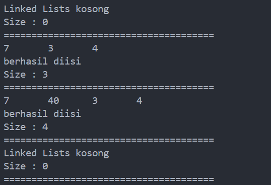
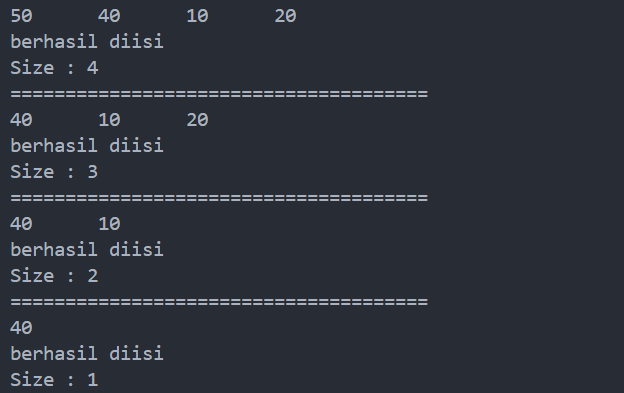
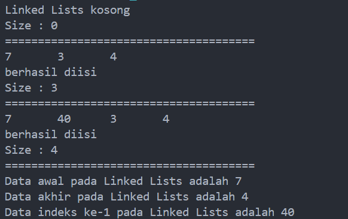
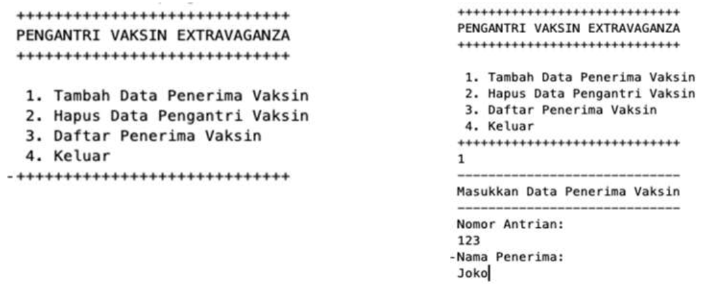
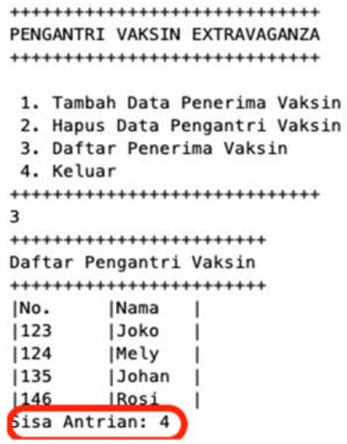
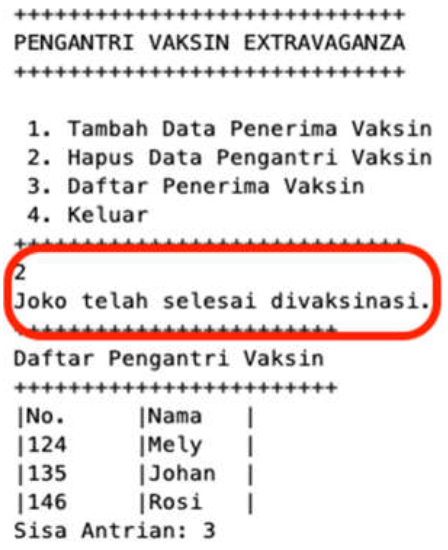
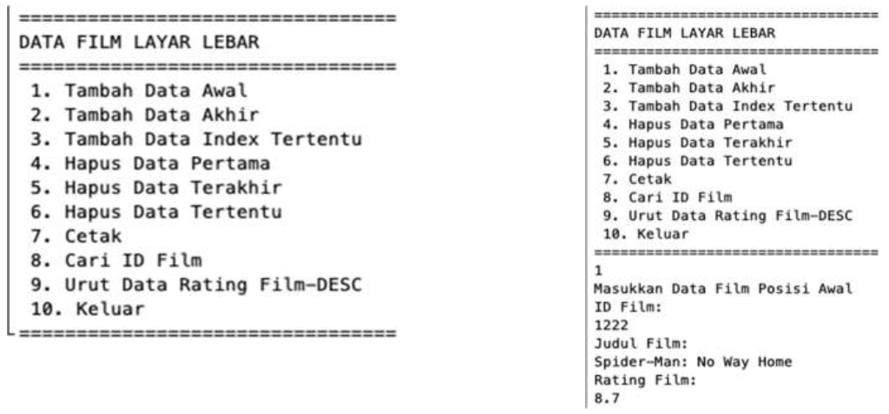
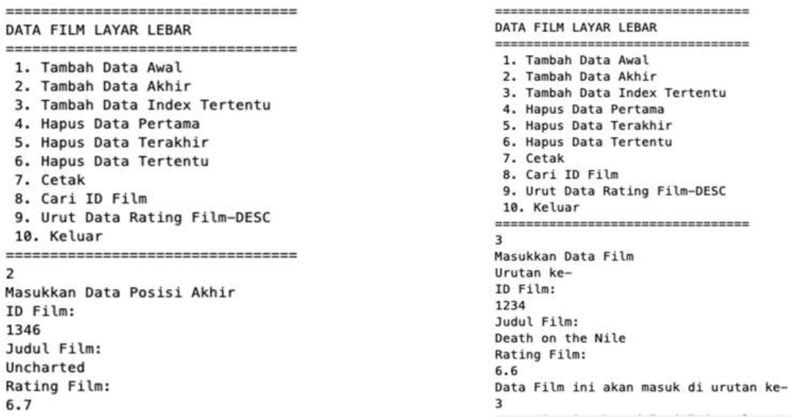
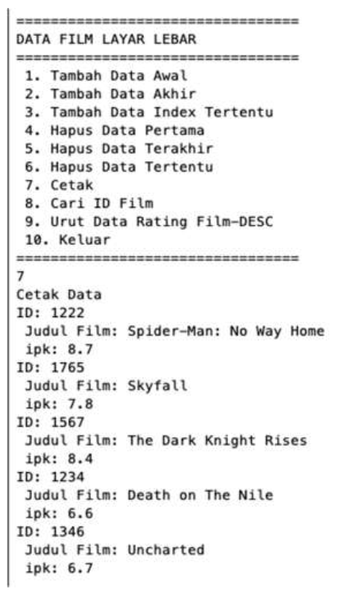
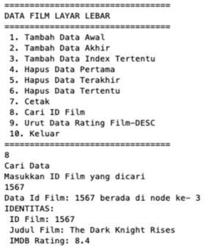

# <p align ="center">Laporan Praktikum Pertemuan 12 Algoritma dan Struktur Data</p>
<br><br><br><br>

<p align="center">
    </p>

<br><br><br><br><br>

<p align = "center"> Nama     : Dio Andika Pradana Mulia Tama </p>
<p align = "center"> NIM      : 2341720098 </p>
<p align = "center"> Prodi    : Teknik Informatika</p>
<p align = "center"> Kelas    : 1B </p>
<p align = "center"> Presensi : 09 </p>

# Jobsheet 12
# Double Linked List

## 12.2 Kegiatan Praktikum 1

### 12.2.1 Percobaan 1
Kode program class Node:
```java
package Pertemuan12.doublelinkedlists;

public class Node {
    int data;
    Node prev, next;

    Node(Node prev, int data, Node next) {
        this.prev = prev;
        this.data = data;
        this.next = next;
    }
}
```

Kode program class DoubleLinkedLists:
```java
package Pertemuan12.doublelinkedlists;

public class DoubleLinkedLists {
    Node head;
    int size;

    public DoubleLinkedLists() {
        head = null;
        size = 0;
    }

    public boolean isEmpty() {
        return head == null;
    }

    public void addFirst(int item) {
        if (isEmpty()) {
            head = new Node(null, item, null);
        } else {
            Node newNode = new Node(null, item, head);
            head.prev = newNode;
            head = newNode;
        }
        size++;
    }

    public void addLast(int item) {
        if (isEmpty()) {
            addFirst(item);
        } else {
            Node current = head;
            while (current.next != null) {
                current = current.next;     
            }
            Node newNode = new Node(current, item, null);
            current.next = newNode;
            size++;
        }
    }

    public void add(int item, int index) throws Exception {
        if (isEmpty()) {
            addFirst(item);     
        } else if (index < 0 || index > size) {
            throw new Exception("Nilai indeks di luar batas");
        } else {
            Node current = head;
            int i = 0;
            while (i < index) {
                current = current.next;
                i++;
            }
            if (current.prev == null) {
                Node newNode = new Node(null, item, current);
                current.prev = newNode;
                head = newNode;
            } else {
                Node newNode = new Node(current.prev, item, current);
                newNode.prev = current.prev;
                newNode.next = current;
                current.prev.next = newNode;
                current.prev = newNode;
            }
        }
        size++;
    }

    public int size() {
        return size;    
    }

    public void clear() {
        head = null;
        size = 0;
    }

    public void print() {
        if (!isEmpty()) {
            Node tmp = head;
            while (tmp != null) {
                System.out.print(tmp.data + "\t");
                tmp = tmp.next;
            }
            System.out.println("\nberhasil diisi");
        } else {
            System.out.println("Linked Lists kosong");
        }
    }
}
```

Kode program class DoubleLinkedListsMain:
```java
package Pertemuan12.doublelinkedlists;

public class DoubleLinkedListsMain {
    public static void main(String[] args) throws Exception {
        DoubleLinkedLists dll = new DoubleLinkedLists();
        dll.print();
        System.out.println("Size : "+dll.size);
        System.out.println("======================================");
        dll.addFirst(3);
        dll.addLast(4);
        dll.addFirst(7);
        dll.print();
        System.out.println("Size : "+dll.size);
        System.out.println("======================================");
        dll.add(40, 1);
        dll.print();
        System.out.println("Size : "+dll.size);
        System.out.println("======================================");
        dll.clear();
        dll.print();
        System.out.println("Size : "+dll.size);
        System.out.println("======================================");
    }
}
```

### 12.2.2 Verifikasi Hasil Percobaan


### 12.2.3 Pertanyaan Percobaan
1. Jelaskan perbedaan antara single linked list dengan double linked lists!<br>
Jawab: Perbedaan antara single linked list dengan double linked lists terletak pada pointernya. Pada single linked list, pointer hanya ada 1 yaitu next yang merujuk ke node selanjutnya. Sedangkan pada double linked lists, pointernya ada dua yaitu next dan prev. Pointer next pada double linked lists sama dengan pointer next pada single linked list yaitu merujuk ke node selanjutnya. Adapun pointer prev pada double linked lists adalah pointer yang merujuk ke node sebelumnya. 

2. Perhatikan class Node, di dalamnya terdapat atribut next dan prev. Untuk apakah atribut tersebut?<br>
Jawab: Atribut next dan prev pada class Node digunakan untuk menghubungkan node saat ini (current) dengan node sesudahnya dan node sebelumnya. Atribut next merupakan pointer untuk node selanjutnya, sedangkan atribut prev merupakan pointer untuk node sebelumya.

3. Perhatikan konstruktor pada class DoubleLinkedLists. Apa kegunaan inisialisasi atribut head dan size seperti pada gambar berikut ini?
```java
    public DoubleLinkedLists() {
        head = null;
        size = 0;
    }
```
Jawab: Inisialisasi atribut head dan size pada konstruktor DoubleLinkedLists di atas berguna untuk mengatur kondisi awal dari pembuatan double linked lists yaitu ketika linked list masih belum ada isinya sama sekali (masih kosong). Oleh karena itu, head diisikan dengan null dan size-nya 0 (karena memang masih kosong).  

4. Pada method **addFirst()**, kenapa dalam pembuatan object dari konstruktor class Node prev dianggap sama dengan null?
```java
    Node newNode = new Node(null, item, head);
```
Jawab: Karena node yang diisikan pada posisi pertama tidak merujuk ke node sebelumnya sehingga prev-nya akan merujuk ke null. Pada blok else method addFirst(), node baru yang disisipkan pada posisi pertama akan menjadi head baru di mana prev dari head yang lama akan merujuk ke head yang baru, dan next dari head yang baru akan merujuk ke head yang lama. Karena node yang baru ini sudah menjadi head, maka prev-nya tidak merujuk ke node lain (null).

5. Perhatikan pada method **addFirst()**. Apakah arti statement head.prev = newNode ?<br>
Jawab: Maksud dari statement di atas adalah prev dari head yang lama akan merujuk ke node yang baru diisikan di posisi pertama double linked list (head yang baru). Jadi, prev dari head yang lama tidak merujuk ke null lagi, melainkan ke node yang baru disisipkan pada posisi pertama (head yang baru).

6. Perhatikan isi method **addLast()**, apa arti dari pembuatan object Node dengan mengisikan parameter prev dengan current, dan next dengan null?
```java
    Node newNode = new Node(current, item, null);
```
Jawab: Pada method addLast(), parameter prev pada node yang dimasukkan di akhir double linked list diisi dengan current agar pointer prev dari tail yang baru ini merujuk ke tail yang lama (dalam hal ini, tail yang lama adalah current). Adapun pointer next diisi dengan null karena node yang dimasukkan di akhir double linked list ini (tail yang baru) tidak merujuk ke node lain (karena merupakan elemen terakhir dalam double linked lists sehingga tidak ada node setelahnya).

7. Pada method **add()**, terdapat potongan kode program sebagai berikut:
```java
    if (current.prev == null) {
        Node newNode = new Node(null, item, current);
        current.prev = newNode;
        head = newNode;
```
jelaskan maksud dari bagian yang ditandai dengan kotak kuning.<br>
Jawab: Kode di atas akan dieksekusi jika prev dari current adalah null (ini berarti current adalah head karena prev-nya tidak merujuk ke node lain). Kode di atas sebenarnya sama dengan kode pada blok else di method addFirst() yang bertujuan untuk menyisipkan node baru sebelum head. Pada kode di atas, ketika prev dari current adalah null, maka node baru dibuat dengan mengisikan pointer prev dengan null dan pointer next dengan current, lalu prev dari current yang semula null diubah menjadi merujuk kepada node yang baru. Dan head dipindahkan ke node yang baru ditambahkan ini. Jadi, node yang baru ditambahkan akan ditempatkan di posisi awal double linked lists (head) dengan pointer prev-nya merujuk ke null dan pointer next-nya merujuk ke node current. 

## 12.3 Kegiatan Praktikum 2

### 12.3.1 Tahapan Percobaan
Kode program tambahan method untuk menghapus isi double linked lists pada class DoubleLinkedLists:
```java
    public void removeFirst() throws Exception {
        if (isEmpty()) {
            throw new Exception("Linked list masih kosong, tidak dapat dihapus!");
        } else if (size == 1) {
            removeLast();
        } else {
            head = head.next;
            head.prev = null;
            size--;
        }
    }

    public void removeLast() throws Exception {
        if (isEmpty()) {
            throw new Exception("Linked list masih kosong, tidak dapat dihapus!");
        } else if (head.next == null) {
            head = null;
            size --;
            return;
        } 
        Node current = head;
        while (current.next.next != null) {
            current = current.next;     
        }
        current.next = null;
        size--;
    }

    public void remove(int index) throws Exception {
        if (isEmpty() || index >= size) {
            throw new Exception("Nilai indeks diluar batas");
        } else if (index == 0) {
            removeFirst();
        } else {
            Node current = head;
            int i = 0;
            while (i < index) {
                current = current.next;
                i++;
            }
            if (current.next == null) {
                current.prev.next = null;
            } else if (current.prev == null) {
                current = current.next;
                current.prev = null;
                head = current;
            } else {
                current.prev.next = current.next;
                current.next.prev = current.prev;
            }
            size--;
        }
    }
```
Kode program tambahan pada class DoubleLinkedListsMain untuk mengeksekusi method yang baru saja dibuat:
```java
        dll.addLast(50);
        dll.addLast(40);
        dll.addLast(10);
        dll.addLast(20);
        dll.print();
        System.out.println("Size : "+dll.size);
        System.out.println("======================================");
        dll.removeFirst();
        dll.print();
        System.out.println("Size : "+dll.size);
        System.out.println("======================================");
        dll.removeLast();
        dll.print();
        System.out.println("Size : "+dll.size);
        System.out.println("======================================");
        dll.remove(1);
        dll.print();
        System.out.println("Size : "+dll.size);
```

### 12.3.2 Verifikasi Hasil Percobaan


### 12.3.3 Pertanyaan Percobaan
1. Apakah maksud statement berikut pada method **removeFirst()**?
```java
    head = head.next;
    head.prev = null;
```
Jawab: Statement di atas bertujuan untuk memindahkan head ke pointer next dari head. Ini berarti bahwa posisi head sudah bukan lagi pada node head yang lama, melainkan pada node setelahnya. Setelah itu, pointer prev dari head yang baru (node setelah head yang lama) disetting menjadi null sehingga tidak merujuk lagi ke head yang lama.

2. Bagaimana cara mendeteksi posisi data ada pada bagian akhir pada method **removeLast()**?<br>
Jawab: Untuk mendeteksi posisi data yang ada pada bagian akhir pada method removeLast(), dilakukan pengecekan pada pointer next dari posisi node saat ini. Jika next dari node saat ini adalah null, maka bisa dipastikan bahwa node tersebut ada pada posisi terakhir. Pengecekan dimulai dari head terlebih dahulu. Jika pointer next dari head adalah null, maka head merupakan elemen awal sekaligus terakhir dalam linked list. Namun, jika pointer next dari head bukan null, maka head akan dimasukkan ke current dan current ini akan berpindah ke node selanjutnya untuk melakukan pengecekan sampai ditemukan kondisi `current.next == null` yang menandakan bahwa posisi current sudah berada pada bagian akhir linked list.

3. Jelaskan alasan potongan kode program di bawah ini tidak cocok untuk perintah **remove**!
```java
    Node tmp = head.next;

    head.next=tmp.next;
    tmp.next.prev=head;
```
Jawab: Kode di atas akan menghapus node berikutnya setelah node head, bukan node yang memang ingin dihapus. Selain itu, node di atas hanya akan menghapus elemen setelah head dan tidak bisa melakukan penghapusan node untuk kondisi tertentu.

4. Jelaskan fungsi kode program berikut ini pada fungsi **remove**!
```java
    current.prev.next = current.next;
    current.next.prev = current.prev;
```
Jawab: Kode program di atas berfungsi untuk menghapus node current dari double linked lists. Pointer next dari prev-nya current diubah merujuk ke pointer next dari current dan bukan merujuk ke node current lagi. Lalu, pointer prev dari next-nya current diubah merujuk ke pointer prev dari current dan bukan merujuk ke current lagi. Jadi, dapat diartikan bahwa kode di atas akan menghapus node current dengan menghubungkan langsung node sebelum current dan node setelah current (node current dilewati).

## 12.4 Kegiatan Praktikum 3

### 12.4.1 Tahapan Percobaan
Kode program tambahan method get pada class DoubleLinkedLists:
```java
    public int getFirst() throws Exception {
        if (isEmpty()) {
            throw new Exception("Linked List kosong");
        }
        return head.data;
    }

    public int getLast() throws Exception {
        if (isEmpty()) {
            throw new Exception("Linked List kosong");
        } 
        Node tmp = head;
        while (tmp.next != null) {
            tmp = tmp.next;
        }
        return tmp.data;
    }

    public int get(int index) throws Exception {
        if (isEmpty() || index >= size) {
            throw new Exception("Nilai indeks di luar batas");
        }
        Node tmp = head;
        for (int i = 0; i < index; i++) {
            tmp = tmp.next;
        }
        return tmp.data;
    }
```

Kode program tambahan pada class DoubleLinkedListsMain untuk mengeksekusi method yang baru saja dibuat:
```java
        dll.print();
        System.out.println("Size : "+dll.size);
        System.out.println("======================================");
        dll.addFirst(3);
        dll.addLast(4);
        dll.addFirst(7);
        dll.print();
        System.out.println("Size : "+dll.size);
        System.out.println("======================================");
        dll.add(40, 1);
        dll.print();
        System.out.println("Size : "+dll.size);
        System.out.println("======================================");
        System.out.println("Data awal pada Linked Lists adalah " + dll.getFirst());
        System.out.println("Data akhir pada Linked Lists adalah " + dll.getLast());
        System.out.println("Data indeks ke-1 pada Linked Lists adalah " + dll.get(1));
```

### 12.4.2 Verifikasi Hasil Percobaan


### 12.4.3 Pertanyaan Percobaan
1. Jelaskan method **size()** pada class DoubleLinkedLists!<br>
Jawab: Method **size()** pada class DoubleLinkedLists digunakan untuk mengetahui jumlah elemen yang ada dalam double linked lists dengan cara mengembalikan nilai atribut size. Ketika double linked lists kosong, maka size ini jumlahnya 0.

2. Jelaskan cara mengatur indeks pada double linked lists supaya dapat dimulai dari indeks ke-1!<br>
Jawab: Cara mengatur indeks pada double linked lists supaya dapat dimulai dari indeks ke-1 adalah dengan mengisi nilai awal variabel counter index (biasanya i) dengan 1 bukan nol. Berikut contohnya:
```java
    Node current = head;
    int i = 1; //sebelumnya int i = 0
    while (i < index) {
        current = current.next;
        i++;
    }
```
Kode di atas merupakan kode blok else pada method add().
Hasil modifikasi program:

Saya tidak melakukan perubahan apapun pada kode program class main, penambahan pada indeks masih tetap ``dll.add(40, 1);``. Akan tetapi hasilnya berbeda, sebelumnya ketika indeks dimulai dari 0, nilai 40 akan disisipkan di posisi 2. Ketika indeks dimulai dari 1, maka nilai 40 akan disisipkan di posisi pertama. 

3. Jelaskan perbedaan karakteristik fungsi **Add** pada Double Linked Lists dan Single Linked Lists!<br>
Jawab: Perbedaan karakteristik fungsi Add pada Double Linked Lists dan Single Linked adalah ketika menambahkan node baru pada Double Linked Lists, yang perlu diperhatikan adalah referensi prev dan next dari node tersebut. Sedangkan ketika menambahkan node baru pada Single Linked Lists, yang perlu diperhatikan hanya referensi next dari node tersebut saja.

4. Jelaskan perbedaan logika dari kedua kode program di bawah ini!<br>
<br>
Jawab: Kode program (a) menggunakan if-else statement. Jika size (jumlah elemen dalam linked list) sama dengan 0, maka fungsi mengembalikan true (artinya linked list kosong). Jika size bukan 0, maka fungsi mengembalikan false (artinya linked list tidak kosong).<br>
Kode (b) menggunakan return statement langsung. Fungsi mengembalikan true jika head (node pada posisi awal) adalah null (artinya linked list kosong). Jika head bukan null, maka fungsi mengembalikan false (artinya linked list tidak kosong).<br>
Jadi, dapat disimpulkan bahwa kode program (a) mengecek apakah double linked lists kosong berdasarkan size, sedangkan kode program (b) mengecek apakah double linked lists kosong berdasarkan head. Keduanya akan menghasilkan output yang sama, tetapi memang kode program (b) lebih singkat karena langsung mengembalikan nilai boolean berdasarkan kondisi head. Sebenarnya kode program (a) juga bisa dibuat langsung langsung mengembalikan nilai boolean berdasarkan size. Berikut contohnya.

```java
    public boolean isEmpty() {
        return size == 0;
    }
```
Dengan demikian kode program (a) dapat menjadi lebih singkat dan hasilnya pun juga sama dengan cara sebelumnya (menggunakan if-else).

## 12.5 Tugas Praktikum
1. Buat program antrian vaksinasi menggunakan queue berbasis double linked list sesuai ilustrasi dan menu di bawah ini! **(counter jumlah antrian tersisa di menu cetak(3) dan data orang yang telah divaksinasi di menu Hapus Data(2) harus ada)**<br>
**Contoh Ilustrasi Program**<br>
*Menu Awal dan Penambahan Data*


*Cetak Data (**Komponen di area merah harus ada**)*


*Hapus Data (**Komponen di area merah harus ada**)*


Kode program class Vaksin:
```java
package Pertemuan12.doublelinkedlists;

public class Vaksin {
    int nomor;
    String nama;
    Vaksin prev, next;

    Vaksin(Vaksin prev, int no, String nama, Vaksin next) {
        this.prev = prev;
        nomor = no;
        this.nama = nama;
        this.next = next;
    }
}
```
Kode program class DLLVaksin:
```java
package Pertemuan12.doublelinkedlists;

public class DLLVaksin {
    Vaksin head;
    int size;

    public DLLVaksin() {
        head = null;
        size = 0;
    }

    public boolean isEmpty() {
        return head == null;
    }

    public void addFirst(int no, String nama) {
        if (isEmpty()) {
            head = new Vaksin(null, no, nama, null);
        } else {
            Vaksin newNode = new Vaksin(null, no, nama, head);
            head.prev = newNode;
            head = newNode;
        }
        size++;
    }

    public void addLast(int no, String nama) {
        if (isEmpty()) {
            addFirst(no, nama);
        } else {
            Vaksin current = head;
            while (current.next != null) {
                current = current.next;     
            }
            Vaksin newNode = new Vaksin(current, no, nama, null);
            current.next = newNode;
            size++;
        }
    }

    public int size() {
        return size;    
    }

    public void print() {
        if (!isEmpty()) {
            Vaksin tmp = head;
            System.out.println("++++++++++++++++++++++++++");
            System.out.println("Daftar Pengantri Vaksin");
            System.out.println("++++++++++++++++++++++++++");
            System.out.println("|No." + "\t" + "|Nama" + "\t" + "|");
            while (tmp != null) {
                System.out.println("|" + tmp.nomor + "\t" + "|" + tmp.nama + "\t" + "|");
                tmp = tmp.next;
            }
            System.out.printf("Sisa Antrian: %d\n", size);
        } else {
            System.out.println("Antrian masih kosong!");
        }
    }

    void Enqueue(int no, String nama) {
        if (isEmpty()) {
            addFirst(no, nama);
        } else {
            addLast(no, nama);
        }
    }

    Vaksin Dequeue() {
        if (isEmpty()) {
            System.out.println("Antrian masih kosong, tidak dapat dihapus!");
            return null;
        } else if (size == 1) {
            Vaksin eq = head;
            head = null;
            size --;
            return eq;
        } else {
            Vaksin eq = head;
            head = head.next;
            head.prev = null;
            size--;
            return eq;
        }      
    }
}
```
Kode program class VaksinMain:
```java
package Pertemuan12.doublelinkedlists;

import java.util.Scanner;

public class VaksinMain {
    public static void menu() {
        System.out.println("+++++++++++++++++++++++++++++");
        System.out.println("PENGANTRI VAKSIN EXTRAVAGANZA");
        System.out.println("+++++++++++++++++++++++++++++");
        System.out.println("1. Tambah Data Penerima Vaksin");
        System.out.println("2. Hapus Data Pengantri Vaksin");
        System.out.println("3. Daftar Penerima Vaksin");
        System.out.println("4. Keluar");
        System.out.println("+++++++++++++++++++++++++++++");
    }    
    public static void main(String[] args) {
        Scanner sc = new Scanner(System.in);
        Scanner s = new Scanner(System.in);

        DLLVaksin vaksinQueue = new DLLVaksin();

        short pilih;

        do {
            menu();
            pilih = sc.nextShort();
            switch (pilih) {
                case 1:
                    System.out.println("-----------------------------");
                    System.out.println("Masukkan Data Penerima Vaksin");
                    System.out.println("-----------------------------");
                    System.out.println("Nomor Antrian: ");
                    int no = sc.nextInt();
                    System.out.println("Nama Penerima: ");
                    String nama = s.nextLine();
                    vaksinQueue.Enqueue(no, nama);
                    break;
                case 2:
                    Vaksin data = vaksinQueue.Dequeue();
                    if (data != null) {
                        System.out.println(data.nama + " dengan nomor antrian " + data.nomor + " telah selesai di vaksinasi.");
                    } 
                    vaksinQueue.print();
                    break;
                case 3:
                    vaksinQueue.print();
                    break;
                case 4:
                    System.exit(0);
                    break;
                default:
                    System.out.println("Menu yang Anda masukkan tidak valid!");
                    break;
            }
        } while (pilih == 1 || pilih == 2 || pilih == 3 || pilih == 4);
    }
}
```
Output program:
```
+++++++++++++++++++++++++++++
PENGANTRI VAKSIN EXTRAVAGANZA
+++++++++++++++++++++++++++++
1. Tambah Data Penerima Vaksin
2. Hapus Data Pengantri Vaksin
3. Daftar Penerima Vaksin
4. Keluar
+++++++++++++++++++++++++++++
3
Antrian masih kosong!
+++++++++++++++++++++++++++++
PENGANTRI VAKSIN EXTRAVAGANZA
+++++++++++++++++++++++++++++
1. Tambah Data Penerima Vaksin
2. Hapus Data Pengantri Vaksin
3. Daftar Penerima Vaksin
4. Keluar
+++++++++++++++++++++++++++++
2
Antrian masih kosong, tidak dapat dihapus!
Antrian masih kosong!
+++++++++++++++++++++++++++++
PENGANTRI VAKSIN EXTRAVAGANZA
+++++++++++++++++++++++++++++
1. Tambah Data Penerima Vaksin
2. Hapus Data Pengantri Vaksin
3. Daftar Penerima Vaksin
4. Keluar
+++++++++++++++++++++++++++++
1
-----------------------------
Masukkan Data Penerima Vaksin
-----------------------------
Nomor Antrian:
123
Nama Penerima:
Joko
+++++++++++++++++++++++++++++
PENGANTRI VAKSIN EXTRAVAGANZA
+++++++++++++++++++++++++++++
1. Tambah Data Penerima Vaksin
2. Hapus Data Pengantri Vaksin
3. Daftar Penerima Vaksin
4. Keluar
+++++++++++++++++++++++++++++
1
-----------------------------
Masukkan Data Penerima Vaksin
-----------------------------
Nomor Antrian:
124
Nama Penerima:
Megan
+++++++++++++++++++++++++++++
PENGANTRI VAKSIN EXTRAVAGANZA
+++++++++++++++++++++++++++++
1. Tambah Data Penerima Vaksin
2. Hapus Data Pengantri Vaksin
3. Daftar Penerima Vaksin
4. Keluar
+++++++++++++++++++++++++++++
1
-----------------------------
Masukkan Data Penerima Vaksin
-----------------------------
Nomor Antrian:
137
Nama Penerima:
Johan
+++++++++++++++++++++++++++++
PENGANTRI VAKSIN EXTRAVAGANZA
+++++++++++++++++++++++++++++
1. Tambah Data Penerima Vaksin
2. Hapus Data Pengantri Vaksin
3. Daftar Penerima Vaksin
4. Keluar
+++++++++++++++++++++++++++++
1
-----------------------------
Masukkan Data Penerima Vaksin
-----------------------------
Nomor Antrian:
146 
Nama Penerima:
Rosi
+++++++++++++++++++++++++++++
PENGANTRI VAKSIN EXTRAVAGANZA
+++++++++++++++++++++++++++++
1. Tambah Data Penerima Vaksin
2. Hapus Data Pengantri Vaksin
3. Daftar Penerima Vaksin
4. Keluar
+++++++++++++++++++++++++++++
3
++++++++++++++++++++++++++
Daftar Pengantri Vaksin
++++++++++++++++++++++++++
|No.    |Nama   |
|123    |Joko   |
|124    |Megan  |
|137    |Johan  |
|146    |Rosi   |
Sisa Antrian: 4
+++++++++++++++++++++++++++++
PENGANTRI VAKSIN EXTRAVAGANZA
+++++++++++++++++++++++++++++
1. Tambah Data Penerima Vaksin
2. Hapus Data Pengantri Vaksin
3. Daftar Penerima Vaksin
4. Keluar
+++++++++++++++++++++++++++++
2
Joko dengan nomor antrian 123 telah selesai di vaksinasi.
++++++++++++++++++++++++++
Daftar Pengantri Vaksin
++++++++++++++++++++++++++
|No.    |Nama   |
|124    |Megan  |
|137    |Johan  |
|146    |Rosi   |
Sisa Antrian: 3
+++++++++++++++++++++++++++++
PENGANTRI VAKSIN EXTRAVAGANZA
+++++++++++++++++++++++++++++
1. Tambah Data Penerima Vaksin
2. Hapus Data Pengantri Vaksin
3. Daftar Penerima Vaksin
4. Keluar
+++++++++++++++++++++++++++++
4
PS D:\Kuliah\Semester 2\Tugas Kuliah Semester 2\Algoritma dan Struktur Data\Praktikum-Algoritma dan Struktur Data> 
```

2. Buatlah program daftar film yang terdiri dari id, judul dan rating menggunakan double linked lists, bentuk program memiliki fitur pencarian melalui ID Film dan pengurutan Rating secara descending. Class Film wajib diimplementasikan dalam soal ini.<br>
**Contoh Ilustrasi Program**<br>
*Menu Awal dan Penambahan Data*



*Cetak Data*


*Pencarian Data*


# <p align ="center">--- *** ---</p>