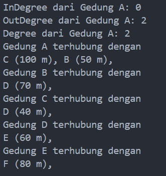
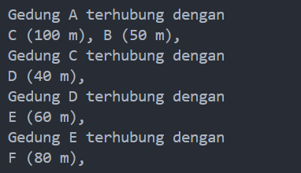
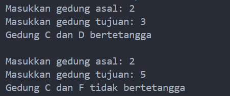
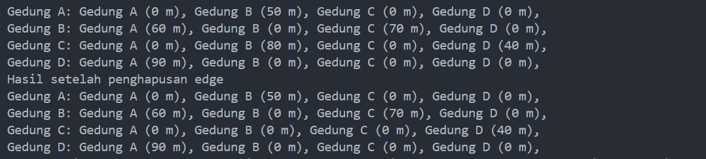
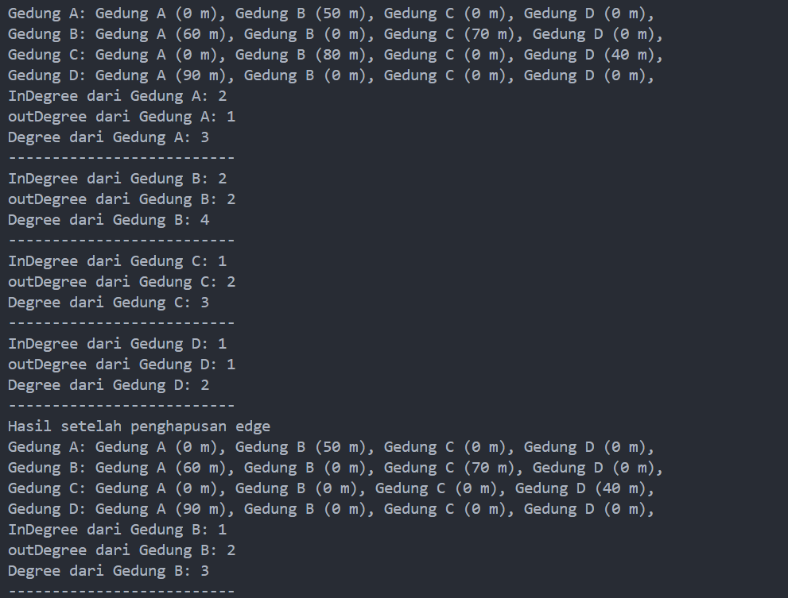

# <p align ="center">Laporan Praktikum Pertemuan 15 Algoritma dan Struktur Data</p>
<br><br><br><br>

<p align="center">
    </p>

<br><br><br><br><br>

<p align = "center"> Nama     : Dio Andika Pradana Mulia Tama </p>
<p align = "center"> NIM      : 2341720098 </p>
<p align = "center"> Prodi    : Teknik Informatika</p>
<p align = "center"> Kelas    : 1B </p>
<p align = "center"> Presensi : 09 </p>

# Jobsheet 15
# Graph

## 2. Praktikum

## 2.1 Percobaan 1: Implementasi Graph menggunakan Linked List
### 2.1.1 Langkah-langkah Percobaan
Kode program class Node09:
```java
package Pertemuan15.src;

public class Node09 {
    int data, jarak;
    Node09 prev, next;

    Node09(Node09 prev, int data, int jarak, Node09 next) {
        this.prev = prev;
        this.data = data;
        this.next = next;
        this.jarak = jarak;
    }
}
```

Kode program class DoubleLinkedList09:
```java
package Pertemuan15.src;

public class DoubleLinkedList09 {
    Node09 head;
    int size;

    public DoubleLinkedList09() {
        head = null;
        size = 0;
    }

    public boolean isEmpty() {
        return head == null;
    }

    public void addFirst(int item, int jarak) {
        if (isEmpty()) {
            head = new Node09(null, item, jarak, null);
        } else {
            Node09 newNode09 = new Node09(null, item, jarak, head);
            head.prev = newNode09;
            head = newNode09;
        }
        size++;
    }

    public int getJarak(int index) throws Exception {
        if (isEmpty() || index >= size) {
            throw new Exception("Nilai indeks di luar batas");
        }
        Node09 tmp = head;
        for (int i = 0; i < index; i++) {
            tmp = tmp.next; 
        }
        return tmp.jarak;
    }

    public void addLast(int item, int jarak) {
        if (isEmpty()) {
            addFirst(item, jarak);
        } else {
            Node09 current = head;
            while (current.next != null) {
                current = current.next;     
            }
            Node09 newNode09 = new Node09(current, item, jarak, null);
            current.next = newNode09;
            size++;
        }
    }

    public void add(int item, int jarak, int index) throws Exception {
        if (isEmpty()) {
            addFirst(item, jarak);     
        } else if (index < 1 || index > size) {
            throw new Exception("Nilai indeks di luar batas");
        } else {
            Node09 current = head;
            int i = 1;
            while (i < index) {
                current = current.next;
                i++;
            }
            if (current.prev == null) {
                Node09 newNode09 = new Node09(null, item, jarak, current);
                current.prev = newNode09;
                head = newNode09;
            } else {
                Node09 newNode09 = new Node09(current.prev, item, jarak, current);
                newNode09.prev = current.prev;
                newNode09.next = current;
                current.prev.next = newNode09;
                current.prev = newNode09;
            }
        }
        size++;
    }

    public int size() {
        return size;    
    }

    public void clear() {
        head = null;
        size = 0;
    }

    public void print() {
        if (!isEmpty()) {
            Node09 tmp = head;
            while (tmp != null) {
                System.out.print(tmp.data + "\t");
                tmp = tmp.next;
            }
            System.out.println("\nberhasil diisi");
        } else {
            System.out.println("Linked Lists kosong");
        }
    }

    public void removeFirst() throws Exception {
        if (isEmpty()) {
            throw new Exception("Linked list masih kosong, tidak dapat dihapus!");
        } else if (size == 1) {
            removeLast();
        } else {
            head = head.next;
            head.prev = null;
            size--;
        }
    }

    public void removeLast() throws Exception {
        if (isEmpty()) {
            throw new Exception("Linked list masih kosong, tidak dapat dihapus!");
        } else if (head.next == null) {
            head = null;
            size --;
            return;
        } 
        Node09 current = head;
        while (current.next.next != null) {
            current = current.next;     
        }
        current.next = null;
        size--;
    }

    public void remove1(int index) throws Exception {
        if (isEmpty() || index >= size) {
            throw new Exception("Nilai indeks diluar batas");
        } else if (index == 1) {
            removeFirst();
        } else {
            Node09 current = head;
            int i = 1;
            while (i < index) {
                current = current.next;
                i++;
            }
            if (current.next == null) {
                current.prev.next = null;
            } else if (current.prev == null) {
                current = current.next;
                current.prev = null;
                head = current;
            } else {
                current.prev.next = current.next;
                current.next.prev = current.prev;
            }
            size--;
        }
    }

    public void remove(int index) {
        Node09 current = head;
            while (current != null) {
                if (current.data == index) {
                    if (current.prev != null) {
                        current.prev.next = current.next;
                    } else {
                        head = current.next;
                    }
                    if (current.next != null) {
                        current.next.prev = current.prev;
                    }
                    break;
                }
                current = current.next; 
            }
            size--;
    }

    public int getFirst() throws Exception {
        if (isEmpty()) {
            throw new Exception("Linked List kosong");
        }
        return head.data;
    }

    public int getLast() throws Exception {
        if (isEmpty()) {
            throw new Exception("Linked List kosong");
        } 
        Node09 tmp = head;
        while (tmp.next != null) {
            tmp = tmp.next;
        }
        return tmp.data;
    }

    public int get(int index) throws Exception {
        if (isEmpty() || index >= size ) {
            throw new Exception("Nilai indeks di luar batas");
        }
        Node09 tmp = head;
        for (int i = 0; i < index; i++) {
            tmp = tmp.next;
        }
        return tmp.data;
    }
}

```

Kode program class Graph09:
```java
package Pertemuan15.src;

public class Graph09 {
    int vertex;
    DoubleLinkedList09 list[];

    public Graph09(int v) {
        vertex = v;
        list = new DoubleLinkedList09[v];
        for (int i = 0; i < v; i++) {
            list[i] = new DoubleLinkedList09();
        }
    }

    public void addEdgeUD(int asal, int tujuan, int jarak) {
        list[asal].addFirst(tujuan, jarak);
        list[tujuan].addFirst(asal, jarak);
    }

    public void addEdge(int asal, int tujuan, int jarak) {
        list[asal].addFirst(tujuan, jarak);
    }
    
    public void degree(int asal) throws Exception {
        int k, totalIn = 0, totalOut = 0;
        for (int i = 0; i < vertex; i++) {
            //inDegree
            for (int j = 0; j < list[i].size(); j++) {
                if (list[i].get(j) == asal) {
                    ++totalIn;
                }
            }
            //OutDegree
            for (k = 0; k < list[asal].size(); k++) {
                list[asal].get(k);
            }
            totalOut = k;
        }
        System.out.println("InDegree dari Gedung " + (char) ('A' + asal) + ": " + totalIn);
        System.out.println("OutDegree dari Gedung " + (char) ('A' + asal) + ": " + totalOut);
        System.out.println("Degree dari Gedung " + (char) ('A' + asal) + ": " + (totalIn + totalOut));
    }

    public void degreeUD(int asal) throws Exception {
        System.out.println("Degree dari Gedung " + (char) ('A' + asal) + ": " + list[asal].size());
    }

    public void removeEdge(int asal, int tujuan) throws Exception {
        for (int i = 0; i < vertex; i++) {
            if (i == tujuan) {
                list[asal].remove(tujuan);
            }
        }
    }

    public void removeAllEdges() {
        for (int i = 0; i < vertex; i++) {
            list[i].clear();    
        }
        System.out.println("Graf berhasil dikosongkan");
    }

    public void printGraph() throws Exception {
        for (int i = 0; i < vertex; i++) {
            if (list[i].size() > 0) {
                System.out.println("Gedung " + (char) ('A' + i) + " terhubung dengan ");
                for (int j = 0; j < list[i].size(); j++) {
                    System.out.print((char) ('A' + list[i].get(j)) + " (" + list[i].getJarak(j) + " m), ");
                }
                System.out.println("");
            }
        }
        System.out.println("");
    }
}
```

Kode program class GraphMain09:
```java
package Pertemuan15.src;

public class GraphMain09 {
    public static void main(String[] args) throws Exception {
        Graph09 gedung = new Graph09(6);
        gedung.addEdge(0, 1, 50);
        gedung.addEdge(0, 2, 100);
        gedung.addEdge(1, 3, 70);
        gedung.addEdge(2, 3, 40);
        gedung.addEdge(3, 4, 60);
        gedung.addEdge(4, 5, 80);
        gedung.degree(0);
        gedung.printGraph();

        gedung.removeEdge(1, 3);
        gedung.printGraph();
    }
}
```

### 2.1.2 Verifikasi Hasil Percobaan
Hasil running pada langkah 14:<br>
<br>
Hasil running pada langkah 17:<br>


### 2.1.3 Pertanyaan
1. Perbaiki kode program Anda apabila terdapat error atau hasil kompilasi kode tidak sesuai!<br>
Jawab: Terdapat kesalahan pada bagian method remove() yaitu size tidak dikurangi setelah me-remove vertex dari graph sehingga ketika class GraphMain09 dijalankan, akan muncul pesan error `Nilai indeks di luar batas`. Berikut adalah perbaikan kode program method remove(): 
```java
    public void remove(int index) {
        Node09 current = head;
            while (current != null) {
                if (current.data == index) {
                    if (current.prev != null) {
                        current.prev.next = current.next;
                    } else {
                        head = current.next;
                    }
                    if (current.next != null) {
                        current.next.prev = current.prev;
                    }
                    break;
                }
                current = current.next; 
            }
            size--; //Sebelumnya tidak ada
    }
```

2. Pada class Graph, terdapat atribut **list[]** bertipe DoubleLinkedList. Sebutkan tujuan pembuatan variabel tersebut!<br>
Jawab: Atribut `list[]` dalam kelas `Graph09` bertujuan untuk menyimpan node yang terhubung (adjacency list) untuk setiap node (vertex) dalam graph. Setiap elemen dari array `list[]` menghubungkan ke sebuah linked list yang berisi informasi tentang node-node yang terhubung dan jarak (bobot) antara node-node tersebut dalam graph. 

3. Jelaskan alur kerja dari method **removeEdge**!<br>
Jawab: Method removeEdge() pada kelas Graph09 bertujuan untuk menghapus sebuah lintasan (edge) antara dua node yang terhubung dalam graph. Berikut adalah alur kerja dari method removeEdge:
   1. Method removeEdge memerlukan dua parameter yaitu parameter `int asal` (indeks node asal) dan `int tujuan` (indeks node tujuan) yang dihubungkan oleh lintasan (edge).
   2. Melakukan iterasi perulangan for melalui seluruh vertex dalam graph (dari 0 sampai vertex - 1). Jika indeks node saat iterasi sama dengan parameter `tujuan`, maka lintasan (edge) yang menghubungkan node asal dengan node tujuan dari adjacency list node asal akan dihapus.

4. Apakah alasan pemanggilan method **addFirst()** untuk menambahkan data, bukan method add jenis lain saat digunakan pada method **addEdge** pada class Graph?<br>
Jawab: Pemanggilan method addFirst() untuk menambahkan data pada method addEdge akan memasukkan node yang baru ke posisi pertama dalam adjacency list vertex tertentu. Pemanggilan method addFirst() untuk menambahkan data, bukan method add jenis lain saat digunakan pada method addEdge pada kelas Graph09 memiliki beberapa alasan. Penggunaan method addFirst() untuk menambahkan data pada method addEdge akan memastikan bahwa penambahan node yang baru tidak memerlukan iterasi melalui seluruh adjacency list untuk menemukan posisi terakhir. Hal ini membuat kode program lebih efisien dan mudah dibaca. Selain itu, adjacency list sering kali diimplementasikan sebagai list yang tidak diurutkan, di mana urutan penambahan edge tidak terlalu penting. 

5. Modifikasi kode program sehingga dapat dilakukan pengecekan apakah terdapat jalur antara suatu node dengan node lainnya, seperti contoh berikut (Anda dapat memanfaatkan Scanner).<br>
<br>
Jawab: Berikut adalah modifikasi kode program penambahan method untuk mengecek apakah terdapat jalur antara suatu node dengan node lainnya pada class Graph09:

```java
    public void cekEdge(int asal, int tujuan) throws Exception {
        for (int i = 0; i < list[asal].size(); i++) {
            if (list[asal].get(i) == tujuan) {
                System.out.println("Gedung " + (char) ('A' + asal) + " dan " + (char) ('A' + tujuan) + " bertetangga");
            } else {
                System.out.println("Gedung " + (char) ('A' + asal) + " dan " + (char) ('A' + tujuan) + " tidak bertetangga");
            }
        }
    }
```
Hasil running program:<br>
<br>

## 2.2 Percobaan 2: Implementasi Graph menggunakan Matriks
### 2.2.1 Langkah-langkah Percobaan
Kode program class GraphMatriks09:
```java
package Pertemuan15.src;

public class GraphMatriks09 {
    int vertex;
    int[][] matriks;

    public GraphMatriks09(int v) {
        vertex = v;
        matriks = new int[v][v];
    }

    public void makeEdge(int asal, int tujuan, int jarak) {
        matriks[asal][tujuan] = jarak;
    }

    public void removeEdge(int asal, int tujuan) {
        matriks[asal][tujuan] = 0;
    }

    public void printGraph() {
        for (int i = 0; i < vertex; i++) {
            System.out.print("Gedung " + (char) ('A' + i) + ": ");
            for (int j = 0; j < vertex; j++) {
                System.out.print("Gedung " + (char) ('A' + j) + " (" + matriks[i][j] + " m), ");
            }
            System.out.println();
        }
    }
}
```

Kode program class GraphMain09:
```java
package Pertemuan15.src;

public class GraphMain09 {
    public static void main(String[] args) throws Exception {
        GraphMatriks09 gdg = new GraphMatriks09(4);
        gdg.makeEdge(0, 1, 50);
        gdg.makeEdge(1, 0, 60);
        gdg.makeEdge(1, 2, 70);
        gdg.makeEdge(2, 1, 80);
        gdg.makeEdge(2, 3, 40);
        gdg.makeEdge(3, 0, 90);
        gdg.printGraph();
        System.out.println("Hasil setelah penghapusan edge");
        gdg.removeEdge(2, 1);
        gdg.printGraph();
    }
}
```

### 2.2.2 Verifikasi Hasil Percobaan


### 2.2.3 Pertanyaan
1. Perbaiki kode program Anda apabila terdapat error atau hasil kompilasi kode tidak sesuai!<br>
Jawab: Terdapat output yang tidak sesuai yaitu saat lintasan dari gedung B ke gedung C dihapus, jarak ke gedung B tidak akan tercetak di vertex gedung B. Hal ini karena nilai dari edge setelah dihapus adalah -1 sedangkan pada method removeEdges() dilakukan pengecekan apakah nilai edges tidak sama dengan -1. Ketika nilai edges tidak sama dengan -1, maka vertex gedung akan dicetak. Oleh sebab itulah, ketika lintasan dari gedung B ke gedung C dihapus, jarak ke gedung B tidak akan tercetak di vertex gedung B. Untuk memperbaikinya, saya mengganti nilai dari edge setelah dihapus menjadi 0 agar ketika dicetak akan menampilkan nilai 0. Lalu pengecekan kondisi pada method removeEdges() saya hilangkan, karena pada contoh output semua vertex akan tercetak meskipun tidak ada edge (lintasan) antara vertex asal ke vertex tujuan. Berikut kode program setelah diperbaiki:
``` java
    public void removeEdge(int asal, int tujuan) {
        matriks[asal][tujuan] = 0; //sebelumnya matriks[asal][tujuan] = -1;
    }

    public void printGraph() {
        for (int i = 0; i < vertex; i++) {
            System.out.print("Gedung " + (char) ('A' + i) + ": ");
            for (int j = 0; j < vertex; j++) {
                System.out.print("Gedung " + (char) ('A' + j) + " (" + matriks[i][j] + " m), ");
            }
            System.out.println();
        }
    }
```

2. Apa jenis graph yang digunakan pada Percobaan 2?<br>
jawab: Jenis graph yang digunakan pada percobaan 2 adalah Adjacency Matrix karena menggunakan array 2D dengan size v x v dimana v adalah jumlah node pada graph. Nilai jarak dari suatu lintasan yang menghubungkan dua node akan disimpan dalam setiap indeks array 2D.

3. Apa maksud dari dua baris kode berikut?<br>
```java
        gdg.makeEdge(1, 2, 70);
        gdg.makeEdge(2, 1, 80);
```
Jawab: Dua baris kode akan membuat suatu lintasan yang menghubungkan dua node dengan mengakses method makeEdge() dari objek gdg. Baris pertama dengan parameter (1, 2, 70) berarti akan menghubungkan node 1 dan 2 dengan node 1 sebagai asal dan node 2 sebagai tujuan serta jarak dari vertex 1 ke 2 diisi dengan nilai 70. Baris kedua dengan parameter (2, 1, 80) berarti akan menghubungkan node 2 dan 1 dengan node 2 sebagai asal dan node 1 sebagai tujuan serta jarak dari vertex 2 ke 1 diisi dengan nilai 80. 

4. Modifikasi kode program sehingga terdapat method untuk menghitung degree, termasuk inDegree dan outDegree!<br>
Jawab: Berikut adalah modifikasi kode program dengan menambahkan method untuk menghitung degree:
```java
    public void degree(int index) {
        int inDeg = 0, outDeg = 0;
        //inDegree
        for (int i = 0; i < vertex; i++) {
            if (matriks[i][index] != 0) {
                inDeg++;
            }
        }
        //outDegree
        for (int i = 0; i < vertex; i++) {
            if (matriks[index][i] != 0) {
                outDeg++;
            }
        }
        System.out.println("InDegree dari Gedung " + (char) ('A' + index) + ": " + inDeg);
        System.out.println("outDegree dari Gedung " + (char) ('A' + index) + ": " + outDeg);
        System.out.println("Degree dari Gedung " + (char) ('A' + index) + ": " + (inDeg + outDeg));
    }
```
Hasil running program setelah dimodifikasi:


## 3. Latihan Praktikum
1. Modifikasi kode program pada class **GraphMain** sehingga terdapat menu program yang bersifat dinamis, setidaknya terdiri dari:<br>
a) Add Edge<br>
b) Remove Edge<br>
c) Degree<br>
d) Print Graph<br>
e) Cek Edge<br>
Pengguna dapat memilih menu program melalui input Scanner<br>
Jawab: Berikut adalah modifikasi kode program penambahan menu-menu di atas pada class GraphMain09:<br>
```java
package Pertemuan15.src;
import java.util.Scanner;

public class GraphMain09 {
    public static void menu() {
        System.out.println("Pilih menu: ");
        System.out.println("1. Add Edge");
        System.out.println("2. Remove Edge");
        System.out.println("3. Degree");
        System.out.println("4. Print Graph");
        System.out.println("5. Cek Edge");
        System.out.println("6. Keluar");
        System.out.println("--------------------------");
    }
    public static void main(String[] args) throws Exception {
        Scanner sc = new Scanner(System.in);
        int a, t, pilih;
        Graph09 gedung = new Graph09(6);

        do {
            menu();
            pilih = sc.nextInt();
            switch (pilih) {
                case 1:
                    System.out.println("Tambahkan lintasan antar gedung");
                    System.out.print("Masukkan index node (gedung) asal: ");
                    a = sc.nextInt();
                    System.out.print("Masukkan index node (gedung) tujuan: : ");
                    t = sc.nextInt();
                    System.out.print("Masukkan jarak lintasan dari node awal ke node tujuan: : ");
                    int m = sc.nextInt();
                    gedung.addEdge(a, t, m);
                    break;
                case 2:
                    System.out.println("Hapus lintasan antar gedung");
                    System.out.print("Masukkan index node (gedung) asal: ");
                    a = sc.nextInt();
                    System.out.print("Masukkan index node (gedung) tujuan: ");
                    t = sc.nextInt();
                    gedung.removeEdge(a, t);
                case 3:
                    System.out.print("Masukkan index node yang ingin dicek degree-nya: ");
                    a = sc.nextInt();
                    gedung.degree(a);
                    break;
                case 4:
                    System.out.println("Cetak semua node (gedung) yang ada pada graf:");
                    gedung.printGraph();
                    break;
                case 5:
                    System.out.println("Cek lintasan antar node (gedung)");
                    System.out.print("Masukkan index node asal: ");
                    a = sc.nextInt();
                    System.out.print("Masukkan index node tujuan: ");
                    t = sc.nextInt();
                    gedung.cekEdge(a, t);
                    break;
                case 6:
                    System.exit(0);
                    break;
            }
        } while (pilih <= 6);
    }
}
```
Hasil running program:<br>
```
Pilih menu: 
1. Add Edge
2. Remove Edge
3. Degree
4. Print Graph
5. Cek Edge
6. Keluar
--------------------------
1
Tambahkan lintasan antar gedung
Masukkan index node (gedung) asal: 1
Masukkan index node (gedung) tujuan: 2
Masukkan jarak lintasan dari node awal ke node tujuan (satuan meter): 35
Pilih menu: 
1. Add Edge
2. Remove Edge
3. Degree
4. Print Graph
5. Cek Edge
6. Keluar
--------------------------
1
Tambahkan lintasan antar gedung
Masukkan index node (gedung) asal: 1
Masukkan index node (gedung) tujuan: 0
Masukkan jarak lintasan dari node awal ke node tujuan (satuan meter): 23
Pilih menu:
1. Add Edge
2. Remove Edge
3. Degree
4. Print Graph
5. Cek Edge
6. Keluar
--------------------------
1
Tambahkan lintasan antar gedung
Masukkan index node (gedung) asal: 1
Masukkan index node (gedung) tujuan: 4
Masukkan jarak lintasan dari node awal ke node tujuan (satuan meter): 90
Pilih menu:
1. Add Edge
2. Remove Edge
3. Degree
4. Print Graph
5. Cek Edge
6. Keluar
--------------------------
1
Tambahkan lintasan antar gedung
Masukkan index node (gedung) asal: 2
Masukkan index node (gedung) tujuan: 4
Masukkan jarak lintasan dari node awal ke node tujuan (satuan meter): 45
Pilih menu:
1. Add Edge
2. Remove Edge
3. Degree
4. Print Graph
5. Cek Edge
6. Keluar
--------------------------
1
Tambahkan lintasan antar gedung
Masukkan index node (gedung) asal: 2
Masukkan index node (gedung) tujuan: 3
Masukkan jarak lintasan dari node awal ke node tujuan (satuan meter): 29
Pilih menu:
1. Add Edge
2. Remove Edge
3. Degree
4. Print Graph
5. Cek Edge
6. Keluar
--------------------------
4
Cetak semua node (gedung) yang ada pada graf:
Gedung B terhubung dengan
E (90 m), A (23 m), C (35 m),
Gedung C terhubung dengan
D (29 m), E (45 m),

Pilih menu:
1. Add Edge
2. Remove Edge
3. Degree
4. Print Graph
5. Cek Edge
6. Keluar
--------------------------
2
Hapus lintasan antar gedung
Masukkan index node (gedung) asal: 2
Masukkan index node (gedung) tujuan: 4
Pilih menu:
1. Add Edge
2. Remove Edge
3. Degree
4. Print Graph
5. Cek Edge
6. Keluar
--------------------------
3
Masukkan index node yang ingin dicek degree-nya: 1
InDegree dari Gedung B: 0
OutDegree dari Gedung B: 3
Degree dari Gedung B: 3
Pilih menu:
1. Add Edge
2. Remove Edge
3. Degree
4. Print Graph
5. Cek Edge
6. Keluar
--------------------------
1
Tambahkan lintasan antar gedung
Masukkan index node (gedung) asal: 5
Masukkan index node (gedung) tujuan: 1
Masukkan jarak lintasan dari node awal ke node tujuan (satuan meter): 120
Pilih menu:
1. Add Edge
2. Remove Edge
3. Degree
4. Print Graph
5. Cek Edge
6. Keluar
--------------------------
5
Cek lintasan antar node (gedung)
Masukkan index node asal: 2
Masukkan index node tujuan: 3
Gedung C dan D bertetangga
Pilih menu:
1. Add Edge
2. Remove Edge
3. Degree
4. Print Graph
5. Cek Edge
6. Keluar
--------------------------
4
Cetak semua node (gedung) yang ada pada graf:
Gedung B terhubung dengan
E (90 m), A (23 m), C (35 m),
Gedung C terhubung dengan
D (29 m),
Gedung F terhubung dengan
B (120 m),

Pilih menu:
1. Add Edge
2. Remove Edge
3. Degree
4. Print Graph
5. Cek Edge
6. Keluar
--------------------------
5
Cek lintasan antar node (gedung)
Masukkan index node asal: 2
Masukkan index node tujuan: 0
Gedung C dan A tidak bertetangga
Pilih menu:
1. Add Edge
2. Remove Edge
3. Degree
4. Print Graph
5. Cek Edge
6. Keluar
--------------------------
3
Masukkan index node yang ingin dicek degree-nya: 1
InDegree dari Gedung B: 1
OutDegree dari Gedung B: 3
Degree dari Gedung B: 4
Pilih menu:
1. Add Edge
2. Remove Edge
3. Degree
4. Print Graph
5. Cek Edge
6. Keluar
--------------------------
4
Cetak semua node (gedung) yang ada pada graf:
Gedung B terhubung dengan
E (90 m), A (23 m), C (35 m),
Gedung C terhubung dengan
D (29 m),
Gedung F terhubung dengan
B (120 m),

Pilih menu:
1. Add Edge
2. Remove Edge
3. Degree
4. Print Graph
5. Cek Edge
6. Keluar
--------------------------
6
PS D:\Kuliah\Semester 2\Tugas Kuliah Semester 2\Algoritma dan Struktur Data\Praktikum-Algoritma dan Struktur Data> 
```
2. Tambahkan method **updateJarak** pada Percobaan 1 yang digunakan untuk mengubah jarak antara dua node asal dan tujuan!
3. Tambahkan method **hitungEdge** untuk menghitung banyaknya edge yang terdapat di dalam graf!