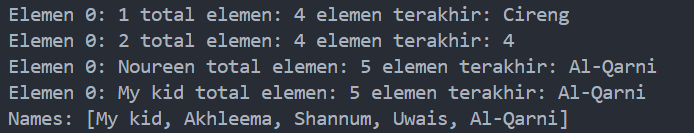
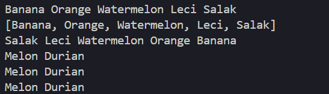
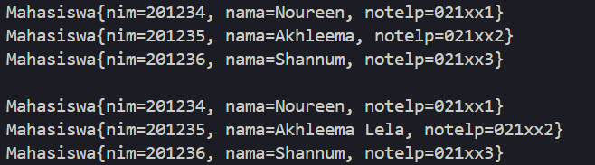

# <p align ="center">Laporan Praktikum Pertemuan 16 Algoritma dan Struktur Data</p>
<br><br><br><br>

<p align="center">
    </p>

<br><br><br><br><br>

<p align = "center"> Nama     : Dio Andika Pradana Mulia Tama </p>
<p align = "center"> NIM      : 2341720098 </p>
<p align = "center"> Prodi    : Teknik Informatika</p>
<p align = "center"> Kelas    : 1B </p>
<p align = "center"> Presensi : 09 </p>

# Jobsheet 16
# Collection

## 16.2. Kegiatan Praktikum 1

### 16.2.1. Percobaan 1
Kode program class ContohList:
```java
import java.util.LinkedList;
import java.util.ArrayList;
import java.util.List;

public class ContohList {
    public static void main(String[] args) {
        List l = new ArrayList();
        l.add(1);
        l.add(2);
        l.add(3);
        l.add("Cireng");
        System.out.printf("Elemen 0: %d total elemen: %d elemen terakhir: %s\n",
                l.get(0), l.size(), l.get(l.size() - 1));

        l.add(4);
        l.remove(0);
        System.out.printf("Elemen 0: %d total elemen: %d elemen terakhir: %s\n",
                l.get(0), l.size(), l.get(l.size() - 1));

        List<String> names = new LinkedList<>();
        names.add("Noureen");
        names.add("Akhleema");
        names.add("Shannum");
        names.add("Uwais");
        names.add("Al-Qarni");

        System.out.printf("Elemen 0: %s total elemen: %d elemen terakhir: %s%n", 
                names.get(0), names.size(), names.get(names.size() - 1));

        names.set(0, "My kid");
        System.out.printf("Elemen 0: %s total elemen: %d elemen terakhir: %s%n", 
                names.get(0), names.size(), names.get(names.size() - 1));
        System.out.println("Names: " + names.toString());
        
    }
}
```

### 16.2.2. Verifikasi Hasil Percobaan


### 16.2.3. Pertanyaan Percobaan
1. Perhatikan baris kode 25-36, mengapa semua jenis data bisa ditampung ke dalam sebuah Arraylist?<br>
Jawab: Karena secara default List akan menggunakan tipe Object ketika tipe generic tidak ditentukan secara eksplisit. Tipe Object adalah tipe dasar dari semua kelas di Java, sehingga List ini dapat menampung objek dari semua jenis data, baik itu Integer, String, atau tipe objek lainnya.

2. Modifikasi baris kode 25-36 seingga data yang ditampung hanya satu jenis atau spesifik tipe tertentu!<br>
Jawab: Berikut kode program hasil modifikasi:
``` java
        List<Integer> l = new ArrayList();
        l.add(1);
        l.add(2);
        l.add(3);
        // l.add("Cireng"); Cireng tidak bisa dimasukkan karena merupakan String
        System.out.printf("Elemen 0: %d total elemen: %d elemen terakhir: %s\n",
                l.get(0), l.size(), l.get(l.size() - 1));

        l.add(4);
        l.remove(0);
```

3. Ubah kode pada baris kode 38 menjadi seperti ini
```java
   LinkedList<String> names = new LinkedList<>();
```
Jawab: Berikut adalah perubahan kode pada baris kode 38:
```java
    LinkedList<String> names = new LinkedList<>();
```

4. Tambahkan juga baris berikut ini, untuk memberikan perbedaan dari tampilan yang sebelumnya
```java
   names.push("Mei-mei");
   System.out.printf("Elemen 0: %s total elemen: %d elemen terakhir: %s%n", 
         names.get(0), names.size(), names.get(names.size() - 1));
   System.out.println("Names: " + names.toString());
```
Jawab: Berikut kode program hasil modifikasi:
```java
    names.push("Mei-mei");
    System.out.printf("Elemen 0: %s total elemen: %d elemen terakhir: %s%n", 
            names.get(0), names.size(), names.get(names.size() - 1));
    System.out.println("Names: " + names.toString());
```

5. Dari penambahan kode tersebut, silakan dijalankan dan apakah yang dapat Anda jelaskan!<br>
Jawab: Berikut adalah output kode program setelah dimodifikasi:
<br>
Dengan mengubah List menjadi LinkedList, maka method push() bisa digunakan. Method push() akan menambahkan elemen di bagian depan LinkedList (addFirst) dan elemen tersebut akan menjadi elemen pertama. 

## 16.3. Kegiatan Praktikum 2

### 16.3.1. Tahapan Percobaan
Kode program class LoopCollection:
```java
import java.util.Iterator;
import java.util.Stack;

public class LoopCollection {
    public static void main(String[] args) {
        Stack<String> fruits = new Stack<>();
        fruits.push("Banana");
        fruits.add("Orange");
        fruits.add("Watermelon");
        fruits.add("Leci");
        fruits.push("Salak");

        for (String fruit : fruits) {
            System.out.printf("%s ", fruit);
        }

        System.out.println("\n" + fruits.toString());

        while (!fruits.empty()) {
            System.out.printf("%s ", fruits.pop());
        }

        fruits.push("Melon");
        fruits.push("Durian");
        System.out.println("");
        for (Iterator<String> it = fruits.iterator(); it.hasNext();) {
            String fruit = it.next();
            System.out.printf("%s ", fruit);
        }
        System.out.println("");
        fruits.stream().forEach(e -> {
            System.out.printf("%s ", e);
        });
        System.out.println("");
        for (int i = 0; i < fruits.size(); i++) {
            System.out.printf("%s ", fruits.get(i));        
        }
    }
}
```

### 16.3.2. Verifikasi Hasil Percobaan


### 16.3.3. Pertanyaan Percobaan
1. Apakah perbedaan fungsi push() dan add() pada objek *fruits*?<br>
Jawab: Sebenarnya tidak ada perbedaan antara fungsi push() dan add() pada objek *fruits*. Kedua fungsi tersebut akan menambahkan elemen ke posisi terakhir dari stack (top of stack). Namun, push() adalah method yang didefinisikan dalam kelas Stack dan secara eksplisit dimaksudkan untuk menumpuk elemen ke atas Stack. Sementara itu, add() adalah method yang diwarisi dari interface Collection, dan fungsinya serupa dalam konteks ini, serta penggunaannya lebih umum dan tidak secara eksplisit menggambarkan niat menumpuk elemen. Jadi, push() merupakan method khusus untuk Stack, sedangkan add() merupakan method umum untuk collection di Java, termasuk Stack.

2. Silakan hilangkan baris 43 dan 44, apakah yang akan terjadi? Mengapa bisa demikian?<br>
Jawab: Berikut adalah output kode program setelah baris 43 dan 44 dihapus:
<br>
Setelah baris 43 dan 44, tidak ada penambahan elemen baru ke dalam `Stack` yang kosong karena sebelumnya sudah di pop dengan perulangan while. Oleh karena itu, perulangan `for` dan `forEach` pada baris kode selanjutnya tidak memiliki elemen untuk diiterasi, sehingga tidak ada output yang dapat dicetak dari kedua perulangan tersebut. Jadi dapat disimpulkan bahwa ketika program akan mencetak elemen `Stack` setelah di-pop, outputnya tidak akan menampilkan apa pun karena `Stack` sudah kosong dan tidak diisi dengan elemen yang baru.

3. Jelaskan fungsi dari baris 46-49?<br>
Jawab: Baris 46-49 berfungsi untuk mencetak semua elemen dari objek fruits menggunakan iterator. Method fruits.iterator() akan mengembalikan sebuah iterator yang dapat digunakan untuk mengakses elemen-elemen dalam fruits. Method it.hasNext() digunakan untuk memeriksa apakah masih ada elemen yang belum diambil dari iterator. Lalu, method it.next() mengambil elemen berikutnya dari iterator. Dan pada setiap iterasi perulangan akan mencetak elemen yang diambil dari iterator.

4. Silakan ganti baris kode 25, *Stack\<String>* menjadi *List\<String>* dan apakah yang terjadi? Mengapa bisa demikian?<br>
Jawab: Terjadi error pada program karena `List` tidak dapat mengimplementasikan beberapa method yang ada pada `Stack` seperti method pop(), push(), dan empty().

5. Ganti elemen terakhir dari dari objek fruits menjadi “Strawberry”!<br>
Jawab: Untuk mengganti elemen terakhir dari dari objek fruits menjadi “Strawberry”, saya memodifikasi kode program dengan rincian di bawah ini:
- Saya menambahkan kode di bawah ini setelah baris 30:
```java
    if (!fruits.isEmpty()) {
        fruits.set(fruits.size() - 1, "Strawberry");
    }
```
- Saya menambahkan kode di bawah ini setelah baris 44:
```java
    fruits.set(fruits.size() - 1, "Strawberry");
```
Modifikasi kode program di atas akan mengganti elemen terakhir dari objek fruits menjadi “Strawberry”<br>


6. Tambahkan 3 buah seperti “Mango”,”guava”, dan “avocado” kemudian dilakukan sorting!<br>
Jawab: Saya menambahkan kode di bawah ini setelah baris 44:
```java
        fruits.push("Mango");
        fruits.push("Guava");
        fruits.push("Avocado");

        //Menggunakan method sort() dari interface Collections
        Collections.sort(fruits);
```
Output program yang telah dimodifikasi:


## 16.4. Kegiatan Praktikum 3

### 16.4.1. Tahapan Percobaan
Kode program class Mahasiswa:
```java
public class Mahasiswa {
    String nama, nim, notelp;

    public Mahasiswa() {

    }

    public Mahasiswa(String nim, String nama, String notelp) {
        this.nim = nim;
        this.nama = nama;
        this.notelp = notelp;
    }

    @Override
    public String toString() {
        return "Mahasiswa{" + "nim=" + nim + ", nama=" + nama + ", notelp=" + notelp + '}';
    }
}
```

Kode program class ListMahasiswa:
```java
import java.util.ArrayList;
import java.util.Arrays;
import java.util.List;

public class ListMahasiswa {
    List<Mahasiswa> mahasiswas = new ArrayList<>();

    public void tambah(Mahasiswa... mahasiswa) {
        mahasiswas.addAll(Arrays.asList(mahasiswa));
    }

    public void hapus(int index) {
        mahasiswas.remove(index);
    }

    public void update(int index, Mahasiswa mhs) {
        mahasiswas.set(index, mhs);
    }

    public void tampil() {
        mahasiswas.stream().forEach(mhs -> {
            System.out.println("" + mhs.toString());
        });
    }

    int linearSearch(String nim) {
        for (int i = 0; i < mahasiswas.size(); i++) {
            if (nim.equals(mahasiswas.get(i).nim)) {
                return i;
            }
        }
        return -1;
    }

    public static void main(String[] args) {
        ListMahasiswa lm = new ListMahasiswa();
        Mahasiswa m = new Mahasiswa("201234", "Noureen", "021xx1");
        Mahasiswa m1 = new Mahasiswa("201235", "Akhleema", "021xx2");
        Mahasiswa m2 = new Mahasiswa("201236", "Shannum", "021xx3");

        lm.tambah(m, m1, m2);
        lm.tampil();

        lm.update(lm.linearSearch("201235"), new Mahasiswa("201235", "Akhleema Lela"  , "021xx2"));
        System.out.println("");
        lm.tampil();
    }
}
```

### 16.4.2. Verifikasi Hasil Percobaan


### 16.4.3. Pertanyaan Percobaan
1. Pada fungsi tambah() yang menggunakan unlimited argument itu menggunakan konsep apa? Dan kelebihannya apa?<br>
Jawab: Fungsi tambah() yang menggunakan unlimited argument (varargs) menggunakan konsep varargs (variadic arguments). Varargs memungkinkan untuk mengirim sejumlah argumen yang tidak terbatas ke dalam suatu method. Pada kode program class ListMahasiswa, tambah(Mahasiswa... mahasiswa) memungkinkan untuk dapat mengirimkan nol atau lebih objek Mahasiswa sebagai argumen. Argumen varargs akan diterima sebagai array di dalam method. Salah satu kelebihan varargs adalah fleksibilitasnya karena varargs dapat memanggil method dengan jumlah argumen yang berbeda-beda tanpa harus mendefinisikan banyak overloading method. Selain itu, kode juga menjadi lebih ringkas karena tidak perlu membuat banyak method dengan jumlah parameter yang berbeda.

2. Pada fungsi linearSearch() di atas, silakan diganti dengan fungsi binarySearch() dari collection!<br>
Jawab: Berikut kode program penambahan fungsi binarySearch() dari collection:
```java
    int binarySearch(String nim) {
        List<String> sortedNimList = new ArrayList<>(); //Digunakan untuk menyimpan NIM dari semua mahasiswa
        for (Mahasiswa mhs : mahasiswas) {
            sortedNimList.add(mhs.nim);
        }
        Collections.sort(sortedNimList); //Data perlu diurutkan terlebih dahulu untuk melakukan pencarian dengan binary search
        return Collections.binarySearch(sortedNimList, nim);
    }
```
Method main:
```java
    public static void main(String[] args) {
        ListMahasiswa lm = new ListMahasiswa();
        Mahasiswa m = new Mahasiswa("201234", "Noureen", "021xx1");
        Mahasiswa m1 = new Mahasiswa("201235", "Akhleema", "021xx2");
        Mahasiswa m2 = new Mahasiswa("201236", "Shannum", "021xx3");

        lm.tambah(m, m1, m2);
        lm.tampil();

        lm.update(lm.binarySearch("201235"), new Mahasiswa("201235", "Akhleema Lela"  , "021xx2"));
        System.out.println("");
        lm.tampil();
    }
```
Output program yang telah dimodifikasi:<br>
<br>
Hasilnya sama seperti ketika menggunakan method linearSearch().

3. Tambahkan fungsi sorting baik secara ascending ataupun descending pada class tersebut!<br>
Jawab: Berikut kode program penambahan fungsi sorting pada class ListMahasiswa:
```java
    public void sortAscending() { //Sorting ascending berdasarkan nama
        Collections.sort(mahasiswas, (m1, m2) -> m1.nama.compareTo(m2.nama));
    }
    
    public void sortDescending() { //Sorting descending berdasarkan nama
        Collections.sort(mahasiswas, (m1, m2) -> m2.nama.compareTo(m1.nama)); 
    }
```
Output program yang telah dimodifikasi:<br>


## 16.5. Tugas Praktikum
1. Buatlah implementasi program daftar nilai mahasiswa semester, minimal memiliki 3 class yaitu Mahasiswa, Nilai, dan Mata Kuliah. Data Mahasiswa dan Mata Kuliah perlu melalui penginputan data terlebih dahulu.
2. Tambahkan prosedur hapus data mahasiswa melalui implementasi Queue pada collections Tugas nomor 1!