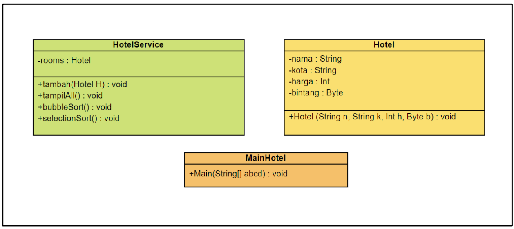
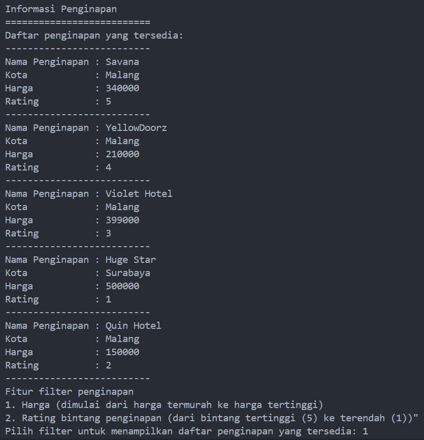
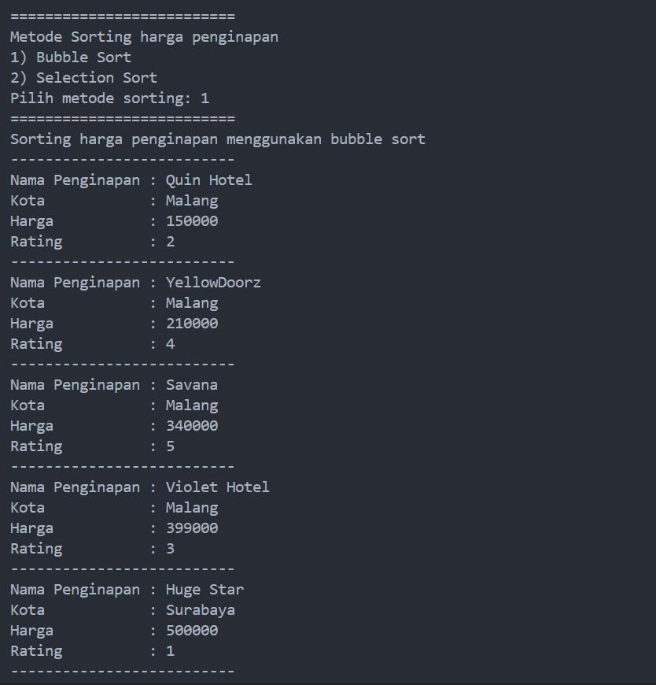
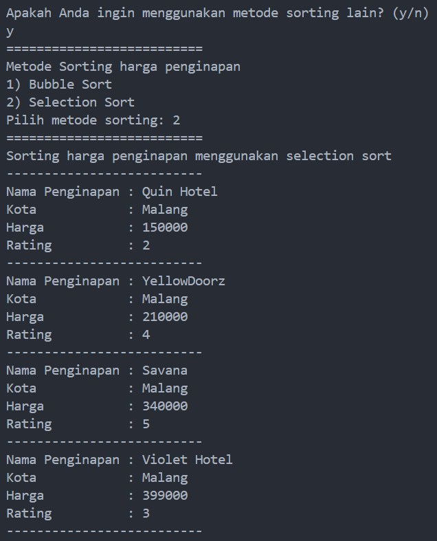
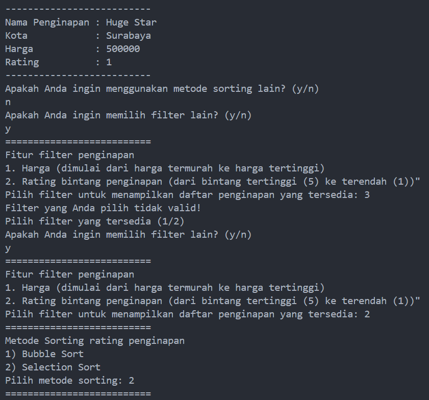
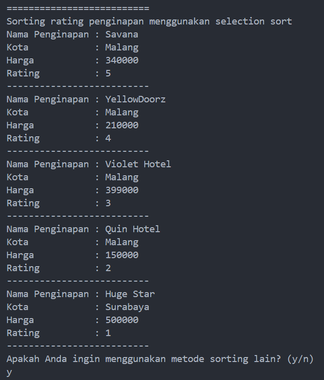
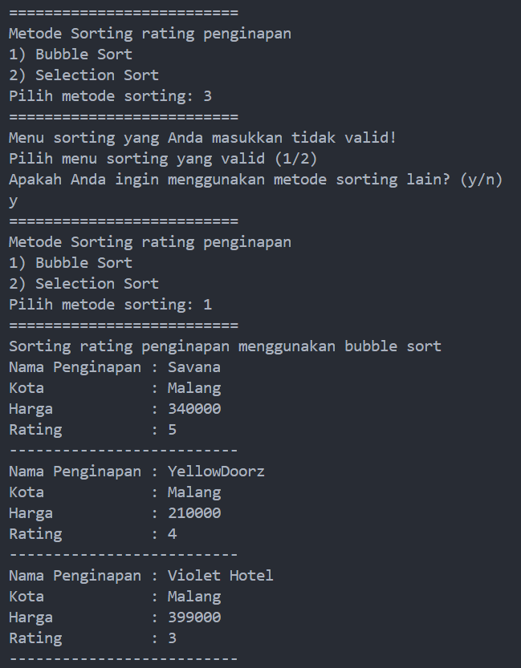
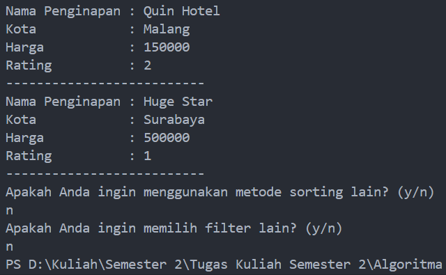

# <p align ="center">Laporan Praktikum Pertemuan 3 Algoritma dan Struktur Data</p>
<br><br><br><br>

<p align="center">
    </p>

<br><br><br><br><br>

<p align = "center"> Nama     : Dio Andika Pradana Mulia Tama </p>
<p align = "center"> NIM      : 2341720098 </p>
<p align = "center"> Prodi    : TEKNIK INFOMATIKA</p>
<p align = "center"> Kelas    : 1B </p>
<p align = "center"> Presensi : 09 </p>

# Jobsheet 5 
# SORTING (BUBBLE, SELECTION, DAN INSERTION SORT)

## 5.2 Mengurutkan Data Mahasiswa Berdasarkan IPK Menggunakan Bubble Sort

### 5.2.1 Langkah-langkah Percobaan
1. Buat project baru dengan nama “bubble-selection-insertion”, kemudian buat package dengan nama “jobsheet6”.<br>
2. Buatlah sebuah class dengan nama Mahasiswa<br>
3. Sesuaikan class Mahasiswa dengan melihat class diagram di atas dengan menambahkan attribute, konstruktor, dan fungsi atau method. Untuk lebih jelasnya class tersebut dapat dilihat pada potongan kode di bawah ini<br>
```java
package Pertemuan6.bubbleSelectionInsertion.jobsheet6;

public class Mahasiswa {
    String nama;
    int thnMasuk, umur;
    double ipk;

    Mahasiswa(String n, int t, int u, double i) {
        nama = n;
        thnMasuk = t;
        umur = u;
        ipk = i;
    }

    void tampil() {
        System.out.println("Nama = " + nama);
        System.out.println("Tahun masuk = " + thnMasuk);
        System.out.println("Umur = " + umur);
        System.out.println("IPK = " + ipk);
    }
}
```
4. Buat class DaftarMahasiswaBerprestasi seperti di bawah ini!
```java
package Pertemuan6.bubbleSelectionInsertion.jobsheet6;

public class DaftarMahasiswaBerprestasi {
    Mahasiswa listMhs[] = new Mahasiswa[5];
    int idx;
}
```
5. Tambahkan method tambah() di dalam class tersebut! Method tambah() digunakan untuk menambahkan objek dari class Mahasiswa ke dalam atribut listMhs.
```java
    void tambah(Mahasiswa m) {
        if (idx < listMhs.length) {
            listMhs[idx] = m;
            idx++;
        } else {
            System.out.println("Data sudah penuh!!");
        }
    }
```

6. Tambahkan method tampil() di dalam class tersebut! Method tampil() digunakan untuk menampilkan semua data mahasiswa-mahasiswa yang ada di dalam class tersebut! Perhatikan penggunaan sintaks for yang agak berbeda dengan for yang telah dipelajari sebelumnya, meskipun secara konsep sebenarnya mirip.
```java
    void tampil() {
        for (Mahasiswa m : listMhs) {
            m.tampil();
            System.out.println("--------------------------------");
        }
    }
```

7. Tambahkan method bubbleSort() di dalam class tersebut!
```java
    void bubbleSort() {
        for (int i = 0; i < listMhs.length-1; i++) {
            for (int j = 1; j < listMhs.length-i; j++) {
                if (listMhs[j].ipk > listMhs[j-1].ipk) {
                    //Proses swap atau pertukaran
                    Mahasiswa tmp = listMhs[j];
                    listMhs[j] = listMhs[j-1];
                    listMhs[j-1] = tmp;
                }
            }
        }   
    }
```

8. Buat class Main dan didalamnya buat method main() seperti di bawah ini!
```java
package Pertemuan6.bubbleSelectionInsertion.jobsheet6;
import java.util.Scanner;

public class Main {
    public static void main(String[] args) {
        
    }
}
```
9. Di dalam method main(), buatlah sebuah objek DaftarMahasiswaBerprestasi dan buatlah 5 objek mahasiswa kemudian tambahkan semua objek mahasiswa tersebut dengan memanggil fungsi tambah pada objek DaftarMahasiswaBerprestasi. Silakan dipanggil fungsi tampil() untuk melihat semua data yang telah dimasukan, urutkan data tersebut dengan memanggil fungsi bubbleSort() dan yang terakhir panggil fungsi tampil kembali.
```java
        DaftarMahasiswaBerprestasi list = new DaftarMahasiswaBerprestasi();
        Mahasiswa m1 = new Mahasiswa("Nusa", 2017, 25, 3);
        Mahasiswa m2 = new Mahasiswa("Rara", 2012, 19, 4);
        Mahasiswa m3 = new Mahasiswa("Dompu", 2018, 19, 3.5);
        Mahasiswa m4 = new Mahasiswa("Abdul", 2017, 23, 2);
        Mahasiswa m5 = new Mahasiswa("Ummi", 2019, 21, 3.75);

        list.tambah(m1);
        list.tambah(m2);
        list.tambah(m3);
        list.tambah(m4);
        list.tambah(m5);

        System.out.println("Data mahasiswa sebelum sorting = ");
        list.tampil();

        System.out.println("Data mahasiswa setelah sorting desc berdasarkan ipk");
        list.bubbleSort();
        list.tampil();
```

### 5.2.2 Verifikasi Hasil Percobaan


### 5.2.3 Pertanyaan
1. Terdapat di method apakah proses bubble sort?<br>
Jawab: Proses bubble sort terdapat pada method buubleSort() pada class DaftarMahasiswaBerprestasi.
```java
    void bubbleSort() {
        for (int i = 0; i < listMhs.length-1; i++) {
            for (int j = 1; j < listMhs.length-i; j++) {
                if (listMhs[j].ipk > listMhs[j-1].ipk) {
                    //Proses swap atau pertukaran
                    Mahasiswa tmp = listMhs[j];
                    listMhs[j] = listMhs[j-1];
                    listMhs[j-1] = tmp;
                }
            }
        }   
    }
```
2. Di dalam method bubbleSort(), terdapat baris program seperti di bawah ini:
```java
                if (listMhs[j].ipk > listMhs[j-1].ipk) {
                    //Proses swap atau pertukaran
                    Mahasiswa tmp = listMhs[j];
                    listMhs[j] = listMhs[j-1];
                    listMhs[j-1] = tmp;
                }
```
Untuk apakah proses tersebut?<br>
Jawab: Proses tersebut adalah proses pertukaran atau swap. Proses tersebut bertujuan untuk menukar posisi nilai yang lebih besar dengan posisi nilai sebelumnya (yang lebih kecil). Jika nilai IPK mahasiswa pada indeks ke-j lebih besar dari nilai IPK pada indeks ke-(j-1), maka proses swap dilakukan. Variabel tmp bertipe Mahasiswa berfungsi sebagai tempat penyimpanan data sementara dari listMhs[j]. Kemudian data pada listMhs[j] ditimpa dengan data dari listMhs[j-1]. Setelah itu, data pada listMhs[j-1] ditimpa dengan data yang disimpan di variabel tmp. Hal ini bertujuan untuk menukar posisi antara mahasiswa pada indeks ke-j (yang IPK nya lebih besar) dengan mahasiswa pada indeks ke-(j-1) (yang IPK nya lebih kecil).

3. Perhatikan perulangan di dalam bubbleSort() di bawah ini:
```java
        for (int i = 0; i < listMhs.length-1; i++) {
            for (int j = 1; j < listMhs.length-i; j++) {
```
a. Apakah perbedaan antara kegunaan perulangan i dan perulangan j?<br>
Jawab:<br>
- Perulangan i digunakan untuk mengatur iterasi dari awal hingga sebelum elemen terakhir dalam array. Ini digunakan untuk menentukan berapa kali tahapan bubble sort berjalan untuk mengurutkan sekumpulan nilai. Setiap iterasi perulangan i memproses satu tahap dari algoritma bubble sort.
- Perulangan j digunakan untuk melakukan perbandingan dan pertukaran nilai elemen (dua elemen yang bersebelahan) pada setiap tahap i. Jumlah iterasi j bergantung pada nilai i saat itu. Setiap iterasi perulangan j membandingkan dua elemen dan melakukan pertukaran jika kondisi if terpenuhi.<br>
Dapat disimpulkan bahwa perulangan i menunjukkan Tahapan dan perulangan j menunjukkan Langkah tiap tahap.

b. Mengapa syarat dari perulangan i adalah i<listMhs.length-1 ? <br>
Jawab: Karena posisi elemen terakhir sudah dibandingkan pada iterasi perulangan sebelumnya sehingga posisinya menjadi terurut dan tidak perlu dibandingkan lagi.  Jadi, Ketika i mencapai listMhs.length-1, perbandingan tidak perlu dilakukan lagi karena elemen terakhir sudah berada di posisi yang benar. Misalnya jika ada 4 elemen dalam array, maka dibutuhkan 3 langkah untuk mengurutkan elemen-elemen tersebut.

c. Mengapa syarat dari perulangan j adalah j<listMhs.length-i ? <br>
Jawab: Syarat tersebut memastikan bahwa perulangan j tidak membandingkan elemen yang sudah terurut berulang kali. Ketika j mencapai listMhs.length-i, berarti elemen yang berada pada posisi terakhir (elemen j) sudah dibandingkan dengan semua elemen di sebelah kiri elemen j.

d. Jika banyak data di dalam listMhs adalah 50, maka berapakali perulangan i akan berlangsung? Dan ada berapa Tahap bubble sort yang ditempuh? <br>
Jawab: perulangan i akan berlangsung selama 49 kali karena i dimulai dari 0 sampai kondisi i < listMhs.length-1 atau i < 49 tidak terpenuhi. ini berarti bahwa i dimulai dari 0 dan berakhir sampai i = 48. Jadi perulangan i akan terjadi 49 kali. Jumlah tahap bubblesort yang ditempuh adalah sama dengan perulangan i yaitu ada 49 tahap.

## 5.3 Mengurutkan Data Mahasiswa Berdasarkan IPK Menggunakan Selection Sort 
Jika pada praktikum yang sebelumnya kita telah mengurutkan data mahasiwa berdasarkan IPK menggunakan Bubble Sort secara descending, pada kali ini kita akan mencoba untuk menambahkan fungsi pengurutan menggunakan Selection Sort.

### 5.3.1. Langkah-langkah Percobaan.
1. Lihat kembali class DaftarMahasiswaBerprestasi, dan tambahkan method selectionSort() di dalamnya! Method ini juga akan melakukan proses sorting secara ascending, tetapi menggunakan pendekatan selection sort.
```java
    void selectionSort() {
        for (int i = 0; i < listMhs.length-1; i++) {
            int idxMin = i;
            for (int j = i + 1; j < listMhs.length; j++) {
                if (listMhs[j].ipk < listMhs[idxMin].ipk) {
                    idxMin = j;
                }
            }
            //swap
            Mahasiswa tmp = listMhs[idxMin];
            listMhs[idxMin] = listMhs[i];
            listMhs[i] = tmp;   
        }
    }
```
2. Setelah itu, buka kembali class Main, dan di dalam method main() tambahkan baris program untuk memanggil method selectionSort() tersebut!
```java
    System.out.println("Data mahasiswa setelah sorting asc berdasarkan ipk");
    list.selectionSort();
    list.tampil();
```
3. Coba jalankan kembali class Main, dan amati hasilnya! Apakah kini data mahasiswa telah   tampil urut menaik berdasar ipk?

### 5.3.2. Verifikasi Hasil Percobaan


### 5.3.3. Pertanyaan   
Di dalam method selection sort, terdapat baris program seperti di bawah ini:
```java
            int idxMin = i;
            for (int j = i + 1; j < listMhs.length; j++) {
                if (listMhs[j].ipk < listMhs[idxMin].ipk) {
                    idxMin = j;
                }
            }
```
Untuk apakah proses tersebut, jelaskan!
Jawab: Proses tersebut digunakan untuk menemukan indeks dari nilai atribut ipk terkecil di dalam array of objek listMhs. Variabel idxMin diinisialisasi dengan i. Ini berarti bahwa mahasiswa pada indeks i merupakan mahasiswa dengan IPK terkecil. Perulangan j dimulai dari indeks i + 1 hingga akhir listMhs. Kemudian dalam perulangan j, nilai atribut ipk dari objek listMHs indeks j dibandingkan dengan nilai ipk objek listMhs pada indeks indxMin.
Jika nilai atribut ipk dari objek listMHs indeks j lebih kecil daripada nilai ipk objek listMhs pada indeks idxMin, maka nilai idxMin diubah dengan j. 

## 5.4 Mengurutkan Data Mahasiswa Berdasarkan IPK Menggunakan Insertion Sort
Yang terakhir akan diimplementasikan Teknik sorting menggunakan Insertion Sort, dengan mengurutkan IPK mahasiswa secara ascending.

### 5.4.1 Langkah-langkah Percobaan
1. Lihat kembali class DaftarMahasiswaBerprestasi, dan tambahkan method insertionSort() di dalamnya. Method ini juga akan melakukan proses sorting secara ascending, tetapi menggunakan pendekatan Insertion Sort.
```java
    void insertionSort() {
        for (int i = 1; i < listMhs.length; i++) {
            Mahasiswa temp = listMhs[i];
            int j = i;
            while (j > 0 && listMhs[j - 1].ipk > temp.ipk) {
                listMhs[j] = listMhs[j - 1];
                j--;
            }
            listMhs[j] = temp;
        }
    }
```
2. Setelah itu, buka kembali class Main, dan di dalam method main() tambahkan baris program untuk memanggil method insertionSort() tersebut!
```java
    System.out.println("Data mahasiswa setelah sorting asc berdasarkan ipk");
    list.insertionSort();
    list.tampil();
```
3. Coba jalankan kembali class Main, dan amati hasilnya! Apakah kini data mahasiswa telah tampil urut menaik berdasar ipk?

### 5.4.2 Verifikasi Hasil Percobaan


### 5.4.3 Pertanyaan
Ubahlah fungsi pada InsertionSort sehingga fungsi ini dapat melaksanakan proses sorting dengan cara descending.<br>
Jawab: Untuk mengubah fungsi pada InsertionSort sehingga fungsi ini dapat melaksanakan proses sorting dengan cara descending adalah dengan cara mengubah operator relasi pada kondisi perulangan dalam (inner loop) yakni pada perulangan while. Operator pembanding listMhs[j - 1].ipk dengan temp.ipk yang semula ">" diubah menjadi "<".<br>
Sebelum:
```java
            while (j > 0 && listMhs[j - 1].ipk > temp.ipk) {
                listMhs[j] = listMhs[j - 1];
                j--;
            }
```
Sesudah:
```java
            while (j > 0 && listMhs[j - 1].ipk < temp.ipk) {
                listMhs[j] = listMhs[j - 1];
                j--;
            }
```
Kode program fungsi InsertionSort setelah diubah:
```java
    void insertionSort() {
        for (int i = 1; i < listMhs.length; i++) {
            Mahasiswa temp = listMhs[i];
            int j = i;
            while (j > 0 && listMhs[j - 1].ipk < temp.ipk) {
                listMhs[j] = listMhs[j - 1];
                j--;
            }
            listMhs[j] = temp;
        }
    }
```
Pemanggilan fungsi InsertionSort pada class Main:
```java
        System.out.println("Data mahasiswa setelah sorting desc berdasarkan ipk (Insertion Sort)");
        list.insertionSort();
        list.tampil();
```
Output program:


## 5.5 Latihan Praktikum
Sebuah platform travel yang menyediakan layanan pemesanan kebutuhan travelling sedang mengembangkan backend untuk sistem pemesanan/reservasi akomodasi (penginapan), salah satu fiturnya adalah menampilkan daftar penginapan yang tersedia berdasarkan pilihan filter yang diinginkan user. Daftar penginapan ini harus dapat disorting berdasarkan
1. Harga dimulai dari harga termurah ke harga tertinggi.
2. Rating bintang penginapan dari bintang tertinggi (5) ke terendah (1)
Buatlah proses sorting data untuk kedua filter tersebut dengan menggunakan algoritma <b>bubble sort</b> dan <b>selection sort.</b>
<br>

Kode program class Hotel:
```java
package Pertemuan6.bubbleSelectionInsertion.jobsheet6;

public class Hotel {
    String nama, kota;
    int harga;
    byte bintang;   

    Hotel(String n, String k, int h, byte b) {
        nama = n;
        kota = k;
        harga = h;
        bintang = b;
    }
}
```
Kode program class HotelService:
```java
package Pertemuan6.bubbleSelectionInsertion.jobsheet6;

public class HotelService {
    Hotel[] rooms = new Hotel[5];
    int idx;

    void tambah(Hotel H) {
        if (idx < rooms.length) {
            rooms[idx] = H;
            idx++;
        } else {
            System.out.println("Data sudah penuh!!");
        }
    }

    void tampilAll() {
        for (int i = 0; i < rooms.length; i++) {
            System.out.println("Nama Penginapan : " + rooms[i].nama);
            System.out.println("Kota            : " + rooms[i].kota);
            System.out.println("Harga           : " + rooms[i].harga);
            System.out.println("Rating          : " + rooms[i].bintang);
            System.out.println("--------------------------");
        }
    }

    void bubbleSortHarga() {
        for (int i = 0; i < rooms.length-1; i++) {
            for (int j = 1; j < rooms.length-i; j++) {
                if (rooms[j].harga < rooms[j-1].harga) {
                    //Proses swap atau pertukaran
                    Hotel tmp = rooms[j];
                    rooms[j] = rooms[j-1];
                    rooms[j-1] = tmp;
                }
            }
        }   
    }

    void bubbleSortRating() {
        for (int i = 0; i < rooms.length-1; i++) {
            for (int j = 1; j < rooms.length-i; j++) {
                if (rooms[j].bintang > rooms[j-1].bintang) {
                    //Proses swap atau pertukaran
                    Hotel tmp = rooms[j];
                    rooms[j] = rooms[j-1];
                    rooms[j-1] = tmp;
                }
            }
        }  
    }

    void selectionSortHarga() {
        for (int i = 0; i < rooms.length-1; i++) {
            int idxMin = i;
            for (int j = i + 1; j < rooms.length; j++) {
                if (rooms[j].harga < rooms[idxMin].harga) {
                    idxMin = j;
                }
            }
            //swap
            Hotel tmp = rooms[idxMin];
            rooms[idxMin] = rooms[i];
            rooms[i] = tmp;   
        }
    }

    void selectionSortRating() {
        for (int i = 0; i < rooms.length-1; i++) {
            int idxMin = i;
            for (int j = i + 1; j < rooms.length; j++) {
                if (rooms[j].bintang > rooms[idxMin].bintang) {
                    idxMin = j;
                }
            }
            //swap
            Hotel tmp = rooms[idxMin];
            rooms[idxMin] = rooms[i];
            rooms[i] = tmp;   
        }
    }
}
```
Kode program class MainHotel:
```java
package Pertemuan6.bubbleSelectionInsertion.jobsheet6;
import java.util.Scanner;

public class MainHotel {
    static Scanner input = new Scanner(System.in);
    static Scanner sc = new Scanner(System.in);
    public static void main(String[] args) {
        HotelService daftar = new HotelService();
        Hotel H1 = new Hotel("Savana", "Malang", 340000, (byte)5);
        Hotel H2 = new Hotel("YellowDoorz", "Malang", 210000, (byte)4);
        Hotel H3 = new Hotel("Violet Hotel", "Malang", 399000, (byte)3);
        Hotel H4 = new Hotel("Huge Star", "Surabaya", 500000, (byte)1);
        Hotel H5 = new Hotel("Quin Hotel", "Malang", 150000, (byte)2);

        daftar.tambah(H1);
        daftar.tambah(H2);
        daftar.tambah(H3);
        daftar.tambah(H4);
        daftar.tambah(H5);

        System.out.println("Informasi Penginapan");
        System.out.println("==========================");
        System.out.println("Daftar penginapan yang tersedia: ");
        System.out.println("--------------------------");
        daftar.tampilAll();

        char konfir;
            do {
                menuFilter(daftar);
                System.out.println("Apakah Anda ingin memilih filter lain? (y/n)");
                konfir = sc.next().charAt(0);
                if (konfir == 'Y'|| konfir == 'y') {
                    System.out.println("==========================");
                } 
            } while (konfir == 'Y'|| konfir == 'y');
    }

    static void menuHarga(HotelService list) {
        System.out.println("==========================");
        System.out.println("Metode Sorting harga penginapan");
        System.out.println("1) Bubble Sort\n" + "2) Selection Sort");
        System.out.print("Pilih metode sorting: ");
        byte menuSort = input.nextByte();
        System.out.println("==========================");

        switch (menuSort) {
            case 1 :
                System.out.println("Sorting harga penginapan menggunakan bubble sort");
                System.out.println("--------------------------");
                list.bubbleSortHarga();
                list.tampilAll();
                break;
            case 2:
                System.out.println("Sorting harga penginapan menggunakan selection sort");
                System.out.println("--------------------------");
                list.selectionSortHarga();
                list.tampilAll();
                break;
            default:
                System.out.println("Menu sorting yang Anda masukkan tidak valid!\n" +
                "Pilih menu sorting yang valid (1/2)");
                break;
        }
    }

    static void menuRating(HotelService list) {
        System.out.println("==========================");
        System.out.println("Metode Sorting rating penginapan");
        System.out.println("1) Bubble Sort\n" + "2) Selection Sort");
        System.out.print("Pilih metode sorting: ");
        byte menuSort = input.nextByte();
        System.out.println("==========================");

        switch (menuSort) {
            case 1 :
                System.out.println("Sorting rating penginapan menggunakan bubble sort");
                list.bubbleSortRating();
                list.tampilAll();
                break;
            case 2:
                System.out.println("Sorting rating penginapan menggunakan selection sort");
                list.selectionSortRating();
                list.tampilAll();
                break;
            default:
                System.out.println("Menu sorting yang Anda masukkan tidak valid!\n" + 
                "Pilih menu sorting yang valid (1/2)");
                break;
        }
    }

    //Ini merupakan fungsi untuk pemilihan filter (harga/rating).
    static void menuFilter(HotelService list) {
        System.out.println("Fitur filter penginapan");
        System.out.println("1. Harga (dimulai dari harga termurah ke harga tertinggi)\n" + 
                           "2. Rating bintang penginapan (dari bintang tertinggi (5) ke terendah (1))\"");
        System.out.print("Pilih filter untuk menampilkan daftar penginapan yang tersedia: ");
        byte menu = input.nextByte();

        if (menu == 1) {
            char konfir1;
            do {
                menuHarga(list);//Pemanggilan fungsi submenu harga penginapan (metode sorting bubble/selection)
                System.out.println("Apakah Anda ingin menggunakan metode sorting lain? (y/n)");
                konfir1 = sc.next().charAt(0);
            } while (konfir1 == 'Y'|| konfir1 == 'y');
        } else if (menu == 2) {
            char konfir2;
            do {
                menuRating(list);//Pemanggilan fungsi submenu rating penginapan (metode sorting bubble/selection)
                System.out.println("Apakah Anda ingin menggunakan metode sorting lain? (y/n)");
                konfir2 = sc.next().charAt(0);
            } while (konfir2 == 'Y'|| konfir2 == 'y');
        } else {
            System.out.println("Filter yang Anda pilih tidak valid!\nPilih filter yang tersedia (1/2)");
        }
    }
}
```

Output program:<br>






