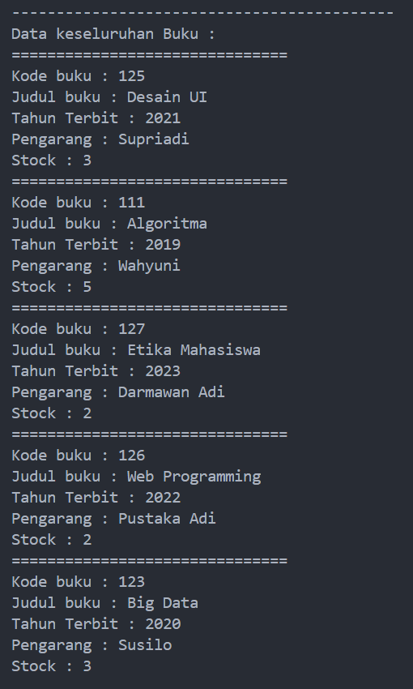
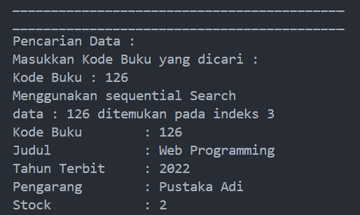
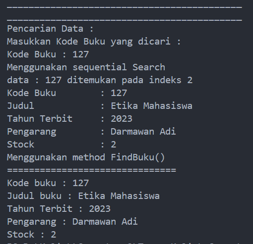
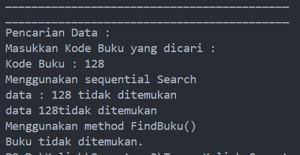

# <p align ="center">Laporan Praktikum Pertemuan 7 Algoritma dan Struktur Data</p>
<br><br><br><br>

<p align="center">
    </p>

<br><br><br><br><br>

<p align = "center"> Nama     : Dio Andika Pradana Mulia Tama </p>
<p align = "center"> NIM      : 2341720098 </p>
<p align = "center"> Prodi    : TEKNIK INFOMATIKA</p>
<p align = "center"> Kelas    : 1B </p>
<p align = "center"> Presensi : 09 </p>

# Jobsheet 6
# Searching

## 6.2. Searching / Pencarian Menggunakan Agoritma Sequential Search

### 6.2.1. Langkah-langkah Percobaan Sequential Search
1. Buatlah Project baru pada dengan nama TestSearching
2. Kemuadian buat packages baru dengan nama P7
3. Buat class BukuNoAbsen, kemudian deklarasikan atribut berikut ini:
```java
public class Buku09 {
    int kodeBuku, tahunTerbit, stock;
    String judulBuku, pengarang;
```
4. Buatlah konstruktor dengan nama Buku dengan parameter (String kodeBuku, String judulBuku, int tahunTerbit, String pengarang, int stock) kemudian Isi konstruktor tersebut dengan kode berikut!
```java
    public Buku09(int kodeBuku, String judulBuku, int tahunTerbit, String pengarang, int stock) {
        this.kodeBuku = kodeBuku;
        this.judulBuku = judulBuku;
        this.tahunTerbit = tahunTerbit;
        this.pengarang = pengarang;
        this.stock = stock;
    }
```
Catatan : Perhatikan konstruktor diatas! Apakah sudah benar? Jika belum, maka perbaiki
konstruktor diatas (konstruktor di atas sudah diperbaiki)
5. Buatlah method tampilDataBuku bertipe void.
```java
    public void tampilDataBuku() {
        System.out.println("===============================");
        System.out.println("Kode buku : " + kodeBuku);
        System.out.println("Judul buku : " + judulBuku);
        System.out.println("Tahun Terbit : " + tahunTerbit);
        System.out.println("Pengarang : " + pengarang);
        System.out.println("Stock : " + stock);
    }
```
6. Buat class baru dengan nama PencarianBukuNoAbsen seperti di bawah ini!
```java
public class PencarianBuku09 {
    Buku09 listBk[] = new Buku09[5];
    int idx;
}
```
7. Tambahkan method tambah() di dalam class tersebut! Method tambah() digunakan untuk menambahkan objek dari class Buku ke dalam atribut listBk.
```java
    void tambah(Buku09 m) {
        if (idx < listBk.length) {
            listBk[idx] = m;
            idx++;
        } else {
            System.out.println("Data sudah penuh!");
        }
    }
```
8. Tambahkan method tampil() di dalam class PencarianBukuNoAbsen Method tampil() digunakan untuk menampilkan semua data buku yang ada di dalam class tersebut! Perhatikan penggunaan sintaks for yang menggunakan konsep for-each. Syntax tersebut akan memberikan tanda error berupa garis merah, Perbaiki agar tidak ada error!
```java
    void tampil() {
        for (Buku09 m : listBk) {
            m.tampilDataBuku();
        }
    }
```
Tidak perlu menuliskan "[]" pada array of objek listBk, karena dalam sintaks foreach yang perlu ditulis hanya nama array saja tidak diikuti "[]".
9. Tambahkan method FindSeqSearch bertipe integer dengan parameter cari bertipe int. Kemudian Deklarasikan isi method FindSeqSearch dengan algoritma pencarian data menggunakan teknik sequential searching.
```java
    public int FindSeqSearch(int cari) {
        int posisi = 2;
        for (int j = 0; j < listBk.length; j++) {
            if (listBk[j].kodeBuku == cari) {
                posisi = j;
                break;
            }
        }
        return posisi;
    }
```
Terdapat kesalahan pada operasi assignment dalam blok kode if pada perulangan for. penulisan operasi assignment yang benar adalah posisi = j bukan j = posisi. Jika j = posisi, maka indeks yang nilainya sama dengan parameter cari akan diganti dengan 2. Penulisan yang benar adalah posisi = j, karena jika indeks yang nilainya sama dengan parameter cari ketemu maka variabel posisi akan diganti dengan indeks tersebut sehinggan nilai posisi yang direturn valid.

10. Buatlah method Tampilpoisisi bertipe void dan Deklarasikan isi dari method Tampilpoisisi.
```java
    public void Tampilposisi(int x, int pos) {
        if (pos != -1) {
            System.out.println("data : " + x + "ditemukan pada indeks " + pos);
        } else {
            System.out.println("data : " + x + "tidak ditemukan");
        }
    }
```

11. Buatlah class baru dengan nama BukuMainNoAbsen tambahkan method main. buatlah sebuah objek PencarianMhs dan buatlah 5 objek buku kemudian tambahkan semua objek buku tersebut dengan memanggil fungsi tambah pada objek PencarianBuku.
```java
package Pertemuan7.TestSearching.src.P7;
import java.util.Scanner;

public class BukuMain09 {
    public static void main(String[] args) {
        Scanner s = new Scanner(System.in); 
        Scanner s1 = new Scanner(System.in);
        
        PencarianBuku09 data = new PencarianBuku09();
        int jumBuku = 5;

        System.out.println("------------------------------------------------");
        System.out.println("Masukkan data Buku secara Urut dari KodeBuku Terkecil : ");
        for (int i = 0; i < jumBuku; i++) {
            System.out.println("------------------");
            System.out.print("Kode Buku \t: ");
            int kodeBuku = s.nextInt();
            System.out.print("Judul Buku \t: ");
            String judulBuku = s1.nextLine();
            System.out.print("Tahun Terbit \t: ");
            int tahunTerbit = s.nextInt();
            System.out.print("Pengarang \t: ");
            String pengarang = s1.nextLine();
            System.out.print("Stock \t\t: ");
            int stock = s.nextInt();

            Buku09 m = new Buku09(kodeBuku, judulBuku, tahunTerbit, pengarang, stock);
            data.tambah(m);
        }
        System.out.println("-------------------------------------------");
        System.out.println("Data keseluruhan Mahasiswa : ");
}

```
Note : perbaiki kode jika terdapat kesalahan. (kode di atas sudah diperbaiki)
Ada sedikit kesalahan pada pemanggilan konsruktor Buku, parameter yang dimasukkan tidak urut yaitu parameter stock mendahului pengarang. Parameter dalam konstruktor harus ditulis secara urut.<br>
Sebelum:
```java
Buku09 m = new Buku09(kodeBuku, judulBuku, tahunTerbit, stock, pengarang);
```
Sesudah:
```java
Buku09 m = new Buku09(kodeBuku, judulBuku, tahunTerbit, pengarang, stock);
```

12. Panggil method tampil() untuk melihat semua data yang telah dimasukan.
```java
        System.out.println("-------------------------------------------");
        System.out.println("Data keseluruhan Buku : ");
        data.tampil();
```

13. Untuk melakukan pencarian berdasarkan kode buku. Buatlah variable cari yang dapat menampung masukan dari keyboard lalu panggil method FindSeqSearch dengan isi parameternya adalah variable cari. Untuk menampilkan index data yang dicari panggil method TampilPosisi
```java
        System.out.println("___________________________________________");
        System.out.println("___________________________________________");
        System.out.println("Pencarian Data : ");
        System.out.println("Masukkan Kode Buku yang dicari : ");
        System.out.print("Kode Buku : ");
        int cari = s.nextInt();
        System.out.println("Menggunakan sequential Search");
        int posisi = data.FindSeqSearch(cari);
        data.Tampilposisi(cari, posisi);
```
Verifikasi hasil pencarian :<br>


```
------------------------------------------------
Masukkan data Buku secara Urut dari KodeBuku Terkecil :
------------------
Kode Buku       : 111
Judul Buku      : Algoritma
Tahun Terbit    : 2019
Pengarang       : Wahyuni
Stock           : 5
------------------
Kode Buku       : 123
Judul Buku      : Big Data
Tahun Terbit    : 2020
Pengarang       : Susilo
Stock           : 3
------------------
Kode Buku       : 125
Judul Buku      : Desain UI 
Tahun Terbit    : 2021
Pengarang       : Supriadi
Stock           : 3
------------------
Kode Buku       : 126
Judul Buku      : Web Programming
Tahun Terbit    : 2022
Pengarang       : Pustaka Adi
Stock           : 2
------------------
Kode Buku       : 127
Judul Buku      : Etika Mahasiswa
Tahun Terbit    : 2023
Pengarang       : Darmawan Adi
Stock           : 2
-------------------------------------------
Data keseluruhan Buku :
===============================
Kode buku : 111
Judul buku : Algoritma
Tahun Terbit : 2019
Pengarang : Wahyuni
Stock : 5
===============================
Kode buku : 123
Judul buku : Big Data
Tahun Terbit : 2020
Pengarang : Susilo
Stock : 3
===============================
Kode buku : 125
Judul buku : Desain UI
Tahun Terbit : 2021
Pengarang : Supriadi
Stock : 3
===============================
Kode buku : 126
Judul buku : Web Programming
Tahun Terbit : 2022
Pengarang : Pustaka Adi
Stock : 2
===============================
Kode buku : 127
Judul buku : Etika Mahasiswa
Tahun Terbit : 2023
Pengarang : Darmawan Adi
Stock : 2
___________________________________________
___________________________________________
Pencarian Data :
Masukkan Kode Buku yang dicari :
Kode Buku : 111
Menggunakan sequential Search
data : 111 ditemukan pada indeks 0
PS D:\Kuliah\Semester 2\Tugas Kuliah Semester 2\Algoritma dan Struktur Data\Praktikum-Algoritma dan Struktur Data>
```
Apakah pencarian pada program anda sudah sesuai? Jika belum perbaiki kode sehingga pencarian
sesuai. <br>
Pencarian pada program sudah sesuai.

14. Buatlah method TampilData bertipe void pada class PencarianBukuNoAbsen dan tambahkan isi dari method TampilData.
```java
    public void TampilData(int x, int pos) {
        if (pos != -1) {
            System.out.println("Kode Buku\t : " + x);
            System.out.println("Judul\t\t : " + listBk[pos].judulBuku);
            System.out.println("Tahun Terbit\t : " + listBk[pos].tahunTerbit);
            System.out.println("Pengarang\t : " + listBk[pos].pengarang);
            System.out.println("Stock\t\t : " + listBk[pos].stock);
        } else {
            System.out.println("data " + x + "tidak ditemukan");
        }
    }
```
15. Di dalam method main(), Lakukan pemanggilan method TampilData dari class PencarianMhs.
```java
data.TampilData(cari, posisi);
```
16. Jalankan dan amati hasilnya.

### 6.2.2. Verifikasi Hasil Percobaan
Jika data ditemukan:<br>

```
___________________________________________
Pencarian Data :
Masukkan Kode Buku yang dicari :
Kode Buku : 111
Menggunakan sequential Search
data : 111 ditemukan pada indeks 0
Kode Buku        : 111
Judul            : Algoritma
Tahun Terbit     : 2019
Pengarang        : Wahyuni
Stock            : 5
```
Jika data tidak ditemukan :
Ternyata masih ada kesalahan pada kode program method FindSeqSearch yaitu nilai posisi (indeks) yang tidak diubah jika tidak ditemukan kodeBuku yang sama dengan kodeBuku yang dicari. Jadi ketika tidak ada nilai kodeBuku yang sesuai, maka variabel posisi akan tetap terisi 2. Hal ini akan menyebabkan ketidak validan program. Oleh karena itu, perlu ditambahkan blok kode else dalam perulangan for agar ketika kode buku tidak ditemukan indeksnya juga tidak ditemukan. Dalam hal ini, ketika kode buku tidak ditemukan maka posisi akan diubah menjadi -1 (karena indeks array tidak ada nilai minus).
Perbaikan kode program:
```java
    public int FindSeqSearch(int cari) {
        int posisi = 2;
        for (int j = 0; j < listBk.length; j++) {
            if (listBk[j].kodeBuku == cari) {
                posisi = j;
                break;
            } else { //Penambahan else untuk menangani kondisi kodeBuku yang di cari tidak ditemukan
                posisi = -1; //Merubah posisi menjadi -1
            }
        }
        return posisi;
    }
```
Output jika data tidak ditemukan:

```
___________________________________________
Pencarian Data :
Masukkan Kode Buku yang dicari :
Kode Buku : 124
Menggunakan sequential Search
data : 124 tidak ditemukan
data 124 tidak ditemukan
PS D:\Kuliah\Semester 2\Tugas Kuliah Semester 2\Algoritma dan Struktur Data\Praktikum-Algoritma dan Struktur Data> 
```

### 6.2.3. Pertanyaan
1. Jelaskan fungsi break yang ada pada method FindSeqSearch!<br>
Jawab: Fungsi break pada method FindSeqSearch adalah menghentikan perulangan untuk mencari kodeBuku (parameter cari) pada atribut kodeBuku array of objek listBK. Jika nilai kode buku pada indeks ke-j sama dengan nilai parameter cari, maka kondisi if terpenuhi dan statement posisi = j; akan dieksekusi untuk menyimpan indeks tempat nilai parameter cari ditemukan. Kemudian dengan sintaks break, program akan berhenti mencari nilai parameter cari karena nilai tersebut sudah ditemukan dalam array of objek listBk. Hal ini dapat membuat proses pencarian lebih efisien dan menghindari perulangan yang tidak perlu (mengecek semua nilai atribut kodeBuku pada array of objek listBK).
2. Jika Data Kode Buku yang dimasukkan tidak terurut dari kecil ke besar. Apakah program masih dapat berjalan? Apakah hasil yang dikeluarkan benar? Tunjukkan hasil screenshoot untuk bukti dengan kode Buku yang acak. Jelaskan Mengapa hal tersebut bisa terjadi?<br>
Jawab: Ya, program masih dapat berjalan ketika data Kode Buku yang dimasukkan tidak terurut dari kecil ke besar. Hasil yang dikeluarkan pun juga benar. Hal ini dapat terjadi karena salah satu keunggulan sequential search adalah kumpulan data tidak harus dalam keadaan terurut. Oleh karena itu, meskipun kumpulan data dalam kondisi teracak, proses pencarian menggunakan sequential search tetap dapat dilakukan dan akan menemukan hasil dengan benar karena proses pengecekan nilai dalam sequential search dilakukan dengan membandingkan satu per satu elemen dalam array mulai dari indeks awal sampai terakhir tanpa memperhatikan urutan elemennya. <br>
Bukti: 



3. Buat method baru dengan nama FindBuku menggunakan konsep sequential search dengan tipe method dari FindBuku adalah BukuNoAbsen. Sehingga Anda bisa memanggil method tersebut pada class BukuMain seperti gambar berikut :

```java
Buku dataBuku = data.FindBuku(cari);
dataBuku.tampilDataBuku();
```
Kode program pembuatan method baru:<br>

```java
    public Buku09 FindBuku(int cari) {
        int posisi = -1;
        for (int j = 0; j < listBk.length; j++) {
            if (listBk[j].kodeBuku == cari) {
                posisi = j;
                break;
            } else {
                posisi = -1;
            }
        }
        if (posisi == -1) {
            return null; // Mengembalikan null jika kodeBuku tidak ditemukan
        } else {
            return listBk[posisi];
        }
    }
```
Pemanggilan method FindBuku() pada class BukuMain09:
```java
        System.out.println("Menggunakan method FindBuku()");
        Buku09 dataBuku = data.FindBuku(cari);
        if (dataBuku != null) {
            dataBuku.tampilDataBuku();
        } else {
            System.out.println("Buku tidak ditemukan.");
        }
```
Ada sedikit perubahan untuk pemanggilan method FindBuku() pada class BukuMain09, jika nilai kembalian tidak null, maka method tampilDataBuku() akan dipanggil. Jika nilai kembalian null, maka akan mencetak "Buku tidak ditemukan".
Output program:<br>


Output jika kodeBuku ditemukan:<br>
<br>
Output jika kodeBuku tidak ditemukan:<br>

Sebenarnya tidak ada perbedaan antara method FindBuku() dengan method FindSeqSearch(), hanya saja pada method FindBuku() nilai yang direturnkan bukanlah posisi indeks saja, melainkan objek listBk dengan posisi indeks yang sama dengan nilai (kodeBuku) yang dicari (jika kodeBuku yang dicari ditemukan). Namun, jika kodeBuku yang dicari tidak ditemukan, maka nilai yang direturnkan adalah null karena jika yang direturnkan adalah objek listBk dengan posisi indeks -1 (karena tidak ditemukan) akan terjadi error ``Exception in thread "main" java.lang.ArrayIndexOutOfBoundsException: Index -1 out of bounds for length 5``. Hal ini dapat dilakukan karena tipe method FindBuku() adalah class Buku09 sehingga nilai yang dikembalikan dapat berupa objek (yang diinstansiasi dengan class Buku09). Untuk menampilkan data buku secara lengkap pada fungsi BukuMain juga dapat secara langsung mengakses method tampilDataBuku() karena nilai yang dikembalikan pada method FindBuku() adalah objek dari class Buku09.

## 6.3. Searching / Pencarian Menggunakan Binary Search

### 6.3.1. Langkah-langkah Percobaan Binary Search
1. Pada percobaan 6.2.1 (sequential search) tambahkan method FindBinarySearch bertipe integer pada class PencarianBukuNoAbsen. Kemudian Deklarasikan isi method FindBinarySearch dengan algoritma pencarian data menggunakan teknik binary searching.
```java
    public int FindBinarySearch(int cari, int left, int right) {
        int mid;
        if (right >= left) {
            mid = (right) / 2;
            if (cari == listBk[mid].kodeBuku) {
                return (mid);
            } else if (listBk[mid].kodeBuku > cari) {
                return FindBinarySearch(cari, left, mid);
            } else {
                return FindBinarySearch(cari, mid, right);
            }
        } 
        return -1;
    }
```
2. Panggil method FindBinarySearch di kelas BukuMainNoAbsen. Kemudia panggil method tampilposisi dan tampilData
```java
        System.out.println("=================================");
        System.out.println("menggunakan binary search");
        posisi = data.FindBinarySearch(cari, 0, jumBuku - 1);
        data.Tampilposisi(cari, posisi);
        data.TampilData(cari, posisi);
```
3. Jalankan dan amati hasilnya.

### 6.3.2. Verifikasi Hasil Percobaan
Terdapat kesalahan pada method FindBinarySearch yaitu pada pengisian variabel mid. Variabel mid seharusnya menjumlahkan antara bagian kiri (left) dan bagian kanan (right) kemudian dibagi 2 untuk mendapatkan nilai tengah, bukan membagi bagian kanan (right) saja dengan 2 untuk mendapatkan nilai tengah. Meskipun nilai parameter awal left adalah 0, tetapi jika nilai tengah kurang dari nilai yang dicari, maka proses pencarian selanjutnya akan dilakukan di bagian kanan array. Oleh karena itu, nilai left akan berubah (bergeser ke kanan) sehingga nilai left tidak 0 lagi. Jika bagian kanan (right) saja yang dibagi 2, maka nilai tengah untuk pencarian yang baru (di bagian kanan array) tidak valid karena nilainya akan sama dengan nilai tengah pencarian awal sehingga pemanggilan fungsi rekursif akan terjadi secara terus-menerus sampai terjadi error StackOverFlow.<br>
Selain itu terdapat pula kesalahan pada pemanggilan method FindBinarySearch secara rekursif. 
```java
            } else if (listBk[mid].kodeBuku > cari) {
                return FindBinarySearch(cari, left, mid);
            } else {
                return FindBinarySearch(cari, mid, right);
```
Pada kondisi else if, seharusnya parameter ketiga (right) yang merupakan nilai akhir pada method FindBinarySearch adalah mid - 1 karena indeks terakhir terletak di sebelah kiri nilai tengah bukan tepat di nilai tengah. Pada kondisi else, seharusnya parameter kedua (left) yang merupakan nilai awal pada method FindBinarySearch adalah mid + 1 karena indeks awal terletak di sebelah kanan nilai tengah bukan tepat di nilai tengah.<br>
Perbaikan kode program method indBinarySearch():
```java
    public int FindBinarySearch(int cari, int left, int right) {
        int mid;
        if (right >= left) {
            mid = (left + right) / 2;
            if (cari == listBk[mid].kodeBuku) {
                return (mid);
            } else if (listBk[mid].kodeBuku > cari) {
                return FindBinarySearch(cari, left, mid - 1);
            } else {
                return FindBinarySearch(cari, mid + 1, right);
            }
        } 
        return -1;
    }
```


```
___________________________________________
___________________________________________
Pencarian Data :
Masukkan Kode Buku yang dicari :
Kode Buku : 126
Menggunakan sequential Search
data : 126 ditemukan pada indeks 3
Kode Buku        : 126
Judul            : Web Programming
Tahun Terbit     : 2022
Pengarang        : Pustaka Adi
Stock            : 2
=================================
menggunakan binary search
data : 126 ditemukan pada indeks 3
Kode Buku        : 126
Judul            : Web Programming
Tahun Terbit     : 2022
Pengarang        : Pustaka Adi
Stock            : 2
```

### 6.3.3. Pertanyaan
1. Tunjukkan pada kode program yang mana proses divide dijalankan!
Jawab: Proses divide dijalankan pada pengisian variabel mid. 
```java
    mid = (left + right) / 2;
```
Pada kode program di atas, proses divide terjadi dengan menghitung nilai tengah (mid) dengan menggunakan formula (left + right) / 2. Ini merupakan operasi pembagian untuk mencari titik tengah (mid) sebagai pemisah antara bagian kiri dan kanan array.

2. Tunjukkan pada kode program yang mana proses conquer dijalankan!
Jawab: Proses conquer dijalankan pada bagian kode program berikut:
```java
            if (cari == listBk[mid].kodeBuku) {
                return (mid);
            } else if (listBk[mid].kodeBuku > cari) {
                return FindBinarySearch(cari, left, mid - 1);
            } else {
                return FindBinarySearch(cari, mid + 1, right);
            }
```
Jika nilai parameter cari sama dengan listBk[mid].kodeBuku, maka fungsi akan mengembalikan nilai mid sebagai posisi elemen yang ditemukan. Jika listBk[mid].kodeBuku lebih besar dari nilai parameter cari, maka fungsi akan memanggil dirinya sendiri (rekursif) dengan parameter kedua left dan yang terakhir menjadi mid - 1. Jika listBk[mid].kodeBuku lebih kecil dari nilai parameter cari, maka fungsi akan memanggil dirinya sendiri (rekursif) dengan parameter kedua menjadi mid + 1 dan yang terakhir adalah right.<br>

4. Jika data Kode Buku yang dimasukkan tidak urut. Apakah program masih dapat berjalan? Mengapa demikian! Tunjukkan hasil screenshoot untuk bukti dengan kode Buku yang acak. Jelaskan Mengapa hal tersebut bisa terjadi?<br>
Jawab: Ya, program masih dapat berjalan, akan tetapi hasil pencarian menggunakan binary search tidak ditemukan padahal kodeBuku yang dicari ada dalam array listBk. Hal ini dapat terjadi karena kode buku yang diinputkan tidak urut dari yang terkecil ke terbesar. Syarat dari pencarian binary search adalah data harus urut terlebih dahulu. Mengapa harus urut, karena pada binary search data akan dibagi menjadi 2 lalu dicari nilai tengahnya yang kemudian nilai tengah tersebut akan dibandingkan dengan nilai yang dicari. Jika data tidak urut, nilai tengah yang dibandingkan tidak dapat dijadikan acuan karena datanya acak.


<br>

3. Jika Kode Buku yang dimasukkan dari Kode Buku terbesar ke terkecil (missal : 20215, 20214, 20212, 20211, 20210) dan elemen yang dicari adalah 20210. Bagaimana hasil dari binary search? Apakah sesuai? Jika tidak sesuai maka ubahlah kode program binary seach agar hasilnya sesuai!
Jawab: Hasilnya adalah tidak sesuai. Elemen yang dicari (20210) tidak dapat ditemukan. Hal ini karena data yang disajikan memang urut, namun secara descending (dari terbesar ke terkecil) sedangkan pada method pencarian binary search dikhususkan untuk data terurut secara ascending (dari terkecil ke terbesar). 
Output awal program:


<br>
Jika ingin mencari nilai pada kumpulan data yang terurut secara descending, maka kode program method FindBinarySearch() harus diubah. Perubahan yang dilakukan adalah pada pengecekan dan pembandingan antara listBk[mid].kodeBuku dengan nilai parameter cari. Ketika listBk[mid].kodeBuku > cari maka pencarian akan dilanjutkan dengan mencari di bagian kanan array. Begitupun sebaliknya, jika listBk[mid].kodeBuku < cari maka pencarian akan dilanjutkan dengan mencari di bagian kiri array.
Modifikasi kode program method FindBinarySearch():

```java
    public int FindBinarySearch(int cari, int left, int right) {
        int mid;
        if (right >= left) {
            mid = (left + right) / 2;
            if (cari == listBk[mid].kodeBuku) {
                return (mid);
            } else if (listBk[mid].kodeBuku < cari) { //Ganti operator ">" dengan "<".
                return FindBinarySearch(cari, left, mid - 1);
            } else {
                return FindBinarySearch(cari, mid + 1, right);
            }
        } 
        return -1;
    }
```
Output program setelah dimodifikasi:


## 6.4. Percobaan Pengayaan Divide and Conquer

### 6.4.1. Langkah-langkah Percobaan Merge Sort
1. Buatlah Package baru didalam package P5 dengan nama MergeSortTest
2. Tambahkan class MergeSortingNoAbsen pada package tersebut
3. Pada class MergeSortingNoAbsen buatlah method mergeSort yang menerima parameter data array yang akan diurutkan
```java
    public void mergeSort(int[] data) {
```
4. Buatlah method merge untuk melakukan proses penggabungan data dari bagian kiri dan kanan.
```java
    public void merge(int[] data, int left, int middle, int right) {
```
5. Implementasikan proses merge sebagai berikut.
```java
        int[] temp = new int[data.length];
        for (int i = left; i <= right; i++) {
            temp[i] = data[i];
        }
        int a = left;
        int b = middle + 1;
        int c = left;

        while (a <= middle && b <= right) {
            if (temp[a] <= temp[b]) {
                data[c] = temp[a];
                a++;
            } else {
                data[c] = temp[b];
                b++;
            }
            c++;
        }
        int s = middle - a;
        for (int i = 0; i <= s; i++) {
            data[c + i] = temp [a + i];
        }
```
6. Buatlah method sort
```java
    public void sort(int data[], int left, int right) {
```
7. Implementasikan kode berikut pada method sort
```java
        if (left < right) {
            int middle = (left + right) / 2;
            sort(data, left, middle);
            sort(data, middle + 1, right);
            merge(data, left, middle, right);
        }
```
8. Pada method mergeSort, panggil method sort dengan parameter data yang ingin diurutkan serta range data awal sampai dengan akhir.
```java
    public void mergeSort(int[] data) {
        sort(data, 0, data.length-1);
    }
```
9. Tambahkan method printArray
```java
    public void printArray(int arr[]) {
        for (int i = 0; i < arr.length; i++) {
            System.out.print(arr[i] + " ");
        }
        System.out.println();
    }
```
10. Sebagai langkah terakhir, deklarasikan data yang akan diurutkan kemudian panggil proses sorting pada class MergeSortMainNoAbsen. Tambahkan fungsi main pada kelas tersebut, kemudian tuliskan kode berikut didalam fungsi main.
```java
        int data[] = {10,40,30,50,70,20,100,90};
        System.out.println("Sorting dengan merge sort");
        MergeSorting09 mSort = new MergeSorting09();
        System.out.println("data awal");
        mSort.printArray(data);
        mSort.mergeSort(data);
        System.out.println("setelah diurutkan");
        mSort.printArray(data);
```

### 6.4.2. Verifikasi Hasil Percobaan


```
Sorting dengan merge sort
data awal
10 40 30 50 70 20 100 90 
setelah diurutkan
10 20 30 40 50 70 90 100 
```

## 6.5. Latihan Praktikum
1. Modifikasi percobaan searching diatas dengan ketentuan berikut ini
- Ubah tipe data dari kode Buku yang awalnya int menjadi String
```java
package P7;

public class Buku09 {
    int tahunTerbit, stock;
    String judulBuku, pengarang, kodeBuku;

    public Buku09(String kodeBuku, String judulBuku, int tahunTerbit, String pengarang, int stock) {
        this.kodeBuku = kodeBuku;
        this.judulBuku = judulBuku;
        this.tahunTerbit = tahunTerbit;
        this.pengarang = pengarang;
        this.stock = stock;
    }

    public void tampilDataBuku() {
        System.out.println("===============================");
        System.out.println("Kode buku : " + kodeBuku);
        System.out.println("Judul buku : " + judulBuku);
        System.out.println("Tahun Terbit : " + tahunTerbit);
        System.out.println("Pengarang : " + pengarang);
        System.out.println("Stock : " + stock);
    }
}
```
- Tambahkan method untuk pencarian kode Buku (bertipe data String) dengan menggunakan sequential search dan binary search.
Kode program method pencarian kode Buku menggunakan sequential search:
```java
    public int FindSeqSearch(String cari) {
        int posisi = 2;
        for (int j = 0; j < listBk.length; j++) {
            if (listBk[j].kodeBuku.equals(cari)) {
                posisi = j;
                break;
            } else {
                posisi = -1;
            }
        }
        return posisi;
    }
```
Kode program method pencarian kode Buku menggunakan sequential search dengan tipe Buku09:
```java
    public Buku09 FindBuku(String cari) {
        int posisi = -1;
        for (int j = 0; j < listBk.length; j++) {
            if (listBk[j].kodeBuku.equals(cari)) {
                posisi = j;
                break;
            } else {
                posisi = -1;
            }
        }
        if (posisi == -1) {
            return null; // Mengembalikan null jika kodeBuku tidak ditemukan
        } else {
            return listBk[posisi];
        }
    }
```
Kode program method pencarian kode Buku menggunakan binary search:
```java
    public int FindBinarySearch(String cari, int left, int right) {
        int mid;
        if (right >= left) {
            mid = (left + right) / 2;
            if (listBk[mid].kodeBuku.equals(cari)) {
                return (mid);
            //Untuk membandingkan string menggunakan compareTo
            } else if (listBk[mid].kodeBuku.compareTo(cari) > 0) {
                return FindBinarySearch(cari, left, mid - 1);
            } else {
                return FindBinarySearch(cari, mid + 1, right);
            }
        } 
        return -1;
    }
```
CompareTo mengembalikan nilai dengan ketentuan:
- Jika nilai yang dikembalikan < 0, maka string pertama memiliki posisi lebih dulu (berdasarkan urutan alfabet).
- Jika nilai yang dikembalikan == 0, maka kedua string memiliki posisi yang sama (berdasarkan urutan alfabet).
- Jika nilai yang dikembalikan > 0, maka string kedua memiliki posisi lebih dulu (berdasarkan urutan alfabet).
``Method FindBinarySearch() ini tetap membutuhkan data kodeBuku secara urut dari terkecil ke terbesar berdasarkan urutan alfabet (bisa juga dari terbesar ke terkecil dengan merubah operator perbandingannya).``
Modifikasi method TampilData() dan TampilPosisi():
```java
    public void Tampilposisi(String x, int pos) {
        if (pos != -1) {
            System.out.println("data : " + x + " ditemukan pada indeks " + pos);
        } else {
            System.out.println("data : " + x + " tidak ditemukan");
        }
    }

    public void TampilData(String x, int pos) {
        if (pos != -1) {
            System.out.println("Kode Buku\t : " + x);
            System.out.println("Judul\t\t : " + listBk[pos].judulBuku);
            System.out.println("Tahun Terbit\t : " + listBk[pos].tahunTerbit);
            System.out.println("Pengarang\t : " + listBk[pos].pengarang);
            System.out.println("Stock\t\t : " + listBk[pos].stock);
        } else {
            System.out.println("data " + x + " tidak ditemukan");
        }
    }
```
Output program setelah dimodifikasi:<br>


Jika data ditemukan:<br>

Jika data tidak ditemukan:<br>


2. Modifikasi percobaan searching diatas dengan ketentuan berikut ini
- Tambahkan method pencarian judul buku menggunakan sequential search dan binary search. Sebelum dilakukan searching dengan binary search data harus dilakukan pengurutan dengan menggunakan algoritma Sorting (bebas pilih algoritma sorting apapun)! Sehingga ketika input data acak, maka algoritma searching akan tetap berjalan
Kode program method pencarian judul buku menggunakan sequential search:<br>
```java
    public int FindJudulSeqSearch(String cariJdl) {
        int posisi = 2;
        for (int j = 0; j < listBk.length; j++) {
            if (listBk[j].judulBuku.equalsIgnoreCase(cariJdl)) {
                posisi = j;
                break;
            } else {
                posisi = -1;
            }
        }
        return posisi;
    }
```
Kode program method pencarian judul buku menggunakan sequential search dengan tipe Buku09:<br>
```java
    public Buku09 FindJudulBuku(String cariJdl) {
        int posisi = -1;
        for (int j = 0; j < listBk.length; j++) {
            if (listBk[j].judulBuku.equalsIgnoreCase(cariJdl)) {
                posisi = j;
                break;
            } else {
                posisi = -1;
            }
        }
        if (posisi == -1) {
            return null; // Mengembalikan null jika kodeBuku tidak ditemukan
        } else {
            return listBk[posisi];
        }
    }
```
Kode program method pengurutan judul buku menggunakan algoritma sorting selection sort:<br>
Kode program method pencarian judul buku menggunakan binary search:<br>
```java
    public int FindJdlBinSearch(String cariJdl, int left, int right) {
        int mid;
        if (right >= left) {
            mid = (left + right) / 2;
            if (listBk[mid].judulBuku.equals(cariJdl)) {
                return (mid);
            //Untuk membandingkan String menggunakan compareTo
            } else if (listBk[mid].judulBuku.compareTo(cariJdl) > 0) {
                return FindBinarySearch(cariJdl, left, mid - 1);
            } else {
                return FindBinarySearch(cariJdl, mid + 1, right);
            }
        } 
        return -1;
    }
```
Kode program method pengurutan kode buku menggunakan algoritma sorting selection sort:<br>
- Buat aturan untuk mendeteksi hasil pencarian judul buku yang lebih dari 1 hasil dalam bentuk kalimat peringatan! Pastikan algoritma yang diterapkan sesuai dengan kasus yang diberikan!