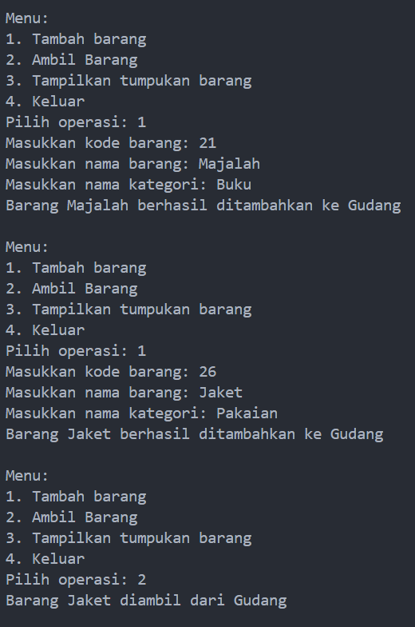
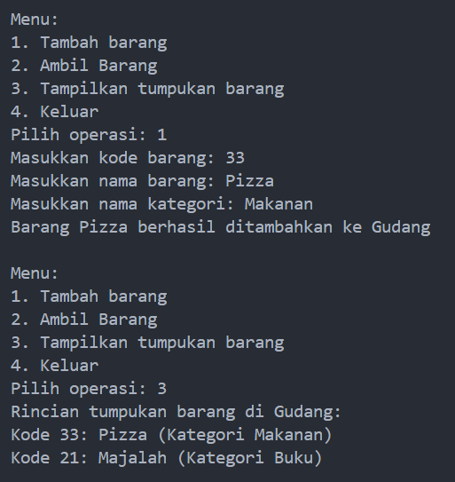
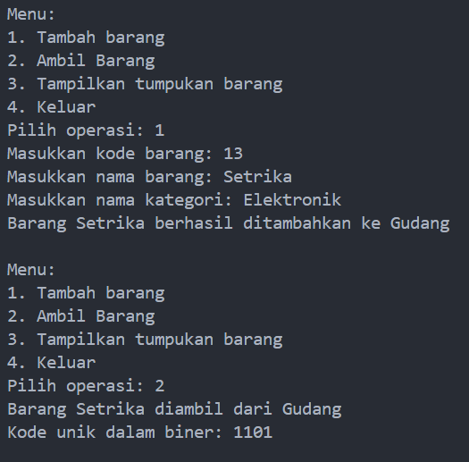
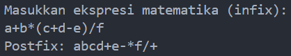

# <p align ="center">Laporan Praktikum Pertemuan 8 Algoritma dan Struktur Data</p>
<br><br><br><br>

<p align="center">
    </p>

<br><br><br><br><br>

<p align = "center"> Nama     : Dio Andika Pradana Mulia Tama </p>
<p align = "center"> NIM      : 2341720098 </p>
<p align = "center"> Prodi    : Teknik Informatika</p>
<p align = "center"> Kelas    : 1B </p>
<p align = "center"> Presensi : 09 </p>

# Jobsheet 7
# Stack

# 2. Praktikum
## 2.1 Percobaan 1: Penyimpanan Tumpukan Barang dalam Gudang

### 2.1.1 Langkah-langkah Percobaan
#### 1. Class Barang
1. Buka text editor. Buat file baru, beri nama **Barang<NoAbsen>.java**
2. Lengkapi class **Barang** dengan atribut yang telah digambarkan di dalam class diagram Barang, yang terdiri dari atribut **kode, nama,** dan **kategori**
3. Tambahkan konstruktor berparameter pada class Barang sesuai dengan class diagram Barang
```java
public class Barang09 {
    int kode;
    String nama, kategori;

    public Barang09(int kode, String nama, String kategori) {
        this.kode = kode;
        this.nama = nama;
        this.kategori = kategori;
    }
}
```
#### 2. Class Gudang
4. Setelah membuat class Barang, selanjutnya perlu dibuat class **Gudang<NoAbsen>.java** sebagai 
tempat untuk mengelola tumpukan barang. Class Gudang merupakan penerapan dari Stack
5. Lengkapi class **Gudang** dengan atribut yang telah digambarkan di dalam class diagram Gudang, yang terdiri dari atribut **tumpukan, size,** dan **top**
```java
public class Gudang09 {
    Barang09[] tumpukan;
    int size, top;
}
```
6. Tambahkan konstruktor berparameter pada class Gudang untuk melakukan inisialisasi kapasitas maksimum data barang yang dapat disimpan di dalam stack, serta mengeset indeks awal dari pointer top
```java
    public Gudang09(int kapasitas) {
        size = kapasitas;
        tumpukan = new Barang09[size];
        top = -1;
    }
```
7. Pada class Gudang, buat method **cekKosong** bertipe boolean untuk mengecek apakah tumpukan barang di dalam gudang masih kosong
```java
    public boolean cekKosong() {
        if (top == -1) {
            return true;
        } else {
            return false;
        }
    }
```
8. Selanjutnya, buat method **cekPenuh** bertipe boolean untuk mengecek apakah tumpukan barang di dalam gudang sudah terisi penuh sesuai kapasitas
```java
    public boolean cekPenuh() {
        if (top == size - 1) {
            return true;
        } else {
            return false;
        }
    }
```
9. Untuk dapat menambahkan barang ke dalam tumpukan di gudang, maka buat method **tambahBarang** yang merepresentasikan push. Method ini menerima parameter **brg** yang berupa object **Barang**
```java
    public void tambahBarang(Barang09 brg) {
        if (!cekPenuh()) {
            top++;
            tumpukan[top] = brg;
            System.out.println("Barang " + brg.nama + " berhasil ditambahkan ke Gudang");
        } else {
            System.out.println("Gagal! Tumpukan barang di Gudang sudah penuh");
        }
    }
```
10. Pengambilan barang dari tumpukan di gudang dilakukan dengan menggunakan method **ambilBarang** yang merepresentasikan pop. Method ini tidak menerima parameter apapun karena barang yang diambil atau dikeluarkan pasti berada di posisi teratas
```java
    public Barang09 ambilBarang() {
        if (!cekKosong()) {
            Barang09 delete = tumpukan[top];
            top--;
            System.out.println("Barang " + delete.nama + " diambil dari Gudang");
            return delete;
        } else {
            System.out.println("Tumpukan barang kosong.");
            return null;
        }
    }
```
*Catatan: Apabila diperlukan informasi mengenai data barang yang diambil, maka tipe kembalian harus berupa object Barang. Sebaliknya, tipe kembalian void dapat digunakan jika data barang yang dikeluarkan tidak akan diolah atau digunakan lagi*
11. Buat method **lihatBarangTeratas** yang merepresentasikan peek untuk dapat mengecek tumpukan barang di posisi paling atas
```java
    public Barang09 lihatBarangTeratas() {
        if (!cekKosong()) {
            Barang09 barangTeratas = tumpukan[top];
            System.out.println("Barang teratas: " + barangTeratas.nama);
            return barangTeratas;
        } else {
            System.out.println("Tumpukan barang kosong.");
            return null;
        }
    }
```
***Perbaiki kode program, jika menurut Anda terdapat kesalahan***
12. Tambahkan method **tampilkanBarang** untuk dapat menampilkan semua rincian tumpukan barang di gudang
```java
    public void tampilkanBarang() {
        if (!cekKosong()) {
            System.out.println("Rincian tumpukan barang di Gudang:");
            //for (int i = top; i >= 0; i--) { Seharusnya ini yang benar
            for (int i = 0; i <= top; i++) {
                System.out.printf("Kode %d: %s (Kategori %s)\n", tumpukan[i].kode, tumpukan[i].nama, tumpukan[i].kategori); 
            }
        } else {
            System.out.println("Tumpukan barang kosong.");
        }
    }
```
Terdapat kesalahan dalam perulangan untuk menampilkan barang yaitu inisalisasi counter i yang salah, batas perulangan yang salah dan update counter i yang salah. Prinsip dari stack adalah LIFO (last in first out), jadi barang dengan posisi terataslah yang akan tampil terlebih dahulu. Jadi, perulangan yang benar adalah ``//for int i = top; i >= 0; i--)``
Kode yang benar:
```java
public void tampilkanBarang() {
        if (!cekKosong()) {
            System.out.println("Rincian tumpukan barang di Gudang:");
            for (int i = top; i >= 0; i--) {
            //for (int i = 0; i <= top; i++) {
                System.out.printf("Kode %d: %s (Kategori %s)\n", tumpukan[i].kode, tumpukan[i].nama, tumpukan[i].kategori); 
            }
        } else {
            System.out.println("Tumpukan barang kosong.");
        }
    }
```
#### 3. Class Utama
13. Buat file baru, beri nama **Utama<NoAbsen>.java**
14. Tuliskan struktur dasar bahasa pemrograman Java yang terdiri dari fungsi **main**
```java
public class Utama09 {
    public static void main(String[] args) {
        
    }
}
```
15. Di dalam fungsi main, lakukan instansiasi object Gudang bernama gudang dengan nilai parameternya adalah 7.
```java
    Gudang09 gudang = new Gudang09(7);
```
16. Deklarasikan Scanner dengan nama variabel **scanner**
```java
        Scanner scanner = new Scanner(System.in);
```
17. Tambahkan menu untuk memfasilitasi pengguna dalam memilih operasi Stack dalam mengelola data barang di gudang menggunakan struktur perulangan **While**
```java
        while (true) {
            System.out.println("\nMenu:");    
            System.out.println("1. Tambah barang");    
            System.out.println("2. Ambil Barang");    
            System.out.println("3. Tampilkan tumbukan barang");    
            System.out.println("4. Keluar");    
            System.out.println("Pilih operasi: ");    
            int pilihan = scanner.nextInt();

            switch (pilihan) {
                case 1:
                    System.out.print("Masukkan kode barang: ");
                    int kode = scanner.nextInt();
                    scanner.nextLine();
                    System.out.print("Masukkan nama barang: ");
                    String nama = scanner.nextLine();
                    System.out.print("Masukkan nama kategori: ");
                    String kategori = scanner.nextLine();
                    Barang09 barangBaru = new Barang09(kode, nama, kategori);
                    gudang.tambahBarang(barangBaru);
                    break;
                case 2:
                    gudang.ambilBarang();
                    break;
                case 3:
                    gudang.tampilkanBarang();
                    break;  
                case 4:
                    break;
                default:
                    System.out.println("Pilihan tidak valid. Silahkan coba lagi.");
            }
        }
```
18. **Commit dan push kode program ke Github**
19. Compile dan run program.

Kode program class Barang09:
```java
public class Barang09 {
    int kode;
    String nama, kategori;

    public Barang09(int kode, String nama, String kategori) {
        this.kode = kode;
        this.nama = nama;
        this.kategori = kategori;
    }
}
```

Kode program class Gudang09.java:
```java
public class Gudang09 {
    Barang09[] tumpukan;
    int size, top;

    public Gudang09(int kapasitas) {
        size = kapasitas;
        tumpukan = new Barang09[size];
        top = -1;
    }

    public boolean cekKosong() {
        if (top == -1) {
            return true;
        } else {
            return false;
        }
    }

    public boolean cekPenuh() {
        if (top == size - 1) {
            return true;
        } else {
            return false;
        }
    }

    public void tambahBarang(Barang09 brg) {
        if (!cekPenuh()) {
            top++;
            tumpukan[top] = brg;
            System.out.println("Barang " + brg.nama + " berhasil ditambahkan ke Gudang");
        } else {
            System.out.println("Gagal! Tumpukan barang di Gudang sudah penuh");
        }
    }

    public Barang09 ambilBarang() {
        if (!cekKosong()) {
            Barang09 delete = tumpukan[top];
            top--;
            System.out.println("Barang " + delete.nama + " diambil dari Gudang");
            return delete;
        } else {
            System.out.println("Tumpukan barang kosong.");
            return null;
        }
    }

    public Barang09 lihatBarangTeratas() {
        if (!cekKosong()) {
            Barang09 barangTeratas = tumpukan[top];
            System.out.println("Barang teratas: " + barangTeratas.nama);
            return barangTeratas;
        } else {
            System.out.println("Tumpukan barang kosong.");
            return null;
        }
    }

    public void tampilkanBarang() {
        if (!cekKosong()) {
            System.out.println("Rincian tumpukan barang di Gudang:");
            for (int i = top; i >= 0; i--) {
            //for (int i = 0; i <= top; i++) {
                System.out.printf("Kode %d: %s (Kategori %s)\n", tumpukan[i].kode, tumpukan[i].nama, tumpukan[i].kategori); 
            }
        } else {
            System.out.println("Tumpukan barang kosong.");
        }
    }
}
```

Kode program class Utama09:
```java
import java.util.Scanner;

public class Utama09 {
    public static void main(String[] args) {
        Gudang09 gudang = new Gudang09(7);

        Scanner scanner = new Scanner(System.in);

        while (true) {
            System.out.println("\nMenu:");    
            System.out.println("1. Tambah barang");    
            System.out.println("2. Ambil Barang");    
            System.out.println("3. Tampilkan tumpukan barang");    
            System.out.println("4. Keluar");    
            System.out.print("Pilih operasi: ");    
            int pilihan = scanner.nextInt();

            switch (pilihan) {
                case 1:
                    System.out.print("Masukkan kode barang: ");
                    int kode = scanner.nextInt();
                    scanner.nextLine();
                    System.out.print("Masukkan nama barang: ");
                    String nama = scanner.nextLine();
                    System.out.print("Masukkan nama kategori: ");
                    String kategori = scanner.nextLine();
                    Barang09 barangBaru = new Barang09(kode, nama, kategori);
                    gudang.tambahBarang(barangBaru);
                    break;
                case 2:
                    gudang.ambilBarang();
                    break;
                case 3:
                    gudang.tampilkanBarang();
                    break;  
                case 4:
                    break;
                default:
                    System.out.println("Pilihan tidak valid. Silahkan coba lagi.");
            }
        }
    }
}
```

### 2.1.2 Verifikasi Hasil Percobaan



### 2.1.3 Pertanyaan
1. Lakukan perbaikan pada kode program, sehingga keluaran yang dihasilkan sama dengan verifikasi hasil percobaan! Bagian mana saja yang perlu diperbaiki?
2. Berapa banyak data barang yang dapat ditampung di dalam tumpukan? Tunjukkan potongan kode programnya!
3. Mengapa perlu pengecekan kondisi **!cekKosong()** pada method **tampilkanBarang**? Kalau kondisi tersebut dihapus, apa dampaknya?
4. Modifikasi kode program pada class **Utama** sehingga pengguna juga dapat memilih operasi lihat barang teratas, serta dapat secara bebas menentukan kapasitas gudang!
5. **Commit dan push kode program ke Github**

## 2.2 Percobaan 2: Konversi Kode Barang ke Biner 
### 2.2.1 Langkah-langkah Percobaan
1. Buka kembali file **Gudang<NoAbsen>.java**
2. Tambahkan method **konversiDesimalKeBiner** dengan menerima parameter **kode** bertipe int
```java
    public String konversiDesimalKeBiner(int kode) {
        StackKonversi09 stack = new StackKonversi09();
        while (kode > 0) {
            int sisa = kode % 2;
            stack.push(sisa);
            kode = kode / 2;
        }
        String biner = new String();
        while (!stack.isEmpty()) {
            biner += stack.pop();   
        }
        return biner;
    }
```
Pada method ini, terdapat penggunaan **StackKonversi** yang merupakan penerapan Stack, sama halnya dengan class Gudang. Hal ini bertujuan agar Stack untuk barang berbeda dengan Stack yang digunakan untuk biner. Oleh karena itu, buat file baru bernama **StackKonversi<NoAbsen>.java**
*Catatan: Perlu diingat bahwa pada dasarnya semua class Stack mempunyai operasi (method) yang sama. Hal yang membedakan adalah aktivitas spesifik yang perlu dilakukan, misalnya setelah menambah atau mengeluarkan data.*
3. Tambahkan empat method yaitu **isEmpty, isFull, push,** dan **pull** sebagai operasi utama Stack pada class **StackKonversi**
```java
    int size, top;
    int[] tumpukanbiner;

    public StackKonversi09() {
        this.size = 32; //asumsi 32 bit
        tumpukanbiner = new int[size];
        top = -1;
    }

    public boolean isEmpty() {
        return top == -1;
    }

    public boolean isFull() {
        return top == size - 1;
    }

    public void push(int data) {
        if (isFull()) {
            System.out.println("Stack penuh");
        } else {
            top++;
            tumpukanbiner[top] = data;
        }
    }

    public int pop() {
        if (isEmpty()) {
            System.out.println("Stack kosong.");
            return -1;
        } else {
            int data = tumpukanbiner[top];
            top--;
            return data;
        }
    }
```
4. Agar kode barang dikonversi ke dalam bentuk biner saat barang tersebut diambil atau dikeluarkan dari tumpukan, maka tambahkan baris kode program pada method **ambilBarang**
```java
    public Barang09 ambilBarang() {
        if (!cekKosong()) {
            Barang09 delete = tumpukan[top];
            top--;
            System.out.println("Barang " + delete.nama + " diambil dari Gudang");
            System.out.println("Kode unik dalam biner: " + konversiDesimalKeBiner(delete.kode));
            return delete;
        } else {
            System.out.println("Tumpukan barang kosong.");
            return null;
        }
    }
```
5. Compile dan run program.
6. **Commit dan push kode program ke Github**

Kode program class StackKonversi09:
```java
public class StackKonversi09 {
    int size, top;
    int[] tumpukanbiner;

    public StackKonversi09() {
        this.size = 32; //asumsi 32 bit
        tumpukanbiner = new int[size];
        top = -1;
    }

    public boolean isEmpty() {
        return top == -1;
    }

    public boolean isFull() {
        return top == size - 1;
    }

    public void push(int data) {
        if (isFull()) {
            System.out.println("Stack penuh");
        } else {
            top++;
            tumpukanbiner[top] = data;
        }
    }

    public int pop() {
        if (isEmpty()) {
            System.out.println("Stack kosong.");
            return -1;
        } else {
            int data = tumpukanbiner[top];
            top--;
            return data;
        }
    }
}
```

### 2.2.2 Verifikasi Hasil Percobaan


### 2.2.3 Pertanyaan
1. Pada method **konversiDesimalKeBiner**, ubah kondisi perulangan menjadi **while (kode != 0)**, bagaimana hasilnya? Jelaskan alasannya!
2. Jelaskan alur kerja dari method **konversiDesimalKeBiner!**

## 2.3 Percobaan 3: Konversi Notasi Infix ke Postfix
### 2.3.1 Langkah-langkah Percobaan
1. Buat file baru bernama **Postfix<NoAbsen>.java**
2. Tambahkan atribut **n, top**, dan **stack** sesuai Class Diagram Postfix tersebut
```java
public class Postfix09 {
    int n, top;
    char[] stack;
}
```
3. Tambahkan pula konstruktor berparameter seperti gambar berikut ini.
```java
    public Postfix09(int total) {
        n = total;
        top = -1;
        stack = new char[n];
        push('(');
    }
```
4. Buat method **push** dan **pop** bertipe void.
```java
    public void push(char c) {
        top++;
        stack[top] = c;
    }

    public char pop() {
        char item = stack[top];
        top--;
        return item;
    }
```
5. Buat method **IsOperand** dengan tipe boolean yang digunakan untuk mengecek apakah elemen data berupa operand.
```java
    public boolean IsOperand(char c) {
        if ((c >= 'A' && c <= 'Z') || (c >= 'a' && c <= 'z') || (c >= '0' && c <= '9') || c == ' ' || c == '.') {
            return true;
        } else {
            return false;
        }
    }
```
6. Buat method **IsOperator** dengan tipe boolean yang digunakan untuk mengecek apakah elemen data berupa operator.
```java
    public boolean IsOperator(char c) {
        if (c == '^' || c == '%' || c == '/' || c == '*' || c == '-' || c == '+') {
            return true;
        } else {
            return false;
        }
    }
```
7. Buat method **derajat** yang mempunyai nilai kembalian integer untuk menentukan derajat operator.
```java
    public int derajat(char c) {
        switch (c) {
            case '^':
                return 3;
            case '%':
                return 2;
            case '/':
                return 2;
            case '*':
                return 2;
            case '-':
                return 1;
            case '+':
                return 1;
            default:
                return 0;
        }
    }
```
8. Buat method **konversi** untuk melakukan konversi notasi infix menjadi notasi postfix dengan cara mengecek satu persatu elemen data pada **String Q** sebagai parameter masukan.
```java
    public String konversi(String Q) {
        String P = "";
        char c;
        for (int i = 0; i < n; i++) {
            c = Q.charAt(i);
            if (IsOperand(c)) {
                P = P + c;
            } 
            if (c == '(') {
                push(c);
            }
            if (c == ')') {
                while (stack[top] != '(') {
                    P = P + pop();
                }
                pop();
            }
            if (IsOperator(c)) {
                while (derajat(stack[top]) >= derajat(c)) {
                    P = P + pop();
                }
                push(c);    
            }
        }
        return P;
    }
```
9. Selanjutnya, buat class baru dengan nama **PostfixMain<NoAbsen>.java**. Buat method main, 
kemudian buat variabel **P** dan **Q**. Variabel P digunakan untuk menyimpan hasil akhir notasi postfix 
setelah dikonversi, sedangkan variabel Q digunakan untuk menyimpan masukan dari pengguna 
berupa ekspresi matematika dengan notasi infix. Deklarasikan variabel Scanner dengan nama sc, 
kemudian panggil fungsi built-in **trim** yang digunakan untuk menghapus adanya spasi di depan 
atau di belakang teks dari teks persamaan yang dimasukkan oleh pengguna.
```java
        Scanner sc = new Scanner(System.in);
        String P, Q;
        System.out.println("Masukkan ekspresi matematika (infix): ");
        Q = sc.nextLine();
        Q = Q.trim();
        Q = Q + ")";
```
Penambahan string **“)”** digunakan untuk memastikan semua simbol/karakter yang masih berada di stack setelah semua persamaan terbaca, akan dikeluarkan dan dipindahkan ke postfix.
10. Buat variabel total untuk menghitung banyaknya karakter pada variabel Q.
```java
        int total = Q.length();
```
11. Lakukan instansiasi objek dengan nama **post** dan nilai parameternya adalah total. Kemudian panggil method **konversi** untuk melakukan konversi notasi infix Q menjadi notasi postfix P.
```java
        Postfix09 post = new Postfix09(total);
        P = post.konversi(Q);
        System.out.println("Postfix: " + P);
```
12. Compile dan run program.
13. **Commit dan push kode program ke Github**

### 2.3.2 Verifikasi Hasil Percobaan


### 2.3.3 Pertanyaan
1. Pada method **derajat**, mengapa return value beberapa case bernilai sama? Apabila return value diubah dengan nilai berbeda-beda setiap case-nya, apa yang terjadi?
2. Jelaskan alur kerja method **konversi**!
3. Pada method konversi, apa fungsi dari potongan kode berikut? 
```java
    c = Q.charAt(i);
```

## 2.4 Latihan Praktikum
Perhatikan dan gunakan kembali kode program pada Percobaan 1. Tambahkan dua method berikut pada class Gudang:
- Method **lihatBarangTerbawah** digunakan untuk mengecek barang pada tumpukan terbawah
- Method **cariBarang** digunakan untuk mencari ada atau tidaknya barang berdasarkan kode barangnya atau nama barangnya
