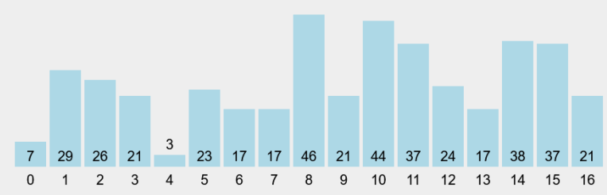

# <p align ="center">Laporan UTS Praktikum Algoritma dan Struktur Data</p>
<br><br><br><br>

<p align="center">
    </p>

<br><br><br><br><br>

<p align = "center"> Nama     : Dio Andika Pradana Mulia Tama </p>
<p align = "center"> NIM      : 2341720098 </p>
<p align = "center"> Prodi    : Teknik Informatika</p>
<p align = "center"> Kelas    : 1B </p>
<p align = "center"> Presensi : 09 </p>

## Kasus


## UTS - TI 1B
1. Implementasikan pengurutan dan pencarian berdasarkan kasus yang diberikan!
Kode program class Nilai:
```java
package UTS.src;

public class Nilai {
    int nilai;

    public Nilai(int n){
        nilai = n;
    }

    public void tampilNilai(){
        System.out.print(nilai + " ");
    }
}
```
Kode program class DaftarNilai:
```java
package UTS.src;

public class DaftarNilai {
    Nilai listNilai[] = new Nilai[17];
    int idx;

    void tambah(Nilai m) {
        if (idx < listNilai.length) {
            listNilai[idx] = m;
            idx++;
        } else {
            System.out.println("Nilai sudah penuh!");
        }
    }

    void tampil() {
        for (Nilai m : listNilai) {
            m.tampilNilai();
        }
        System.out.println();
    }

    public void Tampilposisi(int x, int pos) {
        if (pos != -1) {
            System.out.println("Nilai : " + x + " ditemukan pada indeks " + pos);
        } else {
            System.out.println("Nilai : " + x + " tidak ditemukan");
        }
    }

    public int FindBinarySearch(int cari, int left, int right) {
        int mid;
        if (right >= left) {
            mid = (left + right) / 2;
            if (cari == listNilai[mid].nilai) {
                return (mid);
            } 

            int findLeft = FindBinarySearch(cari, left, mid - 1);
            if (findLeft != -1) {
                return findLeft;
            }

            int findRight = FindBinarySearch(cari, mid + 1, right);
            if (findRight != -1) {
                return findRight;
            }
        } 
        return -1;  
    }

    public int FindBinarySearchAsc(int cari, int left, int right) {
        int mid;
        if (right >= left) {
            mid = (left + right) / 2;
            if (cari == listNilai[mid].nilai) {
                return (mid);
            } else if (listNilai[mid].nilai > cari) {
                return FindBinarySearchAsc(cari, left, mid - 1);
            } else {
                return FindBinarySearchAsc(cari, mid + 1, right);
            }
        } 
        return -1;
    }

    public int FindBinarySearchDesc(int cari, int left, int right) {
        int mid;
        if (right >= left) {
            mid = (left + right) / 2;
            if (cari == listNilai[mid].nilai) {
                return (mid);
            } else if (listNilai[mid].nilai < cari) {
                return FindBinarySearchDesc(cari, left, mid - 1);
            } else {
                return FindBinarySearchDesc(cari, mid + 1, right);
            }
        } 
        return -1;
    }

    //Sorting secara ascending menggunakan selection sort
    void sortAscending() {
        for (int i = 0; i < listNilai.length-1; i++) {
            int idxMin = i;
            for (int j = i + 1; j < listNilai.length; j++) {
                if (listNilai[j].nilai < listNilai[idxMin].nilai) {
                    idxMin = j;
                }
            }
            //proses swap/pertukaran
            Nilai tmp = listNilai[idxMin];
            listNilai[idxMin] = listNilai[i];
            listNilai[i] = tmp;   
        }
    }

    //Sorting secara descending menggunakan insertion sort
    void sortDescending() {
        for (int i = 1; i < listNilai.length; i++) {
            Nilai temp = listNilai[i];
            int j = i;
            while (j > 0 && listNilai[j - 1].nilai < temp.nilai) {
                listNilai[j] = listNilai[j - 1];
                j--;
            }
            listNilai[j] = temp;
        }
    }

}
```
Kode program class MainNilai:
```java
package UTS.src;
import java.util.Scanner;

public class MainNilai {
    static Scanner s = new Scanner(System.in);
    static Scanner sc = new Scanner(System.in);
    public static void main(String[] args) {
        DaftarNilai dataNilai = new DaftarNilai();
        int jumNilai = 17;

        int[] kumpulanNilai = {7, 29, 26, 21, 3, 23, 17, 17, 46, 21, 44, 37, 24, 17, 38, 37, 21}; 
        System.out.println("Kumpulan nilai awal");
        for (int j = 0; j < kumpulanNilai.length; j++) {
            System.out.print(kumpulanNilai[j] + " ");
        }
        System.out.println();

        for (int i = 0; i < jumNilai; i++) {
            int nilai = kumpulanNilai[i];

            Nilai m = new Nilai(nilai);
            dataNilai.tambah(m);
        }

        char konfir;
            do {
                mainMenu(jumNilai, dataNilai);
                System.out.println("Apakah Anda ingin memilih menu lain? (y/n)");
                konfir = sc.next().charAt(0);
            } while (konfir == 'Y'|| konfir == 'y');
    }

    static void searchTidakUrut(int length, DaftarNilai data) {
        System.out.println("-------------------------------------------");
        System.out.println("Data keseluruhan Nilai (Belum tentu dalam keadaan sudah terurut): ");
        data.tampil();

        System.out.println("___________________________________________");
        System.out.println("___________________________________________");
        System.out.println("Pencarian Data : ");
        System.out.println("Masukkan nilai yang dicari : ");
        System.out.print("Nilai : ");
        int cari = s.nextInt();
        System.out.println("Menggunakan Binary Search");
        int posisi = data.FindBinarySearch(cari, 0, length - 1);
        data.Tampilposisi(cari, posisi);
    }

    static void menuBinAsc(int length, DaftarNilai data) {
        System.out.println("-------------------------------------------");
        System.out.println("Data keseluruhan Nilai (Urut dari terkecil ke terbesar): ");
        data.sortAscending();
        data.tampil();

        System.out.println("___________________________________________");
        System.out.println("___________________________________________");
        System.out.println("Pencarian Data : ");
        System.out.println("Masukkan nilai yang dicari : ");
        System.out.print("Nilai : ");
        int cari = s.nextInt();
        System.out.println("=================================");
        System.out.println("Menggunakan binary search");
        int posisi = data.FindBinarySearchAsc(cari, 0, length - 1);
        data.Tampilposisi(cari, posisi);
    }

    static void menuBinDesc(int length, DaftarNilai data) {
        System.out.println("-------------------------------------------");
        System.out.println("Data keseluruhan Nilai (Urut dari terbesar ke terkecil): ");
        data.sortDescending();
        data.tampil();

        System.out.println("___________________________________________");
        System.out.println("___________________________________________");
        System.out.println("Pencarian Data : ");
        System.out.println("Masukkan nilai yang dicari : ");
        System.out.print("Nilai : ");
        int cari = s.nextInt();
        System.out.println("=================================");
        System.out.println("menggunakan binary search");
        int posisi = data.FindBinarySearchDesc(cari, 0, length - 1);
        data.Tampilposisi(cari, posisi);
    }

    static void menuSort(DaftarNilai data) {
        System.out.println("-------------------------------------------");
        System.out.println("Pilih menu sorting");
        System.out.println("1. Ascending\n2. Descending");
        System.out.print("Masukkan pilihan Anda: ");
        short srt = s.nextShort();
        switch (srt) {
            case 1:
                data.sortAscending();
                data.tampil();
                break;
            case 2:
                data.sortDescending();
                data.tampil();
                break;
            default:
                System.out.println("Menu sorting yang Anda masukkan tidak valid!\n" +
                "Pilih menu sorting yang valid (1/2)");
                break;
        }
    }

    static void menuSearch(int length, DaftarNilai data) {
        System.out.println("-------------------------------------------");
        System.out.println("Pilih menu searching");
        System.out.println("1. Searching untuk data yang belum diurutkan\n2. Searching untuk data yang sudah diurutkan");
        System.out.print("Masukkan pilihan Anda: ");
        short srch = s.nextShort();
        switch (srch) {
            case 1:
                searchTidakUrut(length, data);
                break;
            case 2:
                menuBinSrch(length, data);
                break;
            default:
                System.out.println("Menu searching yang Anda masukkan tidak valid!\n" +
                "Pilih menu sorting yang valid (1/2)");
                break;
        }
    }

    static void menuBinSrch(int length, DaftarNilai data) {
        System.out.println("-------------------------------------------");
        System.out.println("Pilih metode binary search");
        System.out.println("1. Binary search dengan nilai yang diurutkan secara ascending\n2. Binary search dengan nilai yang diurutkan secara descending");
        System.out.print("Masukkan pilihan Anda: ");
        short menuSrch = s.nextShort();
        switch (menuSrch) {
            case 1:
                menuBinAsc(length, data);
                break;
            case 2:
                menuBinDesc(length, data);
                break;
            default:
                System.out.println("Metode binary search yang Anda masukkan tidak valid!\n" +
                "Pilih metode binary search yang valid (1/2)");
                break;
        }
    }

    static void mainMenu(int length, DaftarNilai data) {
        System.out.println("-------------------------------------------");
        System.out.println("Pilih menu operasi");
        System.out.println("1. Sorting\n2. Searching");
        System.out.print("Menu yang Anda pilih: ");
        byte menu = s.nextByte();
        if (menu == 1) {
            char knfrMenu1;
            do {
                menuSort(data);
                System.out.println("Apakah Anda ingin memilih metode sorting yang lain? (y/n)");
                knfrMenu1 = sc.next().charAt(0);
            } while (knfrMenu1 == 'Y'|| knfrMenu1 == 'y');
        } else if (menu == 2) {
            char knfrMenu2;
            do {
                menuSearch(length, data);
                System.out.println("Apakah Anda ingin memilih metode searching yang lain? (y/n)");
                knfrMenu2 = sc.next().charAt(0);
            } while (knfrMenu2 == 'Y'|| knfrMenu2 == 'y');
        } else {
            System.out.println("Menu yang Anda pilih tidak valid!");
        }  
    }
}
```
2. Metode pencarian dan pengurutan mengikuti ketentuan yang tercantum!
Kode program method sorting pada class DaftarNilai:
```java
//Sorting secara ascending menggunakan selection sort
    void sortAscending() {
        for (int i = 0; i < listNilai.length-1; i++) {
            int idxMin = i;
            for (int j = i + 1; j < listNilai.length; j++) {
                if (listNilai[j].nilai < listNilai[idxMin].nilai) {
                    idxMin = j;
                }
            }
            //proses swap/pertukaran
            Nilai tmp = listNilai[idxMin];
            listNilai[idxMin] = listNilai[i];
            listNilai[i] = tmp;   
        }
    }

    //Sorting secara descending menggunakan insertion sort
    void sortDescending() {
        for (int i = 1; i < listNilai.length; i++) {
            Nilai temp = listNilai[i];
            int j = i;
            while (j > 0 && listNilai[j - 1].nilai < temp.nilai) {
                listNilai[j] = listNilai[j - 1];
                j--;
            }
            listNilai[j] = temp;
        }
    }
```
Kode program method searching pada class DaftarNilai:
```java
public int FindBinarySearch(int cari, int left, int right) {
        int mid;
        if (right >= left) {
            mid = (left + right) / 2;
            if (cari == listNilai[mid].nilai) {
                return (mid);
            } 

            int findLeft = FindBinarySearch(cari, left, mid - 1);
            if (findLeft != -1) {
                return findLeft;
            }

            int findRight = FindBinarySearch(cari, mid + 1, right);
            if (findRight != -1) {
                return findRight;
            }
        } 
        return -1;  
    }

    public int FindBinarySearchAsc(int cari, int left, int right) {
        int mid;
        if (right >= left) {
            mid = (left + right) / 2;
            if (cari == listNilai[mid].nilai) {
                return (mid);
            } else if (listNilai[mid].nilai > cari) {
                return FindBinarySearchAsc(cari, left, mid - 1);
            } else {
                return FindBinarySearchAsc(cari, mid + 1, right);
            }
        } 
        return -1;
    }

    public int FindBinarySearchDesc(int cari, int left, int right) {
        int mid;
        if (right >= left) {
            mid = (left + right) / 2;
            if (cari == listNilai[mid].nilai) {
                return (mid);
            } else if (listNilai[mid].nilai < cari) {
                return FindBinarySearchDesc(cari, left, mid - 1);
            } else {
                return FindBinarySearchDesc(cari, mid + 1, right);
            }
        } 
        return -1;
    }
```
3. Simulasi pengurutan dilakukan secara ascending dan descending! Nilai yang dicari merupakan nilai bebas ditentukan setiap mahasiswa dengan ketentuan empat kondisi, yaitu: 

1) nilai yang dapat ditemukan (ditunjukkan pada lokasi index sebelum pengurutan); 
```PowerShell
Kumpulan nilai awal
7 29 26 21 3 23 17 17 46 21 44 37 24 17 38 37 21
-------------------------------------------
Pilih menu operasi
1. Sorting
2. Searching
Menu yang Anda pilih: 2
-------------------------------------------
Pilih menu searching
1. Searching untuk data yang belum diurutkan
2. Searching untuk data yang sudah diurutkan
Masukkan pilihan Anda: 1
-------------------------------------------
Data keseluruhan Nilai (Belum tentu dalam keadaan sudah terurut): 
7 29 26 21 3 23 17 17 46 21 44 37 24 17 38 37 21 
___________________________________________
___________________________________________
Pencarian Data : 
Masukkan nilai yang dicari : 
Nilai : 3
Menggunakan Binary Search
Nilai : 3 ditemukan pada indeks 4
Apakah Anda ingin memilih metode searching yang lain? (y/n)
y
-------------------------------------------
Pilih menu searching
1. Searching untuk data yang belum diurutkan
2. Searching untuk data yang sudah diurutkan
Masukkan pilihan Anda: 1
-------------------------------------------
Data keseluruhan Nilai (Belum tentu dalam keadaan sudah terurut):
7 29 26 21 3 23 17 17 46 21 44 37 24 17 38 37 21
___________________________________________
___________________________________________
Pencarian Data :
Masukkan nilai yang dicari :
Nilai : 24
Menggunakan Binary Search
Nilai : 24 ditemukan pada indeks 12
```
``Pencarian pada menu pertama dapat mencari nilai meskipun belum terurut. Jikalau nilai sudah terurut pun juga masih dapat menemukan nilai yang dicari``
```PowerShell
Kumpulan nilai awal
7 29 26 21 3 23 17 17 46 21 44 37 24 17 38 37 21
-------------------------------------------
Pilih menu operasi
1. Sorting
2. Searching
Menu yang Anda pilih: 1
-------------------------------------------
Pilih menu sorting
1. Ascending
2. Descending
Masukkan pilihan Anda: 1
3 7 17 17 17 21 21 21 23 24 26 29 37 37 38 44 46
Apakah Anda ingin memilih metode sorting yang lain? (y/n)
n
Apakah Anda ingin memilih menu lain? (y/n)
y
-------------------------------------------
Pilih menu operasi
1. Sorting
2. Searching
Menu yang Anda pilih: 2
-------------------------------------------
Pilih menu searching
1. Searching untuk data yang belum diurutkan
2. Searching untuk data yang sudah diurutkan
Masukkan pilihan Anda: 1 
-------------------------------------------
Data keseluruhan Nilai (Belum tentu dalam keadaan sudah terurut):
3 7 17 17 17 21 21 21 23 24 26 29 37 37 38 44 46
___________________________________________
___________________________________________
Pencarian Data :
Masukkan nilai yang dicari :
Nilai : 38
Menggunakan Binary Search
Nilai : 38 ditemukan pada indeks 14
Apakah Anda ingin memilih metode searching yang lain? (y/n)
```
2)  nilai yang dapat ditemukan (ditunjukkan pada lokasi index setelah pengurutan secara ascending); 
```PowerShell
Pilih menu operasi
1. Sorting
2. Searching
Menu yang Anda pilih: 2
-------------------------------------------
Pilih menu searching
1. Searching untuk data yang belum diurutkan
2. Searching untuk data yang sudah diurutkan
Masukkan pilihan Anda: 2
-------------------------------------------
Pilih metode binary search
1. Binary search dengan nilai yang diurutkan secara ascending
2. Binary search dengan nilai yang diurutkan secara descending
Masukkan pilihan Anda: 1
-------------------------------------------
Data keseluruhan Nilai (Urut dari terkecil ke terbesar):
3 7 17 17 17 21 21 21 23 24 26 29 37 37 38 44 46
___________________________________________
___________________________________________
Pencarian Data :
Masukkan nilai yang dicari :
Nilai : 46
=================================
Menggunakan binary search
Nilai : 46 ditemukan pada indeks 16
Apakah Anda ingin memilih metode searching yang lain? (y/n)
y
```
3) nilai yang dapat ditemukan (ditunjukkan pada lokasi index setelah pengurutan secara descending); 
```PowerShell
-------------------------------------------
Pilih menu searching
1. Searching untuk data yang belum diurutkan
2. Searching untuk data yang sudah diurutkan
Masukkan pilihan Anda: 2
-------------------------------------------
Pilih metode binary search
1. Binary search dengan nilai yang diurutkan secara ascending
2. Binary search dengan nilai yang diurutkan secara descending
Masukkan pilihan Anda: 2
-------------------------------------------
Data keseluruhan Nilai (Urut dari terbesar ke terkecil):
46 44 38 37 37 29 26 24 23 21 21 21 17 17 17 7 3
___________________________________________
___________________________________________
Pencarian Data :
Masukkan nilai yang dicari :
Nilai : 26
=================================
menggunakan binary search
Nilai : 26 ditemukan pada indeks 6
```
4) nilai tidak ditemukan.
```PowerShell
Apakah Anda ingin memilih metode searching yang lain? (y/n)
y
-------------------------------------------
Pilih menu searching
1. Searching untuk data yang belum diurutkan
2. Searching untuk data yang sudah diurutkan
Masukkan pilihan Anda: 2
-------------------------------------------
Pilih metode binary search
1. Binary search dengan nilai yang diurutkan secara ascending
2. Binary search dengan nilai yang diurutkan secara descending
Masukkan pilihan Anda: 1
-------------------------------------------
Data keseluruhan Nilai (Urut dari terkecil ke terbesar):
3 7 17 17 17 21 21 21 23 24 26 29 37 37 38 44 46
___________________________________________
___________________________________________
Pencarian Data :
Masukkan nilai yang dicari :
Nilai : 11
=================================
Menggunakan binary search
Nilai : 11 tidak ditemukan
Apakah Anda ingin memilih metode searching yang lain? (y/n)
n
Apakah Anda ingin memilih menu lain? (y/n)
n
```

4. Waktu pengerjaan di kelas adalah satu jam, selanjutnya dosen akan memanggil setiap mahasiswa untuk menunjukkan progress!
5. Setelah pemeriksaan selesai, mahasiswa melanjutkan pengerjaan secara mandiri.
Kumpulkan hasil kode program melalui repo GitHub, laporan hasil pengerjaan dilakukan melalui file markdown (.md)!
6. Perhatikan pengumpulan di repo dipisahkan dalam folder tersendiri!
7. Perhatikan deadline pengumpulan, tidak ada toleransi ketrlambatan dalam bentuk alasan apapun!

Output Program secara keseluruhan:
```PowerShell
Kumpulan nilai awal
7 29 26 21 3 23 17 17 46 21 44 37 24 17 38 37 21
-------------------------------------------
Pilih menu operasi
1. Sorting
2. Searching
Menu yang Anda pilih: 2
-------------------------------------------
Pilih menu searching
1. Searching untuk data yang belum diurutkan
2. Searching untuk data yang sudah diurutkan
Masukkan pilihan Anda: 1
-------------------------------------------
Data keseluruhan Nilai (Belum tentu dalam keadaan sudah terurut): 
7 29 26 21 3 23 17 17 46 21 44 37 24 17 38 37 21 
___________________________________________
___________________________________________
Pencarian Data : 
Masukkan nilai yang dicari : 
Nilai : 3
Menggunakan Binary Search
Nilai : 3 ditemukan pada indeks 4
Apakah Anda ingin memilih metode searching yang lain? (y/n)
y
-------------------------------------------
Pilih menu searching
1. Searching untuk data yang belum diurutkan
2. Searching untuk data yang sudah diurutkan
Masukkan pilihan Anda: 1
-------------------------------------------
Data keseluruhan Nilai (Belum tentu dalam keadaan sudah terurut):
7 29 26 21 3 23 17 17 46 21 44 37 24 17 38 37 21
___________________________________________
___________________________________________
Pencarian Data :
Masukkan nilai yang dicari :
Nilai : 24
Menggunakan Binary Search
Nilai : 24 ditemukan pada indeks 12
Apakah Anda ingin memilih metode searching yang lain? (y/n)
n
Apakah Anda ingin memilih menu lain? (y/n)
y
-------------------------------------------
Pilih menu operasi
1. Sorting
2. Searching
Menu yang Anda pilih: 1
-------------------------------------------
Pilih menu sorting
1. Ascending
2. Descending
Masukkan pilihan Anda: 1
3 7 17 17 17 21 21 21 23 24 26 29 37 37 38 44 46 
Apakah Anda ingin memilih metode sorting yang lain? (y/n)
y
-------------------------------------------
Pilih menu sorting
1. Ascending
2. Descending
Masukkan pilihan Anda: 2
46 44 38 37 37 29 26 24 23 21 21 21 17 17 17 7 3
Apakah Anda ingin memilih metode sorting yang lain? (y/n)
n
Apakah Anda ingin memilih menu lain? (y/n)
y
-------------------------------------------
Pilih menu operasi
1. Sorting
2. Searching
Menu yang Anda pilih: 2
-------------------------------------------
Pilih menu searching
1. Searching untuk data yang belum diurutkan
2. Searching untuk data yang sudah diurutkan
Masukkan pilihan Anda: 2
-------------------------------------------
Pilih metode binary search
1. Binary search dengan nilai yang diurutkan secara ascending
2. Binary search dengan nilai yang diurutkan secara descending
Masukkan pilihan Anda: 1
-------------------------------------------
Data keseluruhan Nilai (Urut dari terkecil ke terbesar):
3 7 17 17 17 21 21 21 23 24 26 29 37 37 38 44 46
___________________________________________
___________________________________________
Pencarian Data :
Masukkan nilai yang dicari :
Nilai : 46
=================================
Menggunakan binary search
Nilai : 46 ditemukan pada indeks 16
Apakah Anda ingin memilih metode searching yang lain? (y/n)
y
-------------------------------------------
Pilih menu searching
1. Searching untuk data yang belum diurutkan
2. Searching untuk data yang sudah diurutkan
Masukkan pilihan Anda: 2
-------------------------------------------
Pilih metode binary search
1. Binary search dengan nilai yang diurutkan secara ascending
2. Binary search dengan nilai yang diurutkan secara descending
Masukkan pilihan Anda: 2
-------------------------------------------
Data keseluruhan Nilai (Urut dari terbesar ke terkecil):
46 44 38 37 37 29 26 24 23 21 21 21 17 17 17 7 3
___________________________________________
___________________________________________
Pencarian Data :
Masukkan nilai yang dicari :
Nilai : 26
=================================
menggunakan binary search
Nilai : 26 ditemukan pada indeks 6
Apakah Anda ingin memilih metode searching yang lain? (y/n)
y
-------------------------------------------
Pilih menu searching
1. Searching untuk data yang belum diurutkan
2. Searching untuk data yang sudah diurutkan
Masukkan pilihan Anda: 2
-------------------------------------------
Pilih metode binary search
1. Binary search dengan nilai yang diurutkan secara ascending
2. Binary search dengan nilai yang diurutkan secara descending
Masukkan pilihan Anda: 1
-------------------------------------------
Data keseluruhan Nilai (Urut dari terkecil ke terbesar):
3 7 17 17 17 21 21 21 23 24 26 29 37 37 38 44 46
___________________________________________
___________________________________________
Pencarian Data :
Masukkan nilai yang dicari :
Nilai : 11
=================================
Menggunakan binary search
Nilai : 11 tidak ditemukan
Apakah Anda ingin memilih metode searching yang lain? (y/n)
n
Apakah Anda ingin memilih menu lain? (y/n)
n
PS D:\Kuliah\Semester 2\Tugas Kuliah Semester 2\Algoritma dan Struktur Data\Praktikum-Algoritma dan Struktur Data> 
```